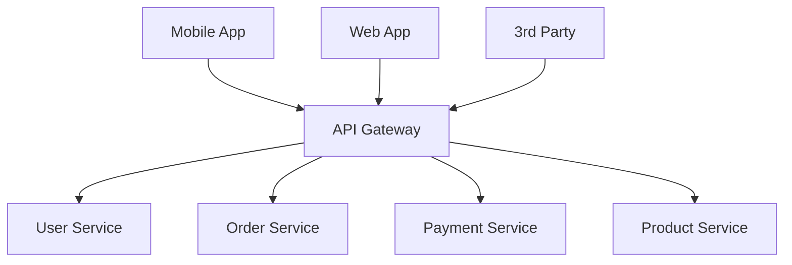
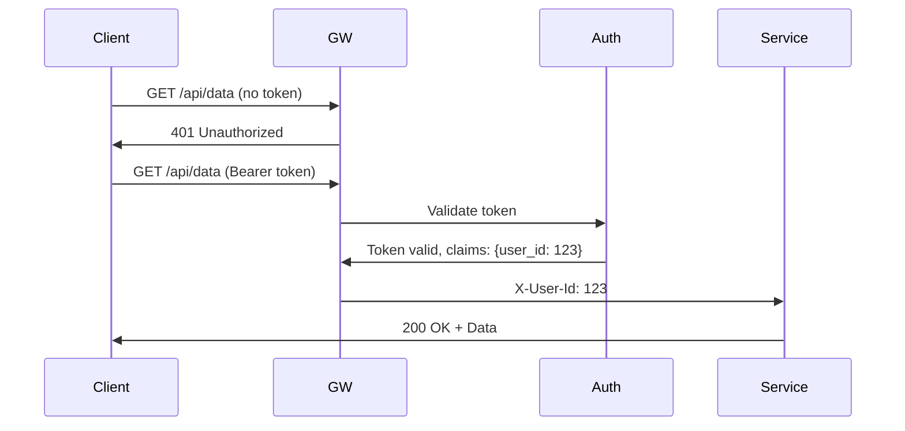

# API Gateway

> **The single entry point for all client requests. Handles cross-cutting concerns so your services don't have to.**

---

## 1. What is an API Gateway?

An API Gateway sits between clients and your backend services. It handles:
- Request routing
- Authentication/Authorization
- Rate limiting
- Request/Response transformation
- Protocol translation (HTTP → gRPC, etc.)
- SSL termination
- Logging and monitoring



---

## 2. Why Use an API Gateway?

### Without Gateway
- Each service must implement auth, rate limiting, logging
- Client couples to multiple service URLs
- No centralized policy enforcement
- Hard to evolve APIs

### With Gateway
- Single entry point for all clients
- Centralized cross-cutting concerns
- Decouples clients from service topology
- A/B testing, canary deployments at the edge

---

## 3. Core Functions

### 3.1 Request Routing
```yaml
routes:
  - path: /api/users/*
    service: user-service
    strip_prefix: true
    
  - path: /api/orders/*
    service: order-service
    
  - path: /api/*
    service: fallback-service
```

**Routing Strategies**:
- **Path-based**: `/api/users/*` → User Service
- **Header-based**: `X-Service: orders` → Order Service
- **Query-based**: `?service=orders` → Order Service

### 3.2 Authentication



**Common Patterns**:
- **JWT Validation**: Verify signature, expiration, claims
- **OAuth2 Introspection**: Call authorization server
- **mTLS**: Mutual TLS with certificate validation

### 3.3 Rate Limiting

```
Rate Limit Headers:
X-RateLimit-Limit: 1000
X-RateLimit-Remaining: 999
X-RateLimit-Reset: 1609459200
```

**Algorithms**:
- **Token Bucket**: Allows burst, refills at rate
- **Leaky Bucket**: Constant rate, smooths bursts
- **Fixed Window**: Simple, but allows burst at window boundaries
- **Sliding Window**: More accurate, higher memory

### 3.4 Request/Response Transformation

**Request Transformation**:
```json
// Client sends:
{ "userId": 123 }

// Gateway transforms to:
{ "user_id": 123, "request_id": "uuid", "timestamp": "ISO8601" }
```

**Response Transformation**:
```json
// Service returns:
{ "user_id": 123, "created_at": "2024-01-15T10:30:00Z" }

// Gateway transforms to:
{ "id": 123, "joined": "Jan 15, 2024" }
```

---

## 4. Popular Solutions

| Gateway | Type | Best For |
|---------|------|----------|
| **Kong** | Open Source | Kubernetes-native, large ecosystem |
| **Apigee** | SaaS/On-prem | Enterprise, analytics-heavy |
| **AWS API Gateway** | Managed | AWS-native applications |
| **Ambassador** | Open Source | Kubernetes, self-service |
| **NGINX** | Reverse Proxy | High-performance, simple needs |
| **Envoy** | Service Mesh | Microservices, sidecar model |

---

## 5. Design Considerations for Interviews

### Q: Where does the API Gateway fit in your architecture?
**A**: It's the single entry point. All client traffic goes through it. It handles cross-cutting concerns so services can focus on business logic.

### Q: What happens if the API Gateway becomes a single point of failure?
**A**: Deploy in multiple availability zones, use health checks, and implement circuit breakers. Consider it a critical path component - needs 99.99% availability.

### Q: How do you handle API Gateway scaling?
**A**: Make it stateless (no session affinity), use auto-scaling based on CPU/network, put behind a load balancer, consider caching at the gateway layer for frequent requests.

### Q: What's the difference between API Gateway and Load Balancer?
**A**: LB operates at L4 (transport layer), Gateway at L7 (application layer). Gateway understands HTTP, can route based on path/headers, can transform requests. LB just distributes traffic.

---

## 6. Failure Scenarios

| Scenario | Impact | Mitigation |
|----------|--------|------------|
| Gateway overloaded | All services unreachable | Auto-scaling, rate limiting |
| Auth service down | All requests fail | Cache JWTs, fail open vs closed |
| Config propagation failure | Wrong routing | Versioned configs, rollback |
| SSL cert expiry | HTTPS fails | Automated cert rotation |

---

## 7. Monitoring

**Key Metrics**:
- Request rate (requests/second)
- Error rate (4xx, 5xx)
- Latency (P50, P95, P99)
- Upstream service health
- Rate limit violations

**Logging**:
- Access logs with request/response
- Correlation IDs for tracing
- Security events (auth failures)

---

## 8. Interview Narrative

> "The API Gateway is our single entry point. It handles authentication, rate limiting, and routing so our services don't duplicate this logic. We'd deploy it across multiple AZs behind a load balancer, targeting 99.99% availability. For rate limiting, we use token bucket at the gateway level, with per-user and per-IP limits. If the gateway becomes a bottleneck, we can horizontally scale since it's stateless - no session state, all routing based on request content."

---

## 9. Follow-up Questions

1. **How do you handle authentication if the auth service is down?**
   - Cache valid tokens with TTL
   - Fail-open for reads, fail-closed for writes
   - Implement circuit breaker on auth calls

2. **How do you do A/B testing at the gateway?**
   - Route based on header/cookie
   - Weighted traffic splitting
   - Feature flags passed to services

3. **What's your caching strategy at the gateway?**
   - Cache responses with appropriate TTL
   - Invalidate on POST/PUT/DELETE
   - Consider Vary header for cache keys
