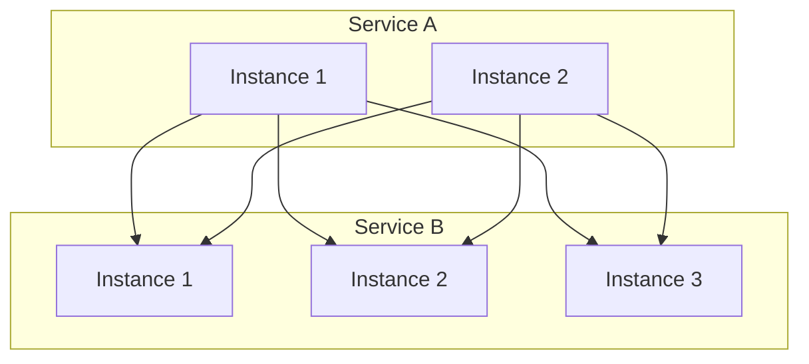
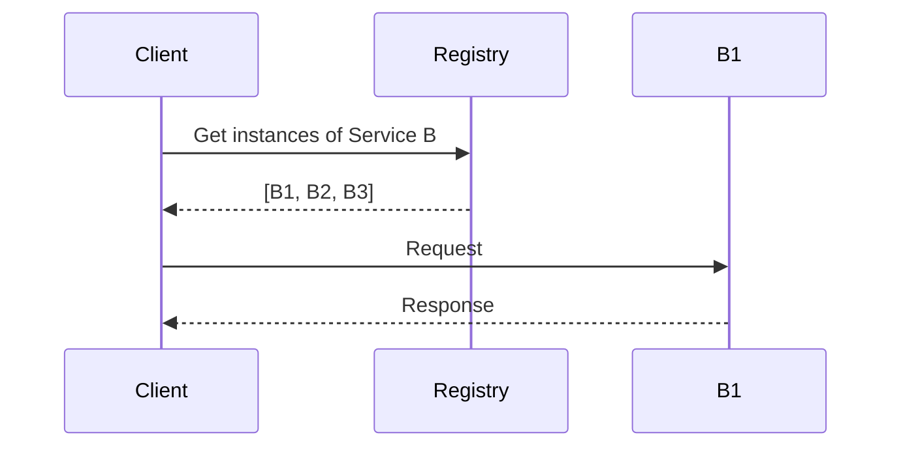
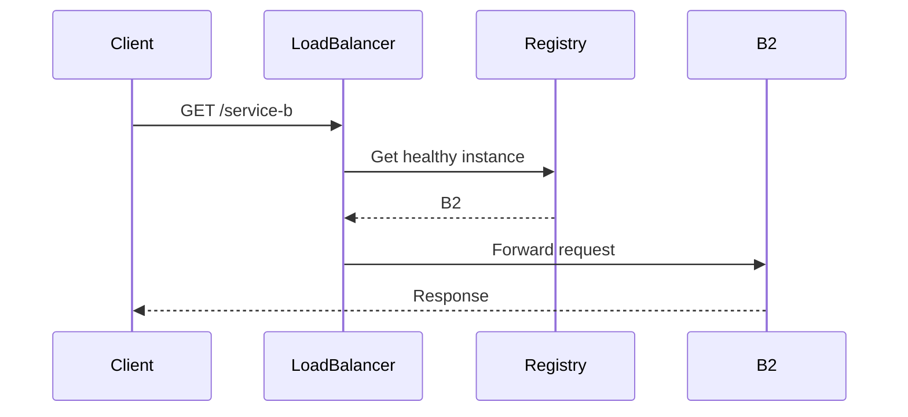

# Service Discovery

> **How services find each other in a dynamic, distributed system.**

---

## 1. The Problem

In a microservices environment:
- Services scale up/down dynamically
- Instances have ephemeral IPs
- New versions deploy continuously
- Services need to find each other without hardcoding URLs



---

## 2. Service Discovery Patterns

### 2.1 Client-Side Discovery



**How it works**:
- Client queries service registry
- Client implements load balancing
- Examples: Eureka, Consul, etcd

**Pros**:
- No network hop
- Client can use sophisticated LB

**Cons**:
- Client couples to registry
- Requires SDK in each language

### 2.2 Server-Side Discovery



**How it works**:
- Router/gateway queries registry
- Examples: AWS ALB, Kubernetes Ingress, Envoy

**Pros**:
- Client is simple
- Language-agnostic

**Cons**:
- Additional network hop
- Additional component to manage

---

## 3. Service Registry

### Registration Patterns

**Self-Registration**:
```
Service starts → Registers with Registry
Service sends heartbeats → Stays registered
Service stops → Deregisters (or timeout)
```

**Third-Party Registration**:
```
Container orchestrator → Registers service
Health checks → Updates registry
```

### Health Checking

| Type | Description | Use Case |
|------|-------------|----------|
| **HTTP** | GET /health returns 200 | Application-level health |
| **TCP** | Port open = healthy | Simple services |
| **TTL** | Heartbeat within N seconds | Lightweight |
| **Custom** | Script/command execution | Complex checks |

### CAP Considerations

- **Consistency**: Registry must be consistent (CP)
- **Availability**: Want high availability (AP)
- **Solution**: Use CP store for metadata (etcd, ZooKeeper), expose via DNS for availability

---

## 4. Popular Solutions

| Tool | Type | Best For |
|------|------|----------|
| **Consul** | CP | Multi-datacenter, service mesh |
| **etcd** | CP | Kubernetes, distributed locking |
| **Eureka** | AP | AWS, Netflix stack |
| **ZooKeeper** | CP | Legacy, distributed coordination |
| **Kubernetes DNS** | AP | K8s native service discovery |

---

## 5. DNS-Based Service Discovery

```yaml
# Kubernetes Service creates DNS entry
# my-service.default.svc.cluster.local resolves to pod IPs

# DNS records for service discovery
my-service    A    10.0.0.1
my-service    A    10.0.0.2
my-service    A    10.0.0.3
```

**Advantages**:
- Universal, no special libraries
- Works with standard tooling
- Cached by OS

**Disadvantages**:
- DNS TTL can cause stale results
- No built-in health checking
- Limited load balancing options

---

## 6. Design Considerations

### Q: How do you handle service instance failures?
**A**: Implement health checks with appropriate intervals. Remove unhealthy instances from the registry. Use circuit breakers to stop calling failing services.

### Q: What's the difference between service discovery and load balancing?
**A**: Discovery finds instances, balancing distributes load across them. Often combined (discovery includes health-aware load balancing).

### Q: How do you handle rolling deployments?
**A**: Register new instances before routing traffic (readiness probe). Deregister old instances after all requests complete. Use connection draining.

---

## 7. Failure Scenarios

| Scenario | Impact | Mitigation |
|----------|--------|------------|
| Registry down | Can't find services | Cache recent results, fail gracefully |
| Stale instance | Request to dead instance | Short TTL, health checks |
| Network partition | Split-brain | Use CP registry, quorum |
| Thundering herd | Registry overwhelmed | Rate limit registrations |

---

## 8. Interview Narrative

> "Service discovery solves the problem of finding service instances in a dynamic environment. I'd use a combination: DNS for basic discovery (works everywhere), with a service mesh like Istio handling advanced routing and health-aware load balancing. For the registry, etcd provides strong consistency for the metadata while DNS provides high availability for lookups. We'd use sidecar proxies to avoid coupling services to the discovery mechanism."

---

## 9. Follow-up Questions

1. **How do you handle service versioning?**
   - Route based on labels/tags
   - Canary deployments via weighted routing
   - Header-based routing for testing

2. **What's your strategy for multi-region discovery?**
   - Local registry per region
   - Cross-region failover via DNS
   - Read from local, write to primary

3. **How do you secure service-to-service communication?**
   - mTLS between services
   - Rotate certificates automatically
   - Identity based on service account
