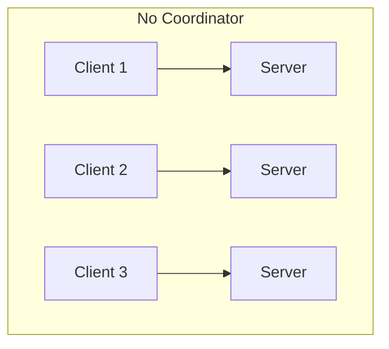
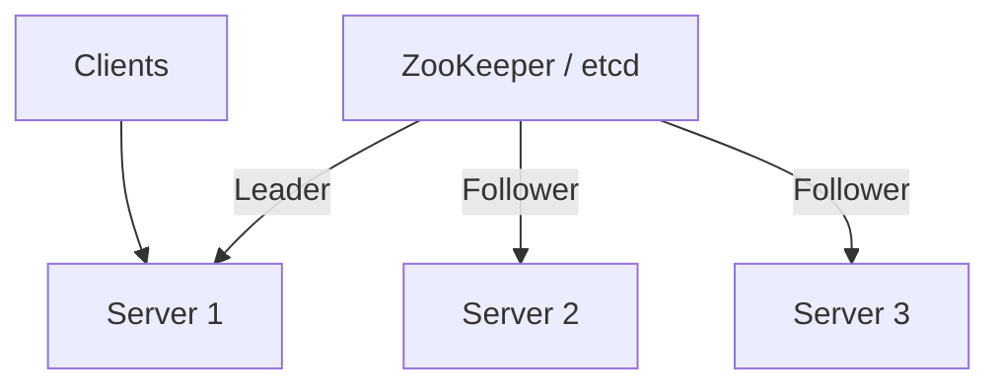
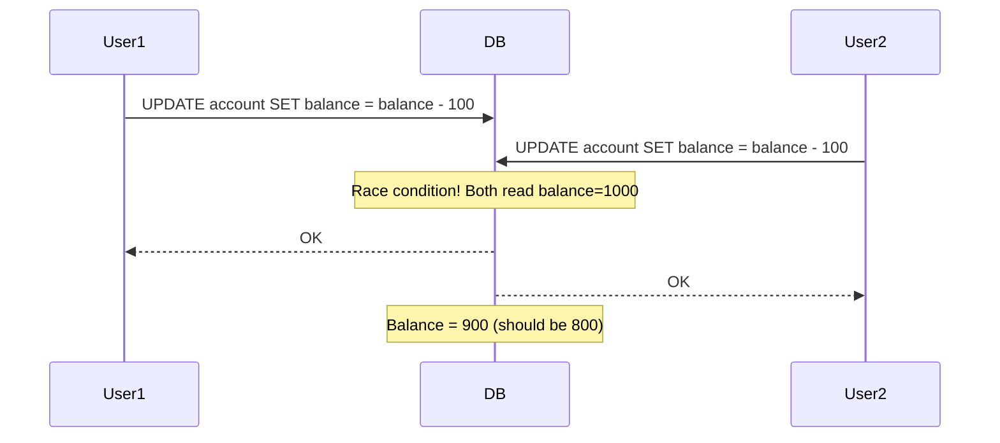
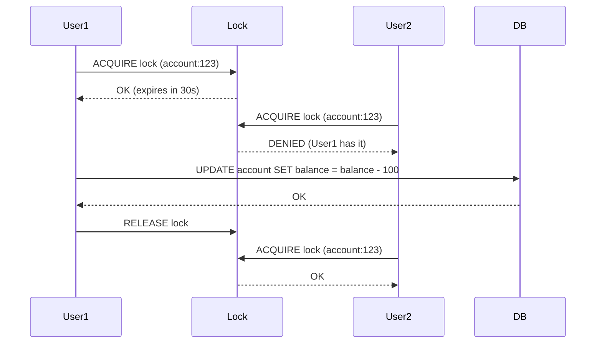
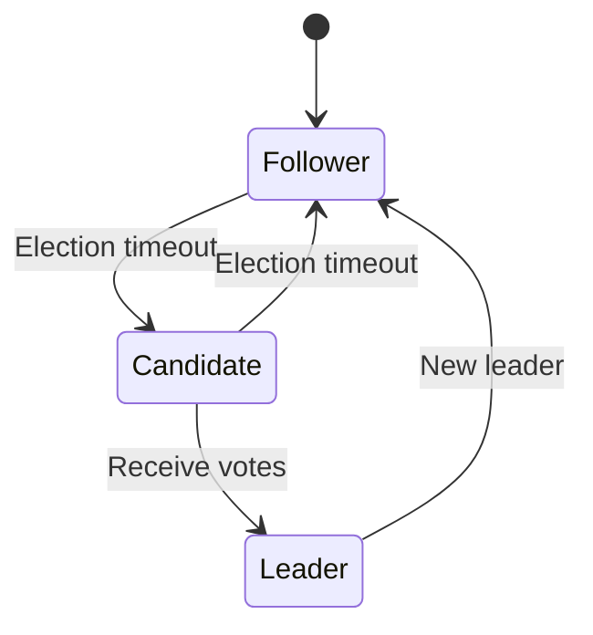
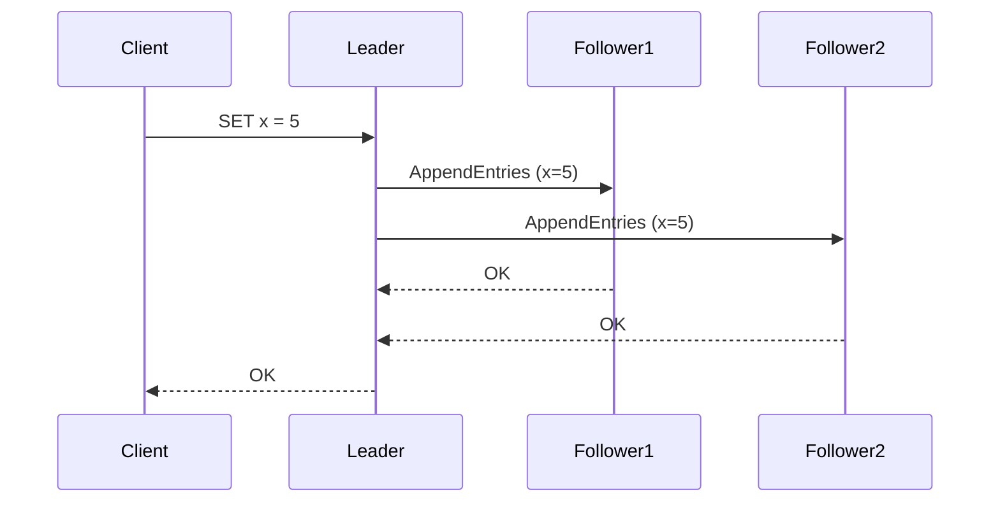

# Distributed Coordination

> **Coordinating state and actions across distributed systems.**

---

## 1. Why Coordination is Hard

In distributed systems:
- **Partial failures**: Some nodes fail, others continue
- **Network partitions**: Nodes can't communicate
- **Clock skew**: Events appear out of order
- **No global clock**: Can't determine true ordering

Distributed coordination provides:
- Leader election
- Distributed locking
- Service configuration
- Consensus

---

## 2. Leader Election

### The Problem



Multiple servers, who does what?

### The Solution: Leader Elects



**Use Cases**:
- Master database for writes
- Job scheduler coordination
- Distributed cache invalidation

### Algorithms

| Algorithm | Description | Use Case |
|-----------|-------------|----------|
| **Bully** | Highest ID wins | Simple, small clusters |
| **Raft** | Log replication leader | State machines |
| **Paxos** | Consensus protocol | Generic |
| **Lease** | Time-based leadership | Ephemeral leadership |

---

## 3. Distributed Locking

### The Problem



### The Solution: Locks



### Lock Implementation with etcd

```go
// Acquire lock
txn := client.Txn(ctx)
resp, err := txn.If(
    v3.Compare(v3.Version(key), "=", 0),
).Then(
    v3.OpPut(key, lockOwnerID, v3.WithTTL(ttl)),
).Else(
    v3.OpGet(key),
).Commit()

// Release lock - only if we own it
client.KV.Delete(ctx, key, v3.Compare(v3.Value(key), "=", lockOwnerID))
```

### Lock Properties

| Property | Description | Why It Matters |
|----------|-------------|----------------|
| **Mutual Exclusion** | Only one holder | Prevents race conditions |
| **Liveness** | Get lock eventually | No deadlock |
| **Fault Tolerance** | Survive failures | Auto-release on crash |

---

## 4. Configuration Management

### Use Cases
- Feature flags
- Service endpoints
- Rate limits
- Feature toggles

### With etcd

```yaml
# Service watches for config changes
services:
  user-service:
    endpoints:
      - 10.0.0.1:8080
      - 10.0.0.2:8080
    timeout: 5s
    retries: 3
    
feature-flags:
  new-checkout: true
  dark-mode: false
```

```go
// Watch for changes
watcher := client.Watch(ctx, "/services/", v3.WithPrefix())
for {
    select {
    case <-ctx.Done():
        return
    case event := <-watcher:
        // Reload configuration
        reloadConfig(event)
    }
}
```

---

## 5. Consensus with Raft

### Raft Overview



**Terms**:
- **Leader**: Handles all client requests
- **Follower**: Replicates log from leader
- **Candidate**: Running for leader

### Log Replication



### Why Raft?

- **Understandable**: Clear algorithm
- **Complete**: Proven correct
- **Practical**: Multiple implementations

---

## 6. Tools Comparison

| Tool | Type | Best For | Consistency |
|------|------|----------|-------------|
| **etcd** | K/V + Watch | K8s, config | CP |
| **ZooKeeper** | K/V + Watch | Legacy, locking | CP |
| **Consul** | K/V + Watch + Health | Multi-DC | CP/AP |
| **Redis** | K/V + Pub/Sub | Caching, locks | AP |

---

## 7. Design Considerations

### Q: Why not use a database for coordination?
**A**: Databases aren't designed for low-latency coordination. The coordination overhead (lock acquisition, heartbeat) would overwhelm a relational database.

### Q: What's the cost of coordination?
**A**: Every coordination point is a potential bottleneck. Minimize coordination - design for eventual consistency where possible.

### Q: How do you handle network partitions?
**A**: CP systems (etcd, ZooKeeper) will become unavailable during partition to preserve consistency. AP systems (Redis, Consul in AP mode) will remain available but may have split-brain.

---

## 8. Failure Scenarios

| Scenario | Impact | Mitigation |
|----------|--------|------------|
| Leader crash | Short downtime | Fast election |
| Network partition | Split-brain | Quorum required |
| Lock holder crashes | Lock held forever | TTL/lease |
| Clock skew | Incorrect ordering | Logical clocks |

---

## 9. Interview Narrative

> "For coordination, I'd use etcd as the backbone. It's a CP system providing strong consistency, with a built-in watch mechanism for dynamic config. For leader election, we'd use Raft which etcd implements. For distributed locking, we'd use lease-based locks with TTL to handle client crashes. The key insight is that coordination is expensive - we'd minimize coordination by designing for eventual consistency wherever possible."

---

## 10. Follow-up Questions

1. **How do you handle clock skew in distributed systems?**
   - Don't rely on wall clocks
   - Use logical clocks (Lamport, vector)
   - For walls, use NTP with bounded error

2. **What's the difference between a lock and a lease?**
   - Lock: Explicit release required
   - Lease: Auto-expires, more fault-tolerant
   - Leases preferred in distributed systems

3. **How do you implement leader election without a coordinator?**
   - Use Raft/Paxos
   - Or lease-based: whoever gets lease first is leader
   - Or hash-based: deterministic leader by key
