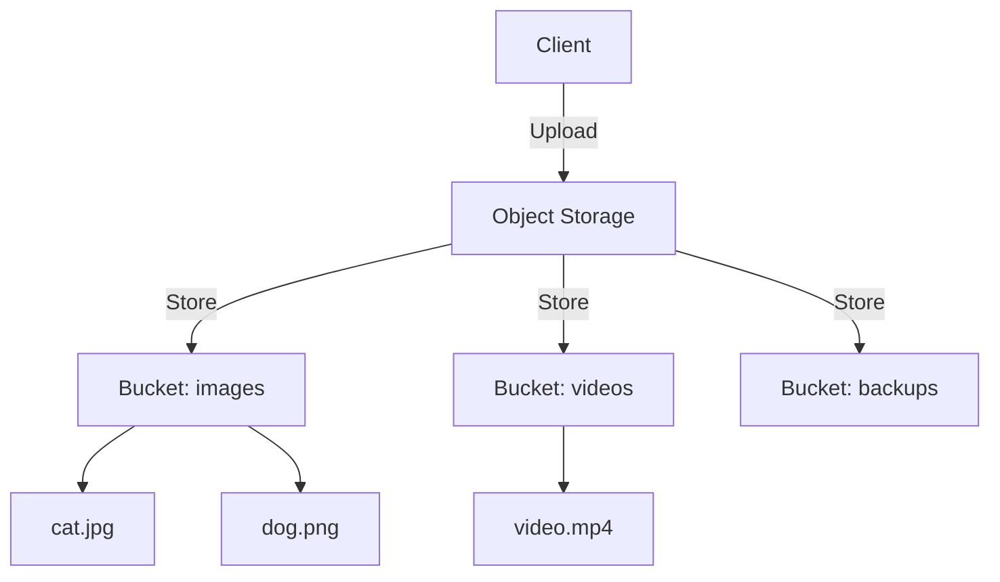
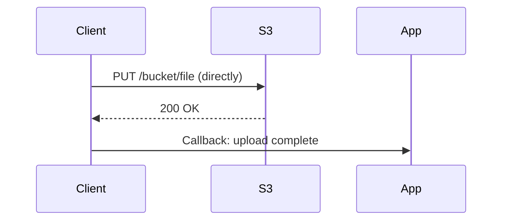
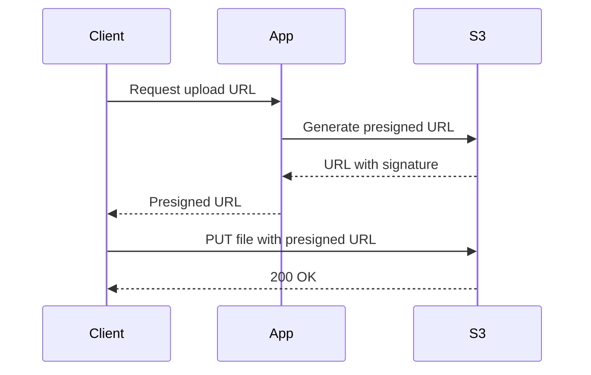
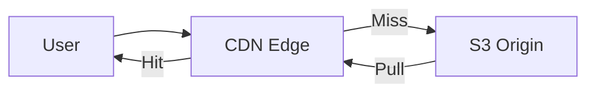
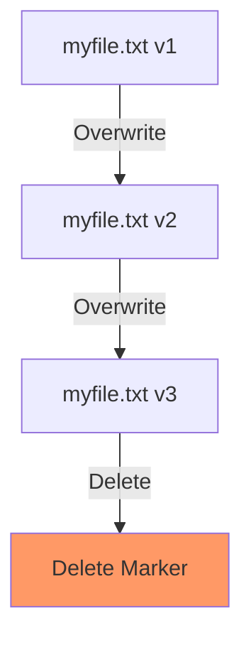

# Object Storage

> **Immutable blob storage for files, images, videos, and backups.**

---

## 1. What is Object Storage?

Object storage stores data as objects (file + metadata) in a flat namespace:



**vs Block Storage**:
| Aspect | Object | Block |
|--------|--------|-------|
| Access | HTTP/REST | Block device |
| Scale | Unlimited | Limited |
| Use Case | Files, media | Databases, OS |
| Updates | Replace whole | In-place |

**vs File Storage**:
| Aspect | Object | File |
|--------|--------|------|
| Protocol | HTTP/S3 | NFS, SMB |
| Hierarchy | Flat with prefixes | Tree |
| Scale | Exabytes | TB-PB |
| Use Case | Cloud-native | Legacy apps |

---

## 2. Core Concepts

### 2.1 Buckets
- Container for objects
- Globally unique name
- Region-based
- Versioning, lifecycle policies

### 2.2 Objects
```
Object = Key + Data + Metadata

Key:        images/2024/cat.jpg
Data:       [binary image data]
Metadata:   {
  content-type: image/jpeg,
  content-length: 1024000,
  last-modified: 2024-01-15T10:30:00Z,
  custom: {user-id: 123}
}
```

### 2.3 Access Patterns
- **RESTful API**: GET/PUT/DELETE over HTTP
- **SDK**: Language-specific libraries
- **CLI**: Command-line tools
- **Mount**: S3FS, RioFS for file-like access

---

## 3. Popular Solutions

| Provider | Service | Use Case |
|----------|---------|----------|
| **AWS** | S3 | Standard cloud storage |
| **Google** | Cloud Storage | GCP integration |
| **Azure** | Blob Storage | Azure ecosystem |
| **MinIO** | Open source | On-prem, K8s |
| **Ceph** | RGW | Self-hosted |
| **Backblaze** | B2 | Cost-effective |

---

## 4. Architecture Patterns

### 4.1 Direct Upload



**Pros**: Simple, no app server bottleneck
**Cons**: Credentials on client, CORS issues

### 4.2 Presigned URL



**Pros**: Secure, no credentials exposed
**Cons**: Extra round-trip

### 4.3 CDN + Origin Pull



**Pros**: Fast for global access, offload origin
**Cons**: Extra cost, cache invalidation needed

---

## 5. Tiering and Lifecycle

| Tier | Use Case | Cost |
|------|----------|------|
| **Standard** | Hot data, frequent access | $0.023/GB |
| **Infrequent** | < once/month access | $0.0125/GB |
| **Glacier** | Archival, 1hr retrieval | $0.004/GB |
| **Deep Archive** | 12hr retrieval | $0.00099/GB |

### Lifecycle Policy Example

```json
{
  "rules": [
    {
      "name": "Move to IA after 30 days",
      "transitions": [
        {"days": 30, "storageClass": "STANDARD_IA"},
        {"days": 90, "storageClass": "GLACIER"},
        {"days": 365, "storageClass": "DEEP_ARCHIVE"}
      ]
    },
    {
      "name": "Delete after 7 years",
      "expiration": {"days": 2555}
    }
  ]
}
```

---

## 6. Versioning



**Why versioning?**
- Protect against accidental deletion
- Maintain audit trail
- Enable easy rollback

---

## 7. Design Considerations

### Q: How do you handle very large files?
**A**: Use multipart upload - split file into parts, upload in parallel, reassemble. Supports files up to 5TB.

### Q: What's the difference between S3 and EBS?
**A**: S3 is object storage (HTTP API), scale unlimited. EBS is block storage (like a hard drive), limited to 64TB, tied to single EC2 instance.

### Q: How do you secure object storage?
**A**: Use IAM policies, bucket policies, ACLs. Enable encryption at rest (SSE-S3, SSE-KMS). Use VPC endpoints for private access.

---

## 8. Failure Scenarios

| Scenario | Impact | Mitigation |
|----------|--------|------------|
| Accidental delete | Data loss | Enable versioning, MFA delete |
| Public exposure | Data leak | Default private, review policies |
| Region outage | Unavailable | Cross-region replication |
| Cost spike | Budget overrun | Lifecycle policies, alerts |

---

## 9. Cost Optimization

| Strategy | Savings |
|----------|---------|
| Lifecycle policies | 60-80% |
| Right-sizing | 20-40% |
| Compression | 30-50% |
| Choose region | 10-30% |
| Reserved capacity | 40-60% |

---

## 10. Interview Narrative

> "For file storage, S3 is the standard. We'd use S3 with lifecycle policies to automatically tier to cheaper storage after 30 days. For our 10TB of user-generated content, this saves ~$200/month. For public content, we'd add CloudFront CDN in front to reduce latency globally. Versioning is enabled for audit and recovery. We'd also implement a presigned URL pattern for secure uploads without exposing credentials."

---

## 11. Follow-up Questions

1. **How do you handle concurrent writes to the same object?**
   - Use versioning - each version is a new object
   - For metadata, use DynamoDB with optimistic locking
   - Or use S3 locking (Object Lock)

2. **How do you implement efficient listing of millions of objects?**
   - Use pagination, not listing all
   - Design keys with prefixes for common queries
   - Consider separate indexes (DynamoDB) for complex queries

3. **What's your backup strategy for object storage?**
   - Cross-region replication for DR
   - Glacier for long-term
   - Point-in-time recovery (if supported)
   - Regular backup to separate account
