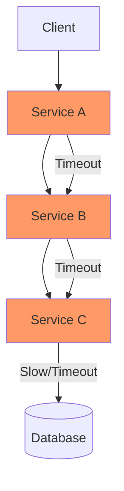
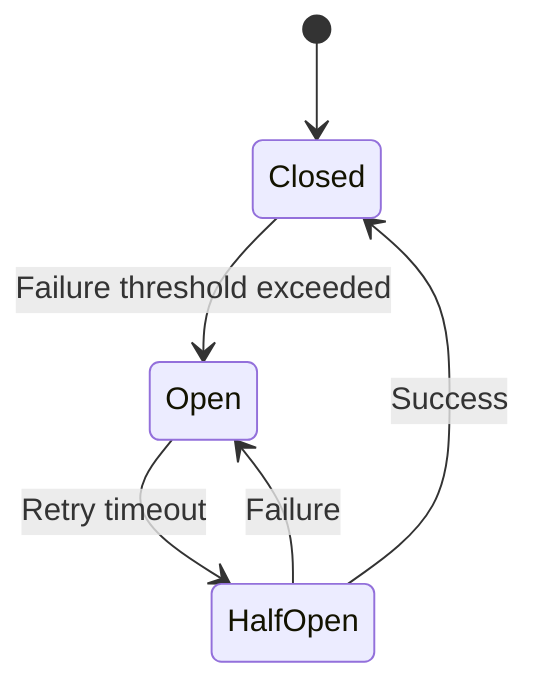

# Circuit Breaker

> **Prevent cascading failures by stopping requests to failing services.**

---

## 1. The Problem: Cascading Failures



Without circuit breaker:
1. Service C slows down
2. Service B times out waiting
3. Service A gets overloaded with requests
4. **Entire system crashes**

---

## 2. The Solution: Circuit Breaker



### States

| State | Behavior |
|-------|----------|
| **Closed** | Requests pass through normally. Failures count up. |
| **Open** | Requests fail immediately. No calls to failing service. |
| **Half-Open** | Limited requests allowed to test recovery. |

---

## 3. Implementation

### Configuration

```python
class CircuitBreaker:
    def __init__(self, failure_threshold=5, 
                 recovery_timeout=30, 
                 half_open_requests=3):
        self.failure_threshold = failure_threshold
        self.recovery_timeout = recovery_timeout
        self.half_open_requests = half_open_requests
        self.failure_count = 0
        self.state = "CLOSED"
        self.last_failure_time = None
```

### Usage

```python
@circuit_breaker(failure_threshold=5, recovery_timeout=30)
def call_payment_service(order_id, amount):
    # This call is protected
    return payment_client.charge(order_id, amount)
```

---

## 4. Key Parameters

| Parameter | Typical Value | Description |
|-----------|---------------|-------------|
| **Failure Threshold** | 5-10 | Failures before opening |
| **Recovery Timeout** | 30-60s | Time before half-open |
| **Success Threshold** | 2-3 | Successes to close |
| **Timeout** | 3-10s | Individual call timeout |

---

## 5. Libraries & Frameworks

| Language | Library |
|----------|---------|
| **Java** | Resilience4j, Hystrix |
| **Go** | Hystrix-go, go-resilience |
| **Python** | pybreaker |
| **Node** | opossum |
| **Envoy** | Built-in |

---

## 6. Fallback Strategies

```python
def get_product(product_id):
    try:
        return product_service.get(product_id)
    except CircuitBreakerOpen:
        # Fallback 1: Return cached data
        return cache.get(f"product:{product_id}")
    except Exception:
        # Fallback 2: Return default
        return Product.default()
```

**Fallback Options**:
1. **Cache**: Return stale data
2. **Default**: Return empty/default
3. **Queue**: Queue request for later
4. **Degrade**: Return simplified response

---

## 7. Design Considerations

### Q: Where do you place circuit breakers?
**A**: At every service-to-service call, especially:
- External service calls
- Database connections
- Any network I/O

### Q: How do you avoid "false positives"?
**A**: Use rolling windows for failure counting. Exclude transient errors (timeouts only, not 404s).

### Q: How do you test circuit breakers?
**A**: Chaos engineering - inject failures, verify circuit opens. Use Chaos Monkey or similar.

---

## 8. Interview Narrative

> "Circuit breakers prevent cascading failures by wrapping calls to unreliable services. When a service fails 5 times in 10 seconds, the circuit opens and fails fast for 30 seconds. This protects the entire system - instead of thousands of pending requests, we fail immediately and return cached/fallback data. We'd use Resilience4j in Java or the built-in circuit breaker in our service mesh."

---

## 9. Follow-up Questions

1. **How is circuit breaker different from retry?**
   - Retry: Try again on failure
   - Circuit breaker: Stop trying after failures
   - Use both: Retry with backoff within circuit

2. **How do you handle partial failures?**
   - Bulkhead pattern: Separate pools
   - Fallback: Return degraded response
   - Timeout: Don't wait forever

3. **What's the difference between fail-fast and fail-safe?**
   - Fail-fast: Return error immediately
   - Fail-safe: Return default/empty, log error
   - Choose based on criticality
