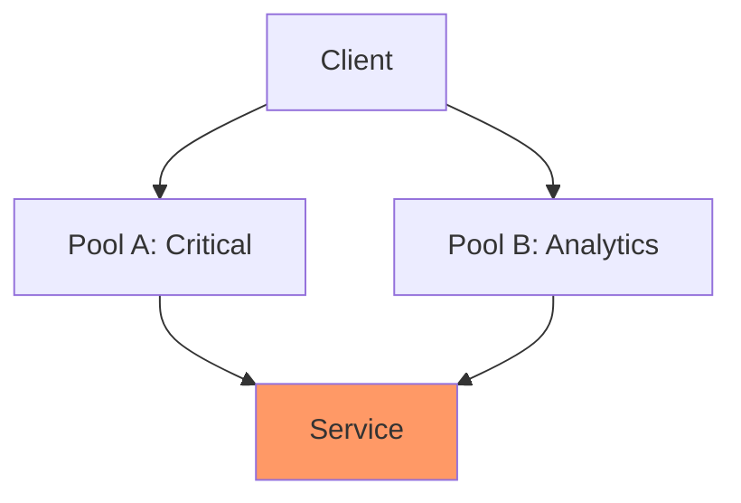
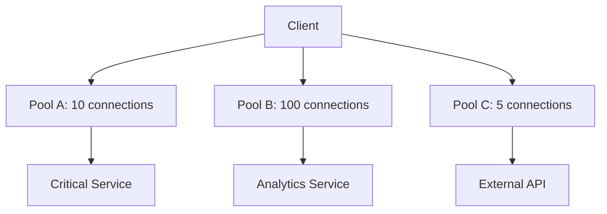
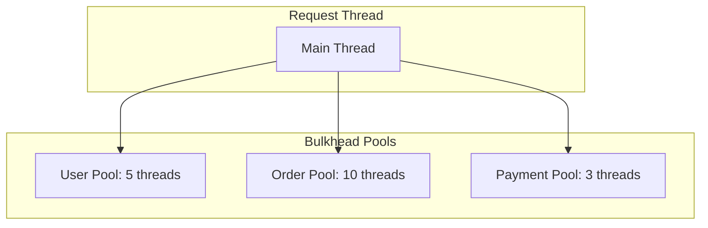
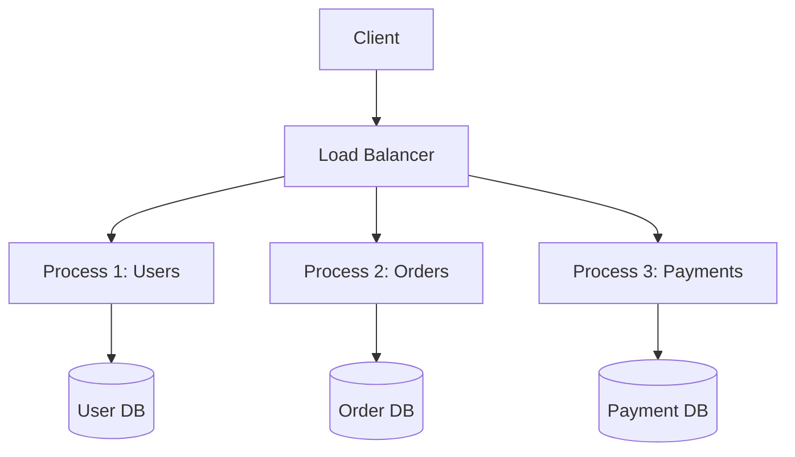

# Bulkhead Pattern

> **Isolate failures to prevent total system collapse.**

---

## 1. The Problem



One misbehaving service consumes all connections, affecting everything.

---

## 2. The Bulkhead Solution



**Isolation Levels**:
- **Connection Pool**: Separate pools per service
- **Thread Pool**: Separate threads per service
- **Process**: Separate processes
- **Region**: Separate deployments

---

## 3. Implementation

### Connection Pool Bulkhead

```python
# Each service has its own pool
user_pool = ConnectionPool(max_connections=10)
order_pool = ConnectionPool(max_connections=50)
analytics_pool = ConnectionPool(max_connections=100)

async def get_user(user_id):
    async with user_pool.connection() as conn:
        return await conn.query("SELECT * FROM users...")

async def get_orders(order_id):
    async with order_pool.connection() as conn:
        return await conn.query("SELECT * FROM orders...")
```

### Thread Pool Bulkhead

```java
// Separate thread pools in Java
@Bulkhead(value = "userService", fallingBack = "fallback")
public User getUser(String id) {
    return userClient.get(id);
}

@Bulkhead(value = "orderService", fallingBack = "fallback")
public Order getOrder(String id) {
    return orderClient.get(id);
}
```

---

## 4. Comparison with Circuit Breaker

| Aspect | Bulkhead | Circuit Breaker |
|--------|----------|-----------------|
| **Purpose** | Isolate resources | Stop failing calls |
| **Trigger** | Pre-allocation | Failure threshold |
| **Failure** | One pool saturates | All calls fail fast |
| **Together** | Yes - use both | Yes - use both |

---

## 5. Design Patterns

### Thread Pool Isolation



### Process Isolation



---

## 6. Interview Narrative

> "Bulkheads isolate resources so one failing service doesn't consume everything. We'd have separate connection pools: 10 connections for critical payment service, 50 for analytics. If analytics misbehaves, it hits its own limit and doesn't starve payments. Combined with circuit breakers, we get defense in depth - bulkheads prevent resource exhaustion, circuit breakers stop calling failing services."

---

## 7. Follow-up Questions

1. **How do you determine pool sizes?**
   - Measure actual usage under load
   - Reserve capacity for critical paths
   - Monitor for saturation

2. **What's the cost of bulkheads?**
   - More resources (pools, threads)
   - Potential underutilization
   - Complexity in management
