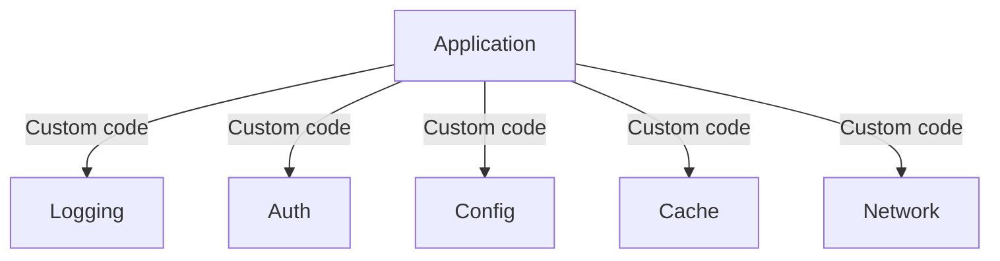
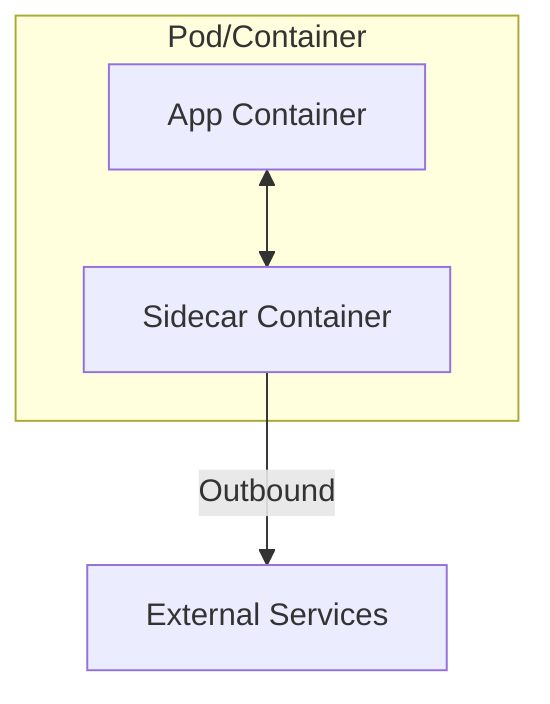
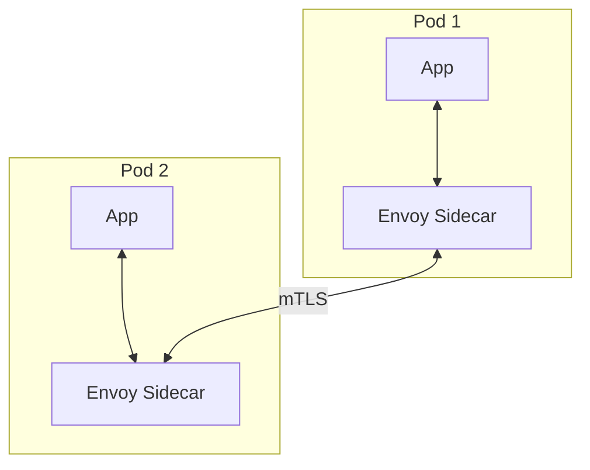
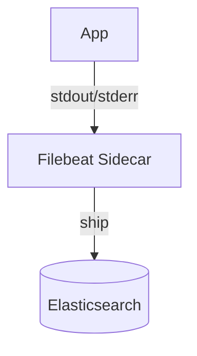
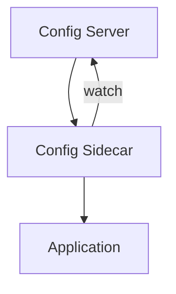

# Sidecar Pattern

> **Extend application functionality without modifying the application code.**

---

## 1. The Problem



Applications need cross-cutting concerns but:
- Pollutes application code
- Different implementations per language
- Hard to update independently

---

## 2. The Sidecar Solution



**Sidecar runs alongside the main container**:
- Same lifecycle
- Shared resources
- Independent scaling

---

## 3. Common Use Cases

### 3.1 Service Mesh



**Envoy Sidecar provides**:
- Service discovery
- Load balancing
- mTLS
- Retries, timeouts
- Metrics, tracing

### 3.2 Log Aggregation



### 3.3 Configuration Sync



---

## 4. Implementation (Kubernetes)

```yaml
apiVersion: v1
kind: Pod
metadata:
  name: myapp
spec:
  containers:
  - name: app
    image: myapp:latest
    ports:
    - containerPort: 8080
  - name: envoy
    image: envoyproxy/envoy:latest
    ports:
    - containerPort: 8000
    volumeMounts:
    - name: envoy-config
      mountPath: /etc/envoy
  volumes:
  - name: envoy-config
    configMap:
      name: envoy-config
```

---

## 5. Service Mesh Comparison

| Mesh | Data Plane | Control Plane | Use Case |
|------|------------|---------------|----------|
| **Istio** | Envoy | Istiod | Full-featured |
| **Linkerd** | Linkerd-proxy | Linkerd-controller | Simpler, lighter |
| **Consul Connect** | Envoy | Consul | HashiCorp ecosystem |
| **Cilium** | Cilium-agent | Cilium-operator | eBPF-based |

---

## 6. Design Considerations

### Q: What's the difference between sidecar and ambassador?
**A**: 
- **Sidecar**: Modifies outbound traffic from within pod
- **Ambassador**: Typically a separate pod handling external traffic

### Q: What's the performance impact?
**A**: 
- Network hop through sidecar (~1-2ms)
- CPU for sidecar processing
- Memory for sidecar process

### Q: How do you secure sidecars?
**A**:
- Minimal permissions (principle of least privilege)
- mTLS between sidecars
- Regular security updates

---

## 7. Interview Narrative

> "Sidecars extend application functionality without code changes. We'd use Istio with Envoy sidecars for service mesh - it handles mTLS, retries, circuit breaking transparently. The sidecar intercepts all traffic, so we get observability without application changes. For configuration, we'd use a config-sync sidecar that watches a config server and signals the app to reload. This separates concerns: the sidecar handles infrastructure, the app handles business logic."

---

## 8. Follow-up Questions

1. **How do you debug sidecar issues?**
   - Logs: `kubectl logs <pod> -c <sidecar>`
   - Metrics: Sidecar Prometheus endpoint
   - Network: `kubectl exec` into sidecar

2. **What's the difference between sidecar and init container?**
   - Init: Runs once at startup, exits
   - Sidecar: Runs for pod lifetime

3. **How do you handle sidecar failures?**
   - Separate liveness probes for app and sidecar
   - Restart sidecar without restarting app
