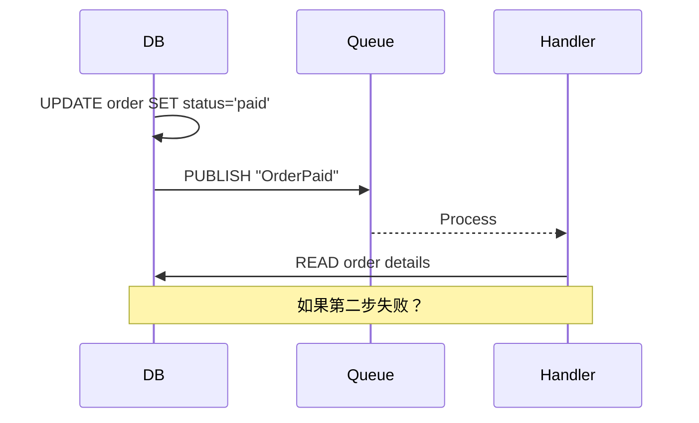
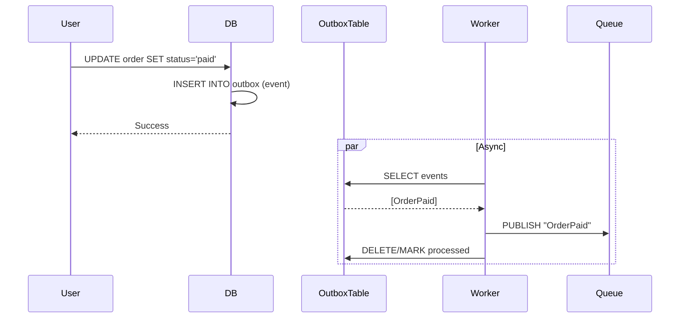
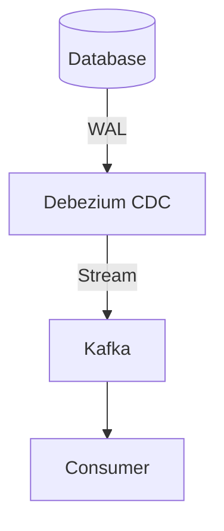

# Outbox Pattern

> **可靠地发布领域事件，同时更新业务数据和发布事件。**

---

## 1. The Problem



**Issue**: 更新数据库和发布消息不是原子的。如果数据库成功但消息失败，数据不一致。

---

## 2. The Outbox Solution



**Two database operations (atomic)**:
1. 更新业务数据
2. 插入事件到 outbox 表

**然后异步发布** outbox 事件到消息队列

---

## 3. Implementation

### Database Schema

```sql
-- 业务表
CREATE TABLE orders (
    id UUID PRIMARY KEY,
    customer_id UUID,
    status VARCHAR(20),
    total DECIMAL(10,2),
    created_at TIMESTAMP
);

-- Outbox 表
CREATE TABLE outbox (
    id UUID PRIMARY KEY,
    aggregate_type VARCHAR(50),
    aggregate_id UUID,
    event_type VARCHAR(50),
    payload JSONB,
    created_at TIMESTAMP,
    processed_at TIMESTAMP,
    
    INDEX idx_created (created_at),
    INDEX idx_unprocessed (processed_at)
);
```

### Application Code

```python
async def process_payment(order_id: str, amount: Decimal):
    async with db.transaction():
        # 1. 更新订单状态
        await db.execute(
            "UPDATE orders SET status='paid' WHERE id = ?", 
            order_id
        )
        
        # 2. 写入 outbox（同一事务）
        await db.execute(
            """INSERT INTO outbox 
               (id, aggregate_type, aggregate_id, event_type, payload, created_at)
               VALUES (?, 'order', ?, 'PaymentReceived', ?, now())""",
            uuid4(), order_id, json.dumps({"amount": str(amount)})
        )
```

### Worker

```python
async def outbox_worker():
    while True:
        events = await db.fetch_all(
            """SELECT * FROM outbox 
               WHERE processed_at IS NULL 
               ORDER BY created_at 
               LIMIT 100"""
        )
        
        for event in events:
            try:
                await message_queue.publish(
                    topic=event["event_type"],
                    payload=event["payload"]
                )
                await db.execute(
                    "UPDATE outbox SET processed_at = NOW() WHERE id = ?",
                    event["id"]
                )
            except Exception as e:
                # 重试逻辑
                await handle_failure(event, e)
        
        await asyncio.sleep(1)
```

---

## 4. Debezium CDC Alternative



**使用 Debezium 代替自定义 worker**:
- 读取数据库事务日志
- 自动发布变更事件到 Kafka
- 无需修改应用代码

---

## 5. Design Considerations

### Q: 为什么不用分布式事务？
**A**: 
- 两阶段提交（2PC）性能差
- 需要所有参与者支持
- Outbox 是更轻量的替代方案

### Q: Outbox 事件会重复吗？
**A**: 
- 可能（至少一次投递）
- 消费者需要幂等处理
- 使用事件 ID 去重

### Q: 如何处理大流量？
**A**:
- 批量处理（每次 100 条）
- 并行 worker
- 分区（按 aggregate_id）

---

## 6. Interview Narrative

> "Outbox 模式解决数据库更新和消息发布不是原子操作的问题。我们把业务更新和事件插入放在同一个数据库事务中，然后用异步 worker 从 outbox 表读取事件发布到消息队列。这保证了至少一次投递， consumers 需要处理幂等。对于高流量场景，我们会批量读取并并行可以处理，每秒处理数万事件。"

---

## 7. Follow-up Questions

1. **如何确保事件按顺序处理？**
   - 按 aggregate_id 分区
   - 同一订单的事件进入同一分区
   - Kafka 保证分区内的顺序

2. **如果 worker 崩溃了会怎样？**
   - 未处理的事件留在 outbox 表
   - 重启后继续处理
   - 确保 at-least-once 语义

3. **Outbox 表会无限增长吗？**
   - 定期清理已处理的事件
   - 归档到冷存储
   - 设置保留策略
