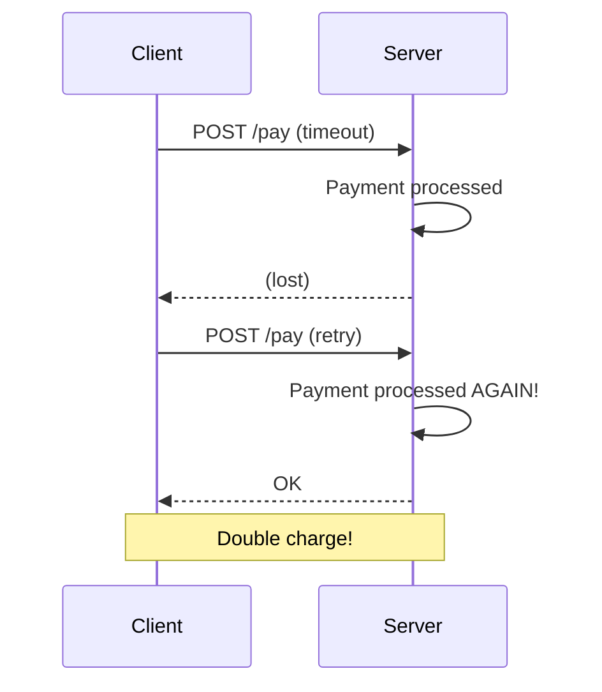
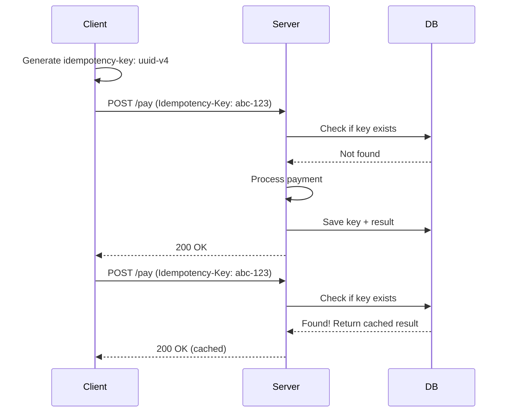

# Idempotency Patterns

> **确保相同的请求执行多次产生相同的结果。**

---

## 1. The Problem



**问题**:
- 网络超时导致重试
- 客户端重试
- **重复扣款！**

---

## 2. 什么是幂等？

```
幂等操作: f(f(x)) = f(x)

例子:
- GET /user/123 - 幂等（读多次不变）
- PUT /user/123 - 幂等（多次 PUT 相同结果）
- DELETE /user/123 - 幂等（多次删除结果相同）
- POST /pay - 非幂等（多次 POST = 多次扣款）
```

---

## 3. Idempotency Key Implementation

### 3.1 客户端生成 Key



### 3.2 API Design

```http
POST /api/payments
Idempotency-Key: 550e8400-e29b-41d4-a716-446655440000
Content-Type: application/json

{
  "amount": 100.00,
  "currency": "USD",
  "order_id": "order-123"
}
```

### 3.3 Server Implementation

```python
class IdempotencyMiddleware:
    def __init__(self, ttl_seconds=86400):
        self.cache = Redis()
        self.ttl = ttl_seconds
    
    async def __call__(self, request, handler):
        key = request.headers.get("Idempotency-Key")
        if not key:
            return Response(400, "Idempotency-Key required")
        
        # 检查缓存
        cached = await self.cache.get(f"idemp:{key}")
        if cached:
            return Response(200, json.loads(cached))
        
        # 处理请求
        response = await handler(request)
        
        # 缓存结果
        await self.cache.setex(
            f"idemp:{key}", 
            self.ttl,
            json.dumps(response.body)
        )
        
        return response
```

---

## 4. Database Schema

```sql
CREATE TABLE idempotency_keys (
    key VARCHAR(64) PRIMARY KEY,
    request_hash VARCHAR(64),
    response_body JSONB,
    response_status INT,
    created_at TIMESTAMP DEFAULT NOW(),
    expires_at TIMESTAMP
);

-- 索引用于清理
CREATE INDEX idx_expires ON idempotency_keys(expires_at);
```

---

## 5. 不同操作的幂等策略

| Operation | Idempotent? | Strategy |
|-----------|-------------|----------|
| **GET** | Yes | 直接返回 |
| **PUT** | Yes | 完全替换 |
| **DELETE** | Yes | 404 = 已删除 |
| **PATCH** | Usually no | 幂等键 |
| **POST** | No | 幂等键 + 事务 |
| **Payments** | No | 幂等键 + 唯一约束 |

---

## 6. Design Considerations

### Q: 幂等键的生命周期？
**A**:
- 短期: 24-48 小时（支付场景）
- 长期: 几个月（订单场景）
- 根据业务需求

### Q: 如何处理并发请求？
**A**:
```python
# 使用数据库唯一约束
INSERT INTO idempotency_keys (key, ...) 
VALUES (?, ...) 
ON CONFLICT (key) DO NOTHING;
```

### Q: 幂等键需要包含什么信息？
**A**:
- 唯一标识符（UUID）
- 建议包含请求哈希
- 防止不同请求使用相同键

---

## 7. Interview Narrative

> "对于支付等非幂等操作，我们使用幂等键模式。客户端生成唯一键（UUID），第一次请求时处理并缓存结果，后续相同键的请求直接返回缓存结果。幂等键设置 24-48 小时过期，支付场景足够。为确保安全，数据库使用唯一约束防止并发问题。"

---

## 8. Follow-up Questions

1. **GET 请求需要幂等键吗？**
   - 不需要，GET 本身就是幂等的
   - 但可以使用缓存

2. **如何处理部分成功的请求？**
   - 使用数据库事务
   - 记录处理状态
   - 支持重试

3. **幂等键的存储策略？**
   - Redis 用于高性能场景
   - PostgreSQL 用于需要持久化
   - 结合两者（Redis + 持久化）
