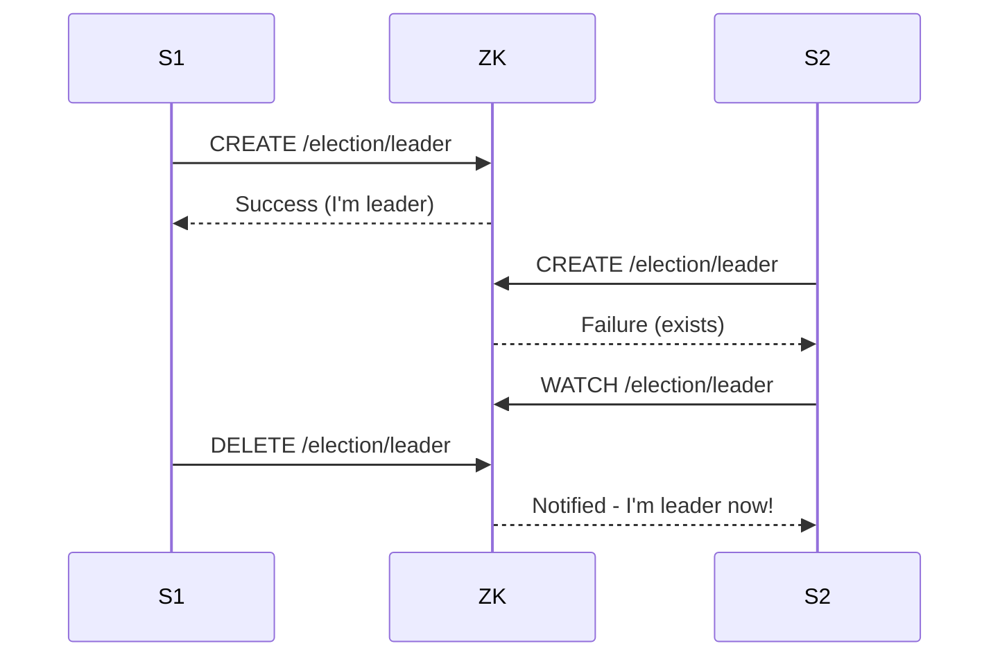
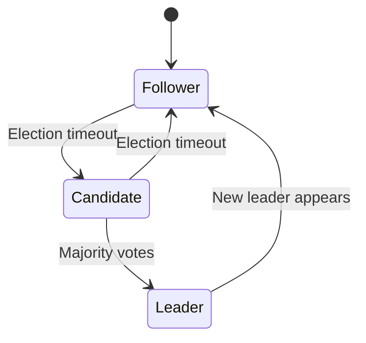
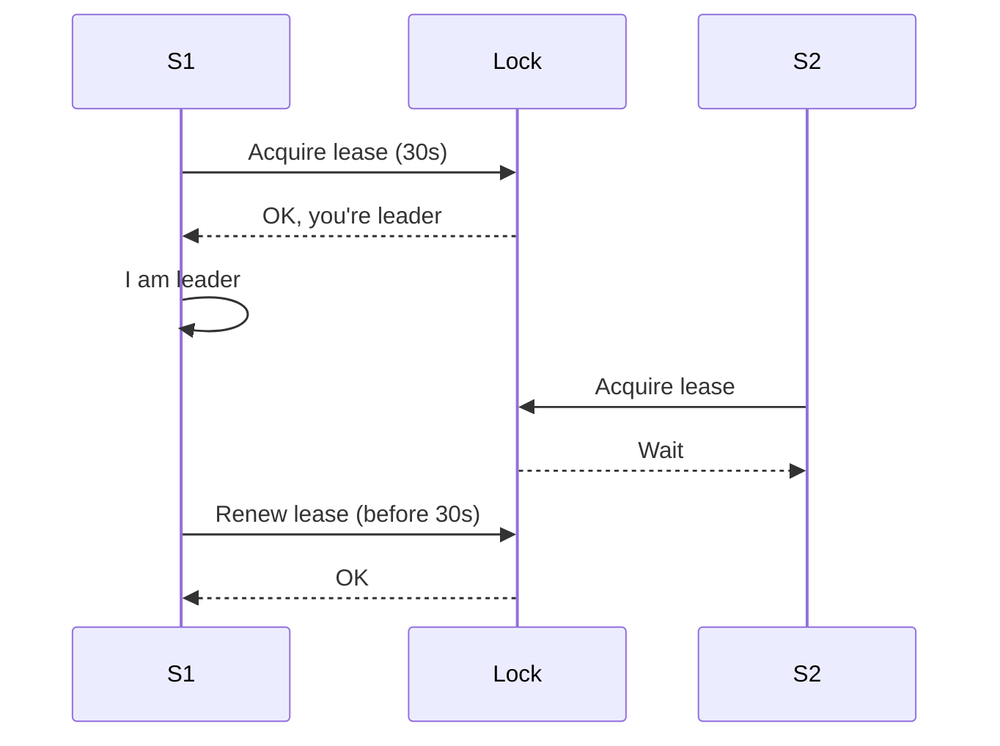

# Leader Election

> **在分布式系统中选择一个领导者来协调操作。**

---

## 1. The Problem

```mermaid
graph TB
    C1[Client 1] --> S1[Server 1]
    C2[Client 2] --> S2[Server 2]
    C3[Client 3] --> S3[Server 3]
    S1 -->|冲突| DB[(Database)]
    S2 -->|冲突| DB
    S3 -->|冲突| DB
    Note over S1,S3: 谁写入？
```

**问题**:
- 多个服务器竞争资源
- 数据冲突
- 需要一个协调者

---

## 2. Leader Election Patterns

### 2.1 中央协调者 (ZooKeeper/etcd)



### 2.2 Raft Consensus



### 2.3 Lease/Lock Based



---

## 3. Implementation with etcd

```go
// 竞选领导者
func ElectLeader(ctx context.Context, client *v3.Client, nodeID string) {
    key := "/election/" + nodeID
    
    // 尝试创建临时节点
    resp, err := client.Put(ctx, key, "running", v3.WithPrevKV())
    if err != nil {
        return
    }
    
    if resp.PrevKv != nil {
        // 节点已存在，等待变更
        watch := client.Watch(ctx, "/election/", v3.WithPrefix())
        for {
            select {
            case <-ctx.Done():
                return
            case ev := <-watch:
                // 领导者已变更，重新竞选
                ElectLeader(ctx, client, nodeID)
            }
        }
    }
    
    // 成为领导者
    fmt.Println("I am the leader!")
    
    // 心跳续约
    keepAlive(ctx, client, key)
}
```

---

## 4. Use Cases

| Use Case | Why Need Leader |
|----------|-----------------|
| **Database Primary** | 单点写入，避免冲突 |
| **Job Scheduler** | 避免重复任务 |
| **Distributed Lock** | 释放锁时通知 |
| **Config Updates** | 防止配置冲突 |
| **Rate Limiter** | 单一计数器 |

---

## 5. Comparison

| Approach | Pros | Cons |
|----------|------|------|
| **etcd/ZooKeeper** | 可靠，成熟 | 额外依赖 |
| **Raft** | 无外部依赖 | 需要集成 |
| **Database** | 简单 | 性能差 |
| **Lease** | 简单 | 需要时钟同步 |

---

## 6. Failure Scenarios

| Scenario | Impact | Mitigation |
|----------|--------|------------|
| Leader crash | 短时不可用 | 快速选举 |
| 网络分区 | 分裂脑 | 多数派规则 |
| 时钟漂移 | Lease 失效 | NTP 同步 |

---

## 7. Interview Narrative

> "领导者选举确保在分布式系统中只有一个协调者。我们使用 etcd 的 Raft 实现：多个服务尝试创建临时节点，成功者成为领导者。其他服务监听节点变更，领导者失败时自动重新选举。为处理时钟问题，Lease 有 30 秒超时，需要持续续约。这确保了高可用 - 旧领导者崩溃后 30 秒内选出新领导者。"

---

## 8. Follow-up Questions

1. **如何处理选举过程中的脑裂？**
   - 使用多数派投票
   - 需要多数节点同意才能成为领导者
   - 网络分区时只有多数派那一边能选举

2. **领导者需要处理什么特定任务？**
   - 写入操作
   - 协调分布式事务
   - 任务分配

3. **如何测试领导者选举？**
   - 杀掉领导者进程
   - 网络分区测试
   - 时钟偏移测试
