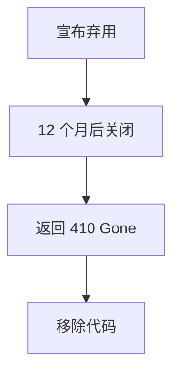

# API Versioning Strategies

> **在不破坏现有客户端的前提下演进 API。**

---

## 1. 为什么要版本控制？

```
发布 v1:
GET /api/users

后来需要修改响应格式:
{
  "user": { "name": "John" }
}

改成:
{
  "data": { "name": "John", "full_name": "John Doe" }
}

❌ 破坏现有客户端！
✅ 引入 v2
```

---

## 2. 版本控制策略

### 2.1 URL Path (最常用)

```
✅ 推荐

GET  /api/v1/users
GET  /api/v2/users

优点:
- 清晰可见
- 简单易用
- 缓存友好

缺点:
- URL 变更
```

### 2.2 Query Parameter

```
GET /api/users?version=2

优点:
- 单个 URL
- 客户端可控

缺点:
- 难以缓存
- 默认版本不明确
```

### 2.3 Header

```
GET /api/users
Accept-Version: v2

或:

GET /api/users
Accept: application/vnd.myapp.v2+json

优点:
- URL 不变
- 灵活

缺点:
- 不直观
- 调试困难
```

### 2.4 Media Type

```
GET /api/users
Accept: application/vnd.myapp.user.v2+json

优点:
- RESTful
- 声明式

缺点:
- 复杂
- 客户端支持有限
```

---

## 3. 版本策略

### 3.1 线性版本

```
v1.0 → v1.1 → v1.2 → v2.0 → v2.1
|_____|         |_____|         
  补丁            主版本
```

**策略**: 
- 保持旧版本至少 12 个月
- 定期弃用通知

### 3.2 雪花版本 (并行多个)

```
同时维护:
- v1 (稳定客户)
- v2 (新功能)
- v3 (测试版)

成本: O(n) 个版本
```

### 3.3 持续版本

```
不显式版本:
/api/users

通过媒体类型区分:
Accept: application/vnd.myapp+json;version=2

所有客户端自动获得最新版本
```

---

## 4. 弃用策略

### 4.1 弃用流程



### 4.2 弃用响应头

```http
GET /api/v1/users

Deprecation: true
Sunset: Sat, 01 Jan 2025 00:00:00 GMT
Link: <https://api.example.com/v2/users>; rel="successor-version"
```

### 4.3 客户端适配

```python
# 客户端自动降级
if response.status == 410:
    switch_to_new_version()
elif response.status == 429:
    rate_limit()
```

---

## 5. 最佳实践

### 5.1 何时需要新版本？

```yaml
需要新版本:
- 响应格式变化
- 字段删除
- 字段语义变化
- 必需字段变化

不需要版本:
- 添加可选字段
- 添加新端点
- 文档改进
- Bug 修复
```

### 5.2 响应兼容性

```json
// v1
{
  "id": 1,
  "name": "John"
}

// v2 (保持向后兼容)
{
  "id": 1,
  "name": "John",
  "full_name": "John Doe",  // 新字段
  "age": null               // 新字段（可空）
}

// ❌ v2 (破坏兼容)
{
  "name": "John"  // id 字段被移除
}
```

### 5.3 模式版本控制

```json
// schema.json
{
  "$schema": "http://json-schema.org/draft-07/schema#",
  "version": "1.0.0",
  "type": "object",
  "properties": {
    "id": { "type": "integer" },
    "name": { "type": "string" }
  }
}
```

---

## 6. 成本与策略

| 策略 | 开发成本 | 维护成本 | 复杂度 |
|------|----------|----------|--------|
| URL 版本 | 低 | 中 | 低 |
| Header | 中 | 中 | 中 |
| 媒体类型 | 高 | 高 | 高 |

**推荐**: URL 路径版本控制（最直观、最常用）

---

## 7. Interview Narrative

> "API 版本控制我推荐 URL 路径方式（/v1/、/v2/），因为它最直观、便于调试、缓存友好。每个主版本保持 12 个月以上的兼容期，期间通过 Deprecation 响应头通知客户端迁移。添加新字段时保持向后兼容，只在破坏性变更时才引入新版本。我们会同时运行最多 2 个版本，老版本超时后下线。"
