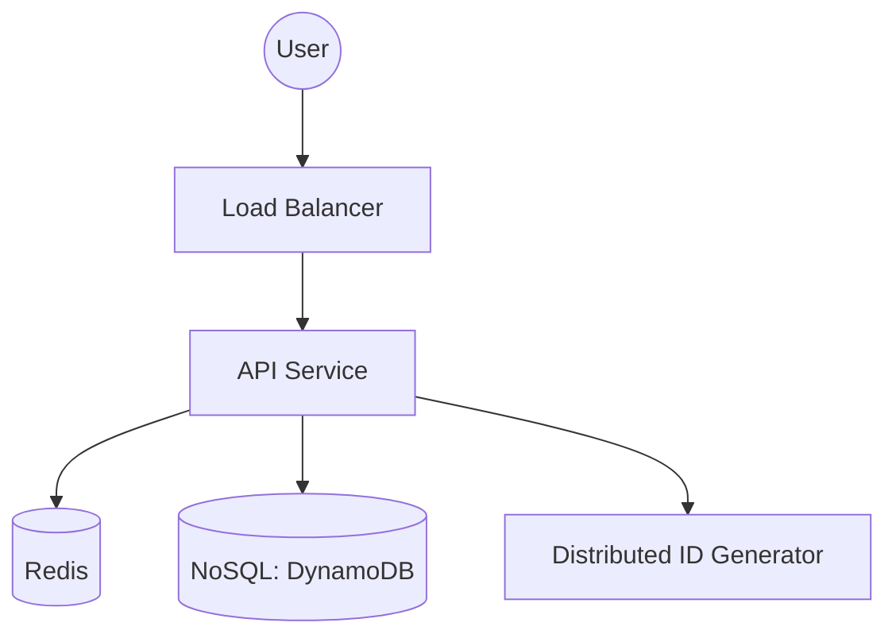

# 🔗 URL Shortener (Standard vs. Staff Level)

> **Staff-Signal**: It's the "Hello World" of system design. Can you move past the basics and discuss distributed ID generation, collision handling, and caching hot-keys?

---

## 1. Problem Statement
Design a service like **bit.ly** or **tinyurl.com** that shortens a long URL and redirects users.

---

## 2. Clarifying Questions
*   **Scale**: 100M URLs created per day. 10B total URLs.
*   **Custom URLs**: Do we support custom aliases (e.g., `bit.ly/my-sale`)? (Yes, if available).
*   **Analytics**: Do we track click counts? (Yes).
*   **Lifecycle**: Do URLs expire? (Default 5 years).

---

## 3. Requirements
### Functional
*   Generate a unique short link for a given long URL.
*   Redirect short link → original long URL.
*   Support custom aliases.
### Non-Functional
*   **Low Latency**: Redirects should be < 20ms at P99.
*   **Persistence**: Once link is created, it cannot be lost.
*   **Scalability**: Handle 150K+ reads per second.

---

## 4. Capacity Estimation (Worked Math)
*   **Write QPS**: 100M / 86400s ≈ **1,200 writes/sec**.
*   **Read QPS**: Assume 100:1 read/write ratio. **120,000 reads/sec**.
*   **Storage (5 years)**: 100M * 365 * 5 = **182 Billion URLs**.
*   **Size**: id (8B) + url (500B) + metadata ≈ 512 bytes.
*   **Total Disk**: 182B * 512B ≈ **100 Terabytes**.

---

## 5. API Design
### `POST /v1/shorten`
```json
{
  "long_url": "https://example.com/very/long/path",
  "alias": "optional-custom-name"
}
```
**Response**: `201 Created` with `{"short_url": "t.co/xyz123"}`.

### `GET /:short_id`
Returns `301 Moved Permanently`. (Important: Use 301 for SEO and to let the browser cache the redirect).

---

## 6. Data Model (NoSQL for Scale)
A simple Key-Value store is best. Shard by `short_id`.
*   **Table: ShortURL**
    *   `short_id` (Partition Key - Base62 encoded)
    *   `long_url`
    *   `created_at`, `expires_at`

---

## 7. High-Level Architecture


---

## 8. Component Deep Dive: Distributed ID Generation
How do we generate 10B unique IDs without collision?
1.  **MD5/SHA Hash**: Take MD5 of long URL, take first 7 chars.
    - **Problem**: Collisions are possible. Requires constant DB checking.
2.  **Range Handler (Zookeeper)**:
    - **Winner**: A central service assigns a "Range" of IDs (e.g., 1 to 1M) to each server. Servers increment locally. No coordination needed for 1M writes.
    - When a server exhaustion its range, it asks Zookeeper for a new one.

---

## 9. Data Flow (Implementation)
1.  **Write**: User sends URL -> Server pulls ID from local range -> Save to DB & Cache -> Return.
2.  **Read**: User hits short link -> Check Redis -> If Miss, Check DB -> Populate Cache -> 301 Redirect.

---

## 10. Bottlenecks & Caching
*   **Hot Keys**: A viral tweet causes 1M hits on one `short_id`.
    *   **Solution**: Redis cluster with LRU eviction. At 150k QPS, memory-native cache is mandatory.

---

## 11. Scaling Strategy
*   **Database**: Shard by `short_id` hash. 
*   **Compute**: API servers are stateless; scale horizontally in an Auto-scaling group.

---

## 12. Failure Scenarios
*   **ID Generator Down**: Use pre-fetched ranges on the API servers to survive a 1-hour outage of the generator.
*   **DB Slow Down**: Redirect path should prioritize Cache.

---

## 13. Tradeoffs

| Topic | Pro | Con |
| :--- | :--- | :--- |
| **Base62 Encoding** | Highly readable URLs | Limited character set |
| **301 vs 302 Redirect** | 301 (Permanent) reduces server load | No analytics on subsequent clicks |

---

## 14. Monitoring Strategy
*   **Cache Hit Rate**: Monitor percentage of redirects served from Redis.
*   **ID Range Exhaustion**: Alert if the Zookeeper range pool is < 20%.

---

## 15. The Interview Narrative
> "To build a URL shortener at 100M URL/day scale, I prioritize write-throughput and read-latency. I utilize a **Distributed ID Generator** with range-based pre-fetching via Zookeeper to ensure collision-free keys without a central bottleneck. For high-speed redirects, I use a **Redis-first** read strategy with 301 status codes to leverage browser-side caching, while sharding the underlying **NoSQL store** by the short ID for horizontal scalability."

---

## 16. Follow-up Questions
1.  **"How do you prevent malicious URLs?"** (Answer: Integrate with Google Safe Browsing API during shorten phase).

---

## 17. Common Mistakes
1.  **Using a single SQL database** for 100TB of data without a sharding strategy.
2.  **Hashing logic without collision handling**.
3.  **Forgetting about the 'Custom Alias' conflict** (Custom aliases can't be part of the range-based IDs).
