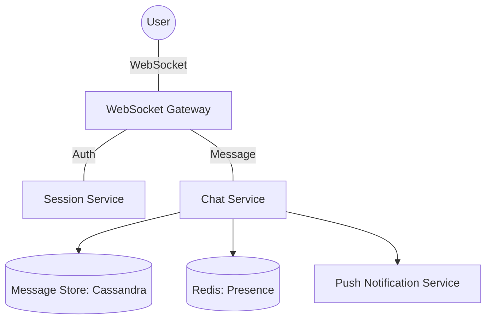

# 💬 Real-Time Chat System (WhatsApp / Messenger Scale)

> **Staff-Signal**: How do you handle 1:1 chat vs. group chats with 10k members? How do you ensure "Seen" receipts don't DOS your database?

---

## 1. Problem Statement
Design a real-time messaging service that supports 1:1 and group chats.

---

## 2. Clarifying Questions
*   **Scale**: 1B users, 50B messages/day.
*   **Real-time**: Latency < 100ms for message delivery.
*   **Features**: Seen receipts, Last seen, Media sharing.
*   **Persistence**: Messages must be stored forever.

---

## 3. Requirements
### Functional
*   Send / Receive 1:1 messages.
*   Group chats (up to 500 members).
*   Online/Offline status.
*   Message delivery/seen receipts.

### Non-Functional
*   **Low Latency**: Real-time feel is critical.
*   **High Availability**: 99.99%.
*   **Consistency**: Message ordering must be preserved per conversation.

---

## 4. Capacity Estimation (Worked Math)
*   **Messages**: 50B / 86400s ≈ **600,000 messages/sec**.
*   **Storage**: 50B * 100 bytes/msg ≈ **5 TB/day**.
*   **Connections**: 1B total users, assume 100M concurrent users. **100M active WebSockets**.
*   **Bandwidth**: 100 bytes * 600k msg/s ≈ **60 MB/sec** (Metadata only).

---

## 5. API Design
### `POST /v1/messages` (For HTTP fallback)
### `WebSocket: SEND_MESSAGE`
```json
{
  "to": "user_id_123",
  "content": "Hello",
  "type": "text",
  "client_msg_id": "uuid-for-idempotency"
}
```

---

## 6. Data Model (NoSQL is Mandatory)
A Relational DB cannot handle 600k writes/sec. Use a Wide-Column store (**Cassandra/HBase**).
*   **Table: Messages**
    *   `partition_key`: `conversation_id`
    *   `sort_key`: `message_id` (TimeUUID / Snowflake)
    *   `content`, `sender_id`, `timestamp`
*   **Table: Presence** (Redis)
    *   `user_id` -> `{"status": "online", "last_active": "..."}`

---

## 7. High-Level Architecture


---

## 8. Component Deep Dive: WebSocket Gateway
How do you track 100M connections?
- **Stateless Gateway**: The Gateway doesn't store the app logic, just the socket.
- **Session Repository**: A Redis map `User_ID -> Gateway_IP`.
- **Flow**: When User A sends to User B:
    1.  Lookup User B's Gateway IP in Redis.
    2.  Forward message to that Gateway IP via RPC.
    3.  Gateway pushes to User B's socket.

---

## 9. Data Flow (1:1 Message)
1.  **Sender** sends message via WebSocket.
2.  **Gateway** assigns a server-side timestamp and saves to **Cassandra**.
3.  **Gateway** acknowledges Receiver is online via **Presence Redis**.
4.  If **Online**: Push via WebSocket.
5.  If **Offline**: Send to **Apple/Google Push Notification (APNS/FCM)**.

---

## 10. Bottlenecks: The "Seen" Receipt Storm
If every message generates 2 more messages (Delivered, Seen), traffic triples.
*   **Staff Solution**: **Batching & Aggregation**. 
    - Don't send a "Seen" event for every single word. Send one "Seen" event with the `last_read_message_id`.
    - Receiver updates their local UI based on that ID.

---

## 11. Scaling Strategy
*   **Cassandra Sharding**: Shard by `conversation_id` so all messages for one chat are on the same physical node (for fast sequential reads).
*   **Redis Sharding**: Use Redis Cluster or consistent hashing for the 100M presence keys.

---

## 12. Failure Scenarios
*   **Gateway Crash**: 1M users disconnect at once.
    - **Thundering Herd**: They all try to reconnect instantly.
    - **Fix**: Use **Exponential Backoff with Jitter** on the client side for reconnections.

---

## 13. Tradeoffs

| Choice | Pro | Con |
| :--- | :--- | :--- |
| **WebSocket** | Bi-directional, low overhead | Hard to load balance, stateful on server |
| **Long Polling** | Works over standard HTTP/1.1 | High overhead, "Hanging" connections |

---

## 14. Monitoring Strategy
*   **Message E2E Latency**: Time from Sender Send to Receiver ACK.
*   **Socket Density**: Number of connections per server (ideal: ~50k-100k).

---

## 15. The Interview Narrative
> "To scale a chat system to 1B users, I decouple the **Real-time Connection Layer** from the **Message Persistence Layer**. I utilize a pool of stateless **WebSocket Gateways** tracked by a global **Session Mapping in Redis** to route messages. By using a **Wide-Column NoSQL store sharded by conversation ID**, I ensure we can handle 600k concurrent writes while maintaining the message ordering required for a prime user experience."

---

## 16. Follow-up Questions
1.  **"How do you handle Group Chats with 10k people?"** (Answer: Don't push presence for large groups. Use a pull-based presence or only show 'typing' for a small subset).

---

## 17. Common Mistakes
1.  **Using SQL**: `SELECT * WHERE receiver_id = ...` will crawl at 10k QPS.
2.  **No Offline Handling**: Assuming the user is always connected.
3.  **Presence Hotspots**: Updating "Online" in a DB on every heartbeat. Use Redis with TTLs instead.
