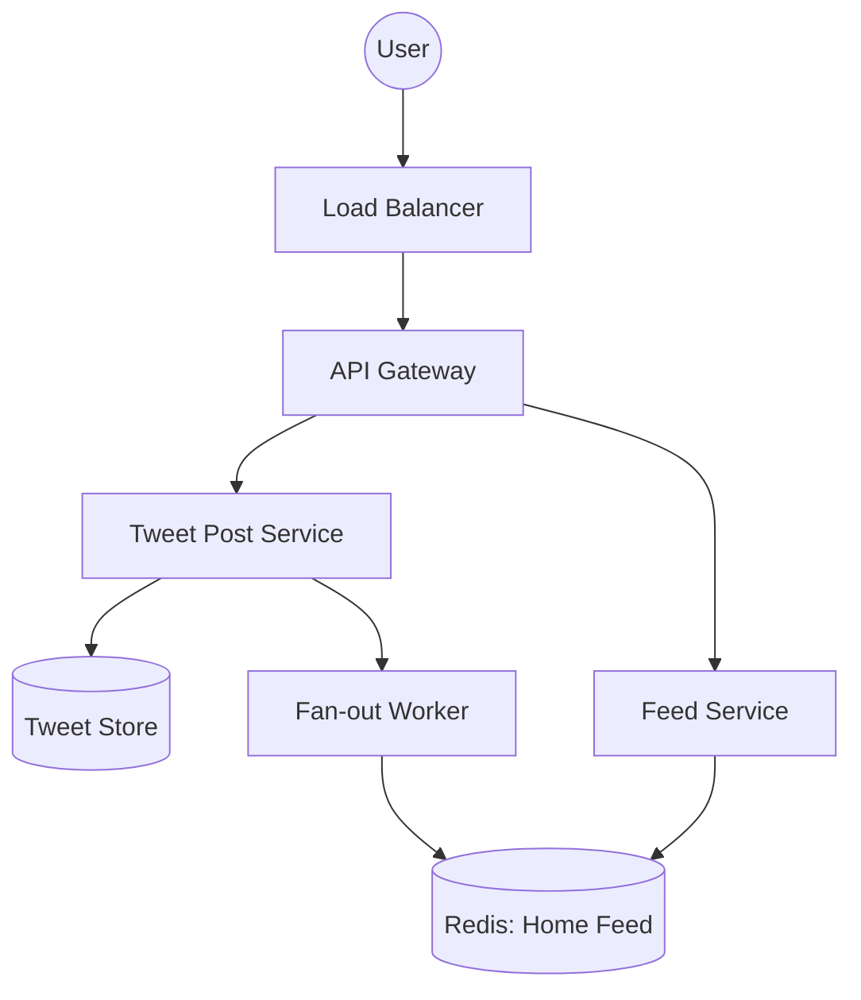

# 🐦 Twitter / X: News Feed at Scale (Massive Fan-out)

> **Staff-Signal**: How do you handle a celebrity with 100M followers posting a tweet? Do you update 100M rows instantly, or make 100M users wait on the read?

---

## 1. Problem Statement
Design a social media feed where users post tweets and see a timeline of tweets from people they follow.

---

## 2. Clarifying Questions
*   **Scale**: 300M DAU. 500M tweets/day.
*   **Celebrities**: How to handle users like Elon Musk (100M+ followers)?
*   **Latency**: Feed load must be < 500ms.
*   **Consistency**: Timeline can be eventually consistent (seconds of delay is fine).

---

## 3. Requirements
### Functional
*   Post tweets.
*   Follow/Unfollow users.
*   Generate Home Timeline (Feed).
*   Search tweets.

### Non-Functional
*   **High Availability**: Reading the feed is the #1 activity.
*   **Scalability**: Handle the "Celebrity Fan-out" without crashing the DB.

---

## 4. Capacity Estimation (Worked Math)
*   **Tweets**: 500M / 86400s ≈ **6,000 tweets/sec**.
*   **Read Traffic**: Assume 100:1 read/write ratio. **600,000 feed reads/sec**.
*   **Fan-out**: If avg follower count is 200, then 6k tweets * 200 = **1.2M writes/sec** to timelines.
*   **Celebrity Case**: 1 tweet * 100M followers = **100M writes for ONE tweet**. This is the bottleneck.

---

## 5. API Design
### `POST /v1/tweet`
```json
{ "body": "Hello world", "media_ids": [...] }
```
### `GET /v1/timeline/home` (Paginated)

---

## 6. Data Model
*   **Tweet Store (NoSQL - Cassandra)**: `tweet_id` (shard key), `user_id`, `content`, `timestamp`.
*   **Follow Graph (SQL/Graph DB)**: `follower_id`, `followee_id`.
*   **Timeline Cache (Redis)**: `user_id` -> `List<tweet_id>`.

---

## 7. High-Level Architecture


---

## 8. Component Deep Dive: The Fan-out Strategy
**This is the most important part of the interview.**
1.  **Push Model (Fan-out on Write)**: When a tweet is posted, push it to all followers' timeline caches.
    - **Pros**: Read is O(1) (super fast).
    - **Cons**: Write is O(followers), slow for celebrities.
2.  **Pull Model (Fan-out on Read)**: When a user loads their feed, fetch tweets from all followees and merge-sort them.
    - **Pros**: Write is O(1).
    - **Cons**: Read is O(followees), very slow.
3.  **The Staff Solution: Hybrid Model**.
    - **Regular Users**: Use the **Push Model**.
    - **Celebrities (>1M followers)**: Use the **Pull Model**. Do not fan out their tweets. On read, merge celebrity tweets into the pre-computed feed.

---

## 9. Data Flow (Hybrid)
1.  User A posts a tweet.
2.  System checks if User A is a "Celebrity."
3.  If **No**, workers iterate over 200 followers and add `tweet_id` to their Redis timelines.
4.  If **Yes**, only save to `TweetDB`.
5.  When a follower reads their feed, they pull the Redis list + any active celebrity tweets.

---

## 10. Bottlenecks
*   **Redis Memory**: Millions of timelines in RAM is expensive.
    *   **Solution**: Evict timelines for inactive users (hasn't logged in for 3 days).
*   **Search**: Searching 1B tweets is slow.
    *   **Solution**: Elasticsearch/Lucene cluster sharded by `tweet_id`.

---

## 11. Scaling Strategy
*   **Shard follow graph** by `follower_id`.
*   **CDN** for media (images/videos).

---

## 12. Failure Scenarios
*   **Fan-out backlog**: If a celebrity tweets and the workers are slow, the feed is "Stale."
    *   **Solution**: Use a prioritized queue (high-priority for influencers).

---

## 13. Tradeoffs

| Choice | Pro | Con |
| :--- | :--- | :--- |
| **Hybrid Fan-out** | Balances read/write load | Complex to implement and maintain |
| **Strict Ordering** | Better UX | Prevents easy sharding of temporal data |

---

## 14. Monitoring Strategy
*   **Fan-out Latency**: Time from tweet post to "visible to all followers."
*   **Redis Hit Rate**: Ensure feeders aren't hitting the DB too often.

---

## 15. The Interview Narrative
> "To handle the massive asymmetrical social graph of Twitter, I implement a **Hybrid Fan-out** architecture. Conventional users follow a **Push model** where their tweets are pre-calculated into their followers' Redis timelines for sub-50ms reads. For celebrities, I skip the fan-out write to prevent database thrashing, instead using a **Pull-at-read** strategy to dynamically merge their content. This ensures high availability and predictable latency regardless of a user's follower count."

---

## 16. Follow-up Questions
1.  **"How do you handle 'Trends'?"** (Answer: Apache Flink/Storm for real-time windowed counting of hashtags).

---

## 17. Common Mistakes
1.  **Pure Pull model**: You will crush the database on every feed load.
2.  **Pure Push model**: A celebrity's tweet could take 10 minutes to reach everyone (or crash the worker).
