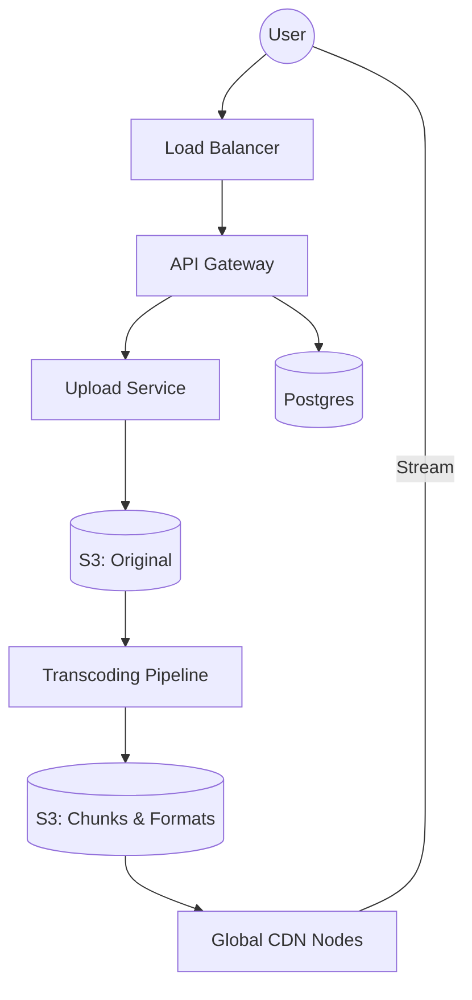

# 📺 YouTube / Netflix: Video Streaming at Scale

> **Staff-Signal**: Can you design a globally distributed content delivery system that handles petabytes of video while maintaining sub-second start times?

---

## 1. Problem Statement
Design a global video-sharing platform where users can upload, view, and interact with videos.

---

## 2. Clarifying Questions
*   **Scale**: 2B total users, 500M Daily Active Users (DAU).
*   **Ingestion**: 500 hours of video uploaded every minute.
*   **Streaming**: How many videos watched? (5B videos/day).
*   **Quality**: 4K, 1080p, 720p, mobile-optimized? (Yes, adaptive bitrate streaming is required).

---

## 3. Requirements
### Functional
*   Upload videos.
*   Watch videos (Streaming).
*   Search videos by title.
*   Interactions (View count, Like, Comment).

### Non-Functional
*   **Low Latency**: Fast video start (minimal buffering).
*   **High Reliability**: Uploads shouldn't fail mid-way.
*   **Scalability**: Handle massive surges (e.g., a viral music video).
*   **Availability**: 99.99%.

---

## 4. Capacity Estimation (Worked Math)
*   **Upload Storage**: 500 hrs/min * 60 min * 24 hrs = **720,000 hrs/day**.
*   **Storage per day**: Assume 10MB/min avg (compressed). 720k hrs * 60 min * 10MB = **432 TB/day**. 
*   **Total Storage (5 yrs)**: 432TB * 365 * 5 ≈ **800 PB**.
*   **Bandwidth (Out)**: 1B views/day * 500MB/video (avg) ≈ **500 PB/day**.
*   **QPS**: 1B views/day / 86400s ≈ **12,000 requests/sec avg**. Peak is **100K+**.

---

## 5. API Design
### `POST /v1/video/upload` (Multipart)
Returns a `upload_id` and signed S3 URL.
### `GET /v1/video/:id/stream`
Returns a manifest file (M3U8/MPD) with links to video chunks.

---

## 6. Data Model (Schema Design)
*   **Table: VideoMetadata (SQL - Postgres for Consistency)**
    *   `video_id` (PK)
    *   `user_id`, `title`, `description`
    *   `upload_status` (PENDING, TRANSCODING, READY)
    *   `s3_original_path`
*   **Table: VideoInteractions (NoSQL - Cassandra for Write Speed)**
    *   `video_id` (Partition Key)
    *   `view_count`, `likes`, `dislikes`

---

## 7. High-Level Architecture

---

## 8. Component Deep Dive: The Transcoding Pipeline
You cannot serve the raw 10GB file the user uploaded.
1.  **Segmentation**: Split video into 5-second chunks.
2.  **Parallel Processing**: Workers encode chunks into 4K, 1080p, 720p (H.264/VP9/AV1).
3.  **Manifest Generation**: Create an **M3U8** file that tells the player which chunk to fetch based on network speed (**DASH/HLS**).

---

## 9. Data Flow (Upload to Playback)
1.  **User** uploads to a pre-signed URL (S3).
2.  **Transcoder** picks up the event via SQS/Kafka.
3.  **Workers** transcode and store chunks in a separate bucket.
4.  **CDN** pulls the chunks from S3 only when requested (Pull model).
5.  **Rider/Player** fetches the manifest and starts streaming chunk #1.

---

## 10. Bottlenecks
*   **Storage Cost**: 800PB is expensive.
    *   **Staff Solution**: **Tiered Storage**. Store 4K for new/viral videos in fast SSD storage. Move 10-year-old videos with 0 views to "Cold Storage" (S3 Glacier).
*   **View Count Hotspot**: A viral video getting 100k likes/sec.
    *   **Staff Solution**: **Atomic Counter with Batching**. Increment in-memory (Redis) and flush to DB every 5 seconds.

---

## 11. Scaling Strategy
*   **CDN (PoPs)**: Global Points of Presence (PoPs) to keep video data < 20ms away from the user.
*   **Database Sharding**: Shard metadata by `video_id`.

---

## 12. Failure Scenarios
*   **Transcoding fails**: The worker puts the message back in the queue (Dead Letter Queue - DLQ) for a retry.
*   **CDN Node goes down**: DNS health checks route the user to the next nearest edge node.

---

## 13. Tradeoffs

| Choice | Pro | Con |
| :--- | :--- | :--- |
| **Pull CDN** | Only caches what is popular; saves storage | High "First-Look" latency |
| **MP4 vs HLS** | MP4 is simple | No Adaptive Bitrate (buffering on slow networks) |

---

## 14. Monitoring Strategy
*   **Vitals**: Rebuffer Rate (Buffering frequency), Start-up Latency.
*   **Infrastructure**: Transcoding queue depth (are we falling behind?).

---

## 15. The Interview Narrative
> "To handle YouTube's scale, I’ve architected a decoupled system where ingestion and streaming are independent. I use an asynchronous transcoding pipeline with a Directed Acyclic Graph (DAG) for parallel encoding into multiple bitrates. To ensure low perceived latency for the 5B daily views, I utilize a global CDN with a 'Pull' cache strategy, combined with adaptive bitrate streaming (HLS/DASH) to ensure a smooth playback experience across varying network conditions."

---

## 16. Follow-up Questions
1.  **"How do you handle copyrighted content?"** (Answer: ContentID - Fingerprinting in the transcoding pipeline).
2.  **"How do you optimize for thumbnails?"** (Answer: Image CDN + Sprites).

---

## 17. Common Mistakes
1.  **Serving raw files**: Will cause massive buffering.
2.  **No CDN**: Trying to serve global traffic from one AWS region.
3.  **Sync Transcoding**: Making the user wait for 10 minutes while the video processes.
