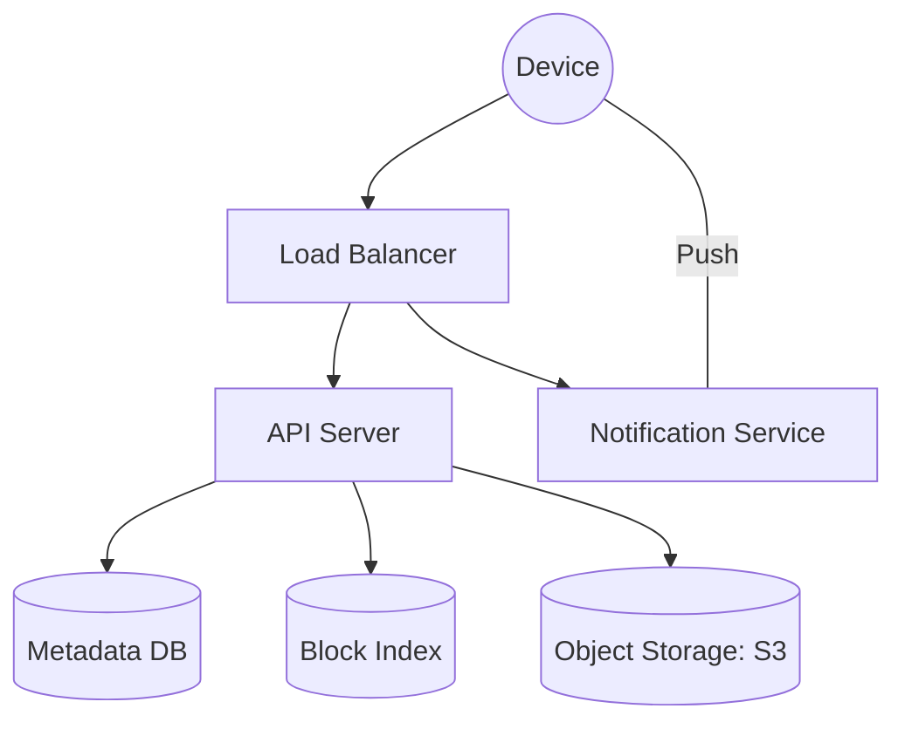

# 📁 Google Drive / Dropbox: Distributed File Sync

> **Staff-Signal**: How do you synchronize a 2GB file across 5 devices in < 1 second using only a few kilobytes of bandwidth?

---

## 1. Problem Statement
Design a file storage and synchronization service similar to Google Drive or Dropbox.

---

## 2. Clarifying Questions
*   **Scale**: 500M users, 10B files.
*   **Devices**: Multiple devices per user (PC, Mobile, Tablet).
*   **File Size**: Max 10GB.
*   **Offline Support**: Can users edit while offline? (Yes, must sync when back online).

---

## 3. Requirements
### Functional
*   Upload, download, and update files.
*   Synchronize across devices.
*   File versioning (History).
*   Sharing and permissions.

### Non-Functional
*   **Strong Consistency**: User saves on Device A, must see it on Device B instantly.
*   **Reliability**: No data loss (Durability).
*   **Efficiency**: Minimize bandwidth and battery usage.

---

## 4. Capacity Estimation (Worked Math)
*   **Users**: 500M. 10M DAU.
*   **Storage**: 500M users * 10GB avg = **5 Petabytes**.
*   **Sync Traffic**: Assume 10 updates/user/day. 10M * 10 = 100M syncs/day.
*   **Bandwidth**: If we sync the whole file, it's impossible. We must use **Delta Sync**.

---

## 5. API Design
### `POST /v1/files/upload`
Initiates a multi-part upload for file chunks.
### `GET /v1/files/sync` (Long Polling / WebSockets)
Clients listen for "Notification of Change" from the server.

---

## 6. Data Model
*   **Metadata DB (SQL - Postgres)**: `file_id`, `version`, `checksum`, `parent_folder`, `owner_id`.
    *   *Why SQL?* We need ACID for file hierarchy and versioning.
*   **Block DB (NoSQL - DynamoDB/HBase)**: Maps `block_checksum` to `storage_url`. This enables **Global De-duplication**.

---

## 7. High-Level Architecture

---

## 8. Component Deep Dive: Block-Level Storage & Delta Sync
**This is the core of the Google Drive interview.**
1.  **Chunking**: Split files into small blocks (e.g., 4MB).
2.  **Checksum**: Calculate `SHA-256` for each block.
3.  **Delta Sync**: When a user changes 1 byte in a 1GB file, the client identifies which 4MB block changed. Only that block is uploaded.
4.  **De-duplication**: If 100 users upload the same "Taylor Swift.mp4", the system only stores **one copy** in S3 and points 100 metadata records to it.

---

## 9. Data Flow (The Sync Loop)
1.  **Device A** edits a file.
2.  **Client** calculates deltas, uploads changed blocks to S3, and updates **Metadata DB** to Version 2.
3.  **Metadata DB** triggers an event to the **Notification Service**.
4.  **Notification Service** sends a WebSocket message to **Device B**.
5.  **Device B** checks local version vs. remote version, downloads only the missing blocks, and reconstructs the file.

---

## 10. Bottlenecks
*   **Metadata Contention**: Many users editing shared folders simultaneously.
    *   **Solution**: Optimistic concurrency control (Version numbers).
*   **Notification Scale**: 10M concurrent WebSockets is hard.
    *   **Solution**: Use a scalable Pub/Sub like Redis or NATS.

---

## 11. Scaling Strategy
*   **Metadata Sharding**: Shard by `user_id` to distribute load.
*   **Cold Storage**: Move old versions (history) to S3 Glacier to save costs.

---

## 12. Failure Scenarios
*   **Upload Interrupted**: Implement **Resumable Uploads** using byte offsets.
*   **Conflict**: Device A and B edit the same line while offline.
    *   **Solution**: Standard "Newer Version Wins" or create a "Conflicted Copy" file.

---

## 13. Tradeoffs

| Choice | Pro | Con |
| :--- | :--- | :--- |
| **Fixed Chunks (4MB)** | Simple to implement | Shift in file (inserting 1 byte) changes all subsequent chunks |
| **Variable Chunks (Rabin Finger.)** | Insertions don't break most chunks; best for sync | Computationally expensive for the client |

---

## 14. Monitoring Strategy
*   **Sync Latency**: Time from "Save" on Device A to "Visible" on Device B.
*   **Storage Overhead**: Percentage of data saved through de-duplication.

---

## 15. The Interview Narrative (The Staff Script)
> "My design for Google Drive focuses on extreme bandwidth efficiency through **Block-Level Delta Synchronization**. Instead of treating files as monolithic blobs, I decompose them into versioned, hashed blocks. This allows for **Global De-duplication** across the entire user base, saving petabytes of storage. To ensure instant updates across devices, I utilize a WebSocket-based **Notification Service** that pushes metadata invalidations in real-time, allowing clients to perform a surgical 'Pull' of only changed blocks."

---

## 16. Follow-up Questions
1.  **"How do you search within files?"** (Answer: Background job sends content to an Indexing Service like Elasticsearch).
2.  **"How do you handle very small files?"** (Answer: Don't chunk them; store them as a single Metadata blob to avoid overhead).

---

## 17. Common Mistakes
1.  **Uploading the whole file** on every change.
2.  **No De-duplication**: Storing 1,000 copies of the exact same OS installer/video.
3.  **Using Eventual Consistency** for the metadata (user thinks they lost work).
