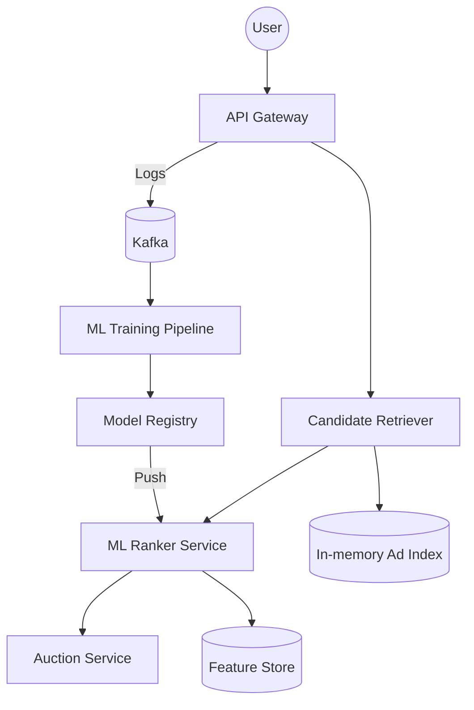

# 🎯 Ad Ranking & Recommendation System (Google/Meta Scale)

> **Staff-Signal**: How do you score 10,000 potential ads against a user's profile and return the "Best" one in under 50ms while processing 100TB of signals daily?

---

## 1. Problem Statement
Design a system that selects and ranks the most relevant ads to show to a user on a social media feed or search results page.

---

## 2. Clarifying Questions
*   **Scale**: 1B users, 10M active advertisers, 100M candidate ads.
*   **Latency**: Ad MUST be selected in < 100ms (P99).
*   **Goal**: Maximize Revenue (CPM) = $P(click) \times Bid$.
*   **Feedback**: How fast should the model learn from a click? (Near real-time).

---

## 3. Requirements
### Functional
*   Retrieve candidate ads based on user profile/context.
*   Rank ads using a Machine Learning (ML) model.
*   Log ad impressions and clicks for billing and training.

### Non-Functional
*   **Ultra-Low Latency**: Latency directly impacts revenue.
*   **High Scalability**: Handle 100K+ requests per second.
*   **Freshness**: Model should adapt to new user behavior quickly.

---

## 4. Capacity Estimation (Worked Math)
*   **Requests**: 100K QPS.
*   **Candidate Search**: 100M ads total.
*   **Budget**: 100ms total. 
    *   Retrieval: 20ms.
    *   Ranking (ML Inference): 50ms.
    *   Auction/Billing: 10ms.
*   **Data**: Each click event ~ 1KB. 1B clicks/day = **1 TB/day of logs**.

---

## 5. API Design
### `GET /v1/ads/fetch`
```json
{
  "user_id": "uuid",
  "context": {"page_url": "...", "device": "iPhone"},
  "ad_slots": 2
}
```
**Response**: `200 OK` with `[ {ad_id, creative_url, tracking_pixel}, ... ]`

---

## 6. Data Model
*   **Ad Metadata (SQL)**: `ad_id`, `advertizer_id`, `bid_amount`, `targeting_criteria`.
*   **User Profile (NoSQL - Redis/Aerospike)**: `user_id` -> `[interests, recent_clicks, demographics]`.
*   **Feature Store**: Key-Value store containing pre-computed embeddings for users and ads.

---

## 7. High-Level Architecture



---

## 8. Component Deep Dive: Retrieval vs. Ranking
You cannot run a deep neural network on 100M ads. You must use a **Two-Stage Pipe**:
1.  **Phase 1: Retrieval (Filtering)**: Use simple heuristics (Location, Language) and **Vector Search (Approximate Nearest Neighbors - ANN)** like Faiss or Milvus to narrow down 100M ads to **~500 candidates**.
2.  **Phase 2: Ranking (Scoring)**: Run a heavy ML model (e.g., DeepFM or Multi-Task Learning) on just those 500 ads to get a precise $P(click)$.

---

## 9. Data Flow (The Feed-Forward Loop)
1.  **Online Serving**: User requests ad -> Retrieve 500 candidates -> Score with Ranker -> Select Top 1 -> Return.
2.  **Offline Training**: Click/Impression events sent to Kafka -> Joins with user features -> Standardized into Training Data (TFRecords) -> Re-train model in GPU cluster -> Push new weights to Servables.

---

## 10. Bottlenecks
*   **Feature Fetching Latency**: Fetching 500 features for the Ranker can take > 100ms if done sequentially.
    *   **Solution**: Batch requests and use a high-performance memory-native database like **Aerospike**.
*   **Training-Serving Skew**: When the model sees different data in training than in production.
    *   **Solution**: Use a centralized **Feature Store** (Tecton/Feast) to ensure consistency.

---

## 11. Scaling Strategy
*   **Model Sharding**: Large models might not fit on one GPU. Shard the model or use smaller "distilled" versions for the first-pass ranker.
*   **Pre-computation**: Pre-compute user embeddings every hour so they are ready for the Retrieval phase.

---

## 12. Failure Scenarios
*   **ML Model Crashes**: Fallback to a simple "Heuristic Ranker" (e.g., rank by highest bid).
*   **Feature Store Down**: Use cached "default" features for new/unknown users.

---

## 13. Tradeoffs

| Choice | Pro | Con |
| :--- | :--- | :--- |
| **Deep Learning** | Higher $P(click)$ accuracy (More $$) | High latency, high compute cost |
| **Logistic Regression** | Sub-millisecond latency | Lower accuracy, misses complex features |
| **On-device Ranking** | Privacy, zero server cost | Limited compute, no global context |

---

## 14. Monitoring Strategy (Operational Rigor)
*   **Model Drift**: Monitor if the model's predictions are diverging from actual click rates.
*   **Explore/Exploit Rate**: Percentage of ads shown that the model is "unsure" about (to gather more data).
*   **CTR (Click-Through Rate)**: The primary business health metric.

---

## 15. The Interview Narrative (The Staff Level Script)
> "Ranking ads is a latency-constrained optimization problem. My design utilizes a **multi-stage funnel**: first, a low-latency retrieval stage using **Vector Search** to filter 100M ads down to 500; then, a high-precision **Deep Neural Network** to score those candidates against real-time user features. To ensure we don't succumb to the **Cold Start** problem, I've integrated an Explore/Exploit strategy that injects new ads into the feed to maintain model freshness."

---

## 16. Follow-up Questions
1.  **"How do you handle 'Ad Fatigue'?"** (Answer: Frequency capping in the filtering stage).
2.  **"How do you optimize for 'Cost per Click' vs 'Cost per Impression'?"** (Answer: Multi-objective optimization in the ranking layer).

---

## 17. Common Mistakes
1.  **Trying to rank all ads at once**: The latency will be seconds, not milliseconds.
2.  **Ignoring the 'Exploration' phase**: The model will eventually only show the same 3 ads forever.
3.  **No fallback strategy**: When the ML service is slow, the whole site breaks.
