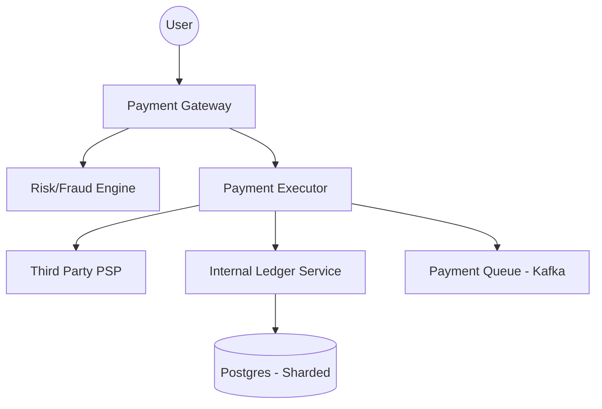

# 💰 Distributed Payment System (Adyen / Stripe Scale)

> **Staff-Signal**: Can you design a system that guarantees 100.00% accuracy, handles $1B+ in transactions, and avoids double-charging users even during a network partition?

---

## 1. Problem Statement
Design a global payment gateway that processes credit card transactions and manages merchant payouts.

---

## 2. Clarifying Questions
*   **Scale**: 100M daily transactions. Peak 10K TPS.
*   **Integrations**: Multiple third-party PSPs (Stripe, Braintree, Adyen).
*   **Consistency**: Absolute ACID compliance. No "Eventual Consistency" for balances.
*   **Compliance**: PCI-DSS, GDPR.

---

## 3. Requirements
### Functional
*   Capture payment (Authorize and Capture).
*   Record transactions in a ledger.
*   Manage merchant accounts and payouts.
*   Handle refunds and disputes.

### Non-Functional
*   **Correctness**: No double charging. No lost payments (Durability).
*   **High Availability**: Payment flow must be up 99.999%.
*   **Security**: Tokenization of PII/Card data.

---

## 4. Capacity Estimation (Worked Math)
*   **Transactions**: 100M / day = 1,150 TPS avg. Peak = **10,000 TPS**.
*   **Storage**: Each transaction (id, amount, currency, status, timestamps) ~ 1KB. 100M * 1KB = **100 GB/day**.
*   **Ledger Storage**: 5 years of data = 100GB * 365 * 5 ≈ **180 TB**.

---

## 5. API Design
### `POST /v1/payments`
```json
{
  "user_id": "uuid",
  "amount": 1000,
  "currency": "USD",
  "payment_method": "pm_123",
  "idempotency_key": "unique-client-request-id" 
}
```
*   **Idempotency Key**: Mandatory to prevent double-charging on retries.

---

## 6. Data Model (Double-Entry Bookkeeping)
**This is the Staff-level differentiator.** Never use a single `balance` column. Use an immutable ledger.
*   **Table: Ledger**
    *   `id`, `account_id`, `amount`, `type` (DEBIT/CREDIT), `transaction_id`.
*   **Rule**: `Sum(Credits) - Sum(Debits) = Balance`. This provides a perfect audit trail.

---

## 7. High-Level Architecture


---

## 8. Component Deep Dive: Idempotency & The Saga Pattern
How do you coordinate a PSP call (External) and a Ledger update (Internal)?
1.  **Idempotency Layer**: Check Redis if `idempotency_key` has been seen. If yes, return previous result.
2.  **Orchestrated Saga**:
    - Step 1: Record `PENDING` in DB.
    - Step 2: Call External PSP.
    - Step 3: If success, record `COMPLETED`. If fail, record `FAILED`.
    - **Staff Insight**: Use a **Transactional Outbox** pattern to ensure the MQ and DB are updated atomically.

---

## 9. Data Flow (Write Path)
1.  **Frontend** sends `POST /payments` with `idempotency_key`.
2.  **Gateway** validates and saves to `PaymentEvents` table (Status: `INIT`).
3.  **Executor** calls Stripe/Adyen.
4.  **On Success**: Executor updates DB and Ledger synchronously.
5.  **On Timeout**: Executor puts the payment in a "Recon" queue to check PSP status via API.

---

## 10. Bottlenecks
*   **Database Write Throughput**: 10K TPS is high for a single Postgres node.
    *   **Solution**: **Horizontal Sharding** by `account_id`.
*   **External Latency**: PSPs can take 2-5 seconds.
    *   **Solution**: **Asynchronous Status Updates** (Webhooks).

---

## 11. Scaling Strategy (10x - 1000x)
*   **Partitioning**: Shard the Ledger into historical (archive) and current (active) tables.
*   **Isolation**: Use dedicated worker pools for different PSPs so a slow Stripe API doesn't block Adyen payments.

---

## 12. Failure Scenarios
*   **PSP Timeout**: We don't know if the payment was successful. We **cannot** retry blindly.
    *   **Solution**: Explicit **Status Check API** call to PSP before retrying.
*   **Database Down**: Buffer requests in Kafka for eventual processing.

---

## 13. Tradeoffs

| Choice | Pro | Con |
| :--- | :--- | :--- |
| **SQL vs NoSQL** | SQL (ACID) is safer for money. | NoSQL (Dynamo) scales better but lacks multi-row transactions. |
| **Sync vs Async** | Sync Ledger is safer. | Async Ledger (Kafka) is faster but requires reconciliation. |

---

## 14. Monitoring Strategy (Operational Rigor)
*   **Financial Reconciliation**: A CRON job that compares our DB with the PSP's CSV exports every night. **Flag any discrepancy > $0.00.**
*   **Success Rate by PSP**: Monitor if Adyen is failing more than Stripe.

---

## 15. The Interview Narrative (The "Staff" Script)
> "In a payment system, **Correctness** is prioritized over **Latency**. My design utilizes a distributed idempotency layer to prevent double-billing. To handle the lack of distributed transactions across external PSPs, I implement the **Saga Pattern** with an internal **Double-Entry Ledger**. This ensures that every cent is accounted for in an immutable audit trail, allowing us to reconcile $1B in daily volume with zero data loss."

---

## 16. Follow-up Questions
1.  **"How do you handle currency conversion?"** (Answer: Oracle/external feed with cached exchange rates).
2.  **"How does PCI compliance affect your architecture?"** (Answer: Use Tokenization; never store raw PAN/CVV in our VPC).

---

## 17. Common Mistakes
1.  **Using `Double` or `Float` for money**: Use `BigDecimal` or `Long` (cents).
2.  **No Idempotency**: Charging the user twice when they click the button twice.
3.  **No Reconciliation**: Totaling the balance in a single column without an audit log.
