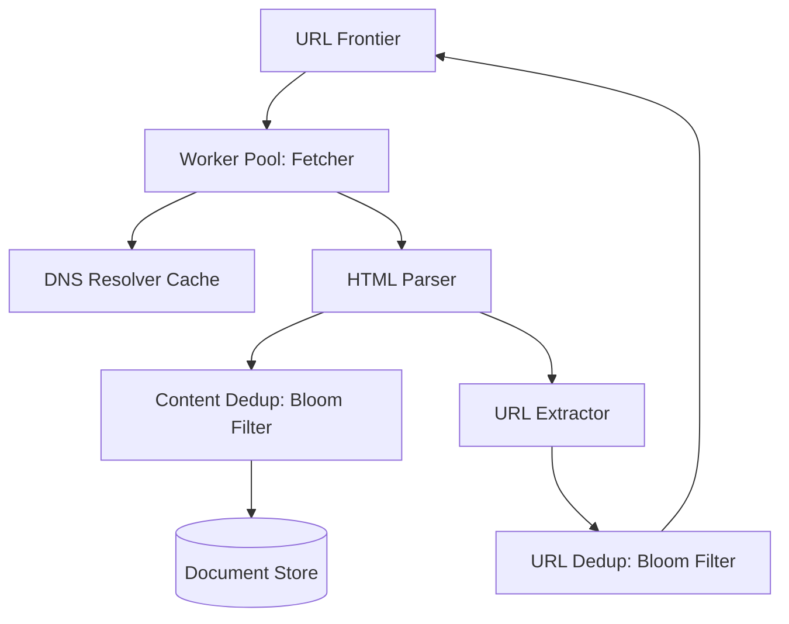

# 🕸️ Web Crawler (Google/Bing Scale)

> **Staff-Signal**: How do you crawl 100 Billion pages without getting banned by websites, doubling your storage costs with duplicates, or getting stuck in a "Spider Trap"?

---

## 1. Problem Statement
Design a system that crawls the World Wide Web and stores the content for a search engine.

---

## 2. Clarifying Questions
*   **Scale**: 100 Billion pages.
*   **Update Frequency**: How often to re-crawl? (Varies: News every hour, blogs every month).
*   **Metadata**: Just HTML text or images/videos too? (Focus on HTML first).
*   **Storage**: How much data total? (Assume 1MB/page = 100 PB).

---

## 3. Requirements
### Functional
*   Discover new URLs (Breadth-First Search).
*   Fetch and parse HTML content.
*   Extract URLs and store them for the next crawl.

### Non-Functional
*   **Scalability**: Hundreds of workers across multiple regions.
*   **Politeness**: Don't DOS (Denial of Service) small websites.
*   **Extensibility**: Support future file types (PDF, JPG).
*   **Robustness**: Handle malformed HTML and spider traps.

---

## 4. Capacity Estimation (Worked Math)
*   **Throughput**: 100B pages / month ≈ **40,000 pages/sec**.
*   **Storage**: 100B * 100KB (compressed) ≈ **10 PB**.
*   **Bandwidth**: 40,000 pages * 100KB ≈ **4 GB/sec**.

---

## 5. Components & Architecture

---

## 6. Component Deep Dive: The URL Frontier & Politeness
**This is the hardest part.** You cannot just pop a URL from a queue.
- **Problem**: If you have 10,000 workers and they all hit `example.com` at once, you will be blocked.
- **Solution (DNS Affinity)**: 
    1.  Map each domain to a specific **Frontier Queue**.
    2.  Ensure only one worker is pulling from a specific domain queue at a time.
    3.  Add a **Wait Time** (e.g., 500ms) between requests to the same IP.
- **Priority**: Use a separate set of queues for "High Quality" domains (e.g., `.gov`, `.edu`).

---

## 7. Handling Duplicates (Bloom Filters)
You shouldn't crawl the same URL twice, and you shouldn't store the same content twice (e.g., mirror sites).
*   **URL Dedup**: Use a **Bloom Filter** (probabilistic data structure) to check if a URL has been seen in **O(1)**.
*   **Content Dedup**: Calculate a **SimHash** of the document. If two pages have a similar hash, treat them as duplicates.

---

## 8. Data Flow
1.  **Frontier** provides a batch of "polite" URLs to a **Fetcher**.
2.  **Fetcher** resolves DNS, downloads HTML.
3.  **Parser** strips scripts, extracts text and new links.
4.  **Dedup** checks if the content is new.
5.  **Extractor** adds new unique links back to the **Frontier**.

---

## 9. Bottlenecks
*   **DNS Resolution**: Resolving 40k domains/sec is slow.
    *   **Solution**: Maintain a massive local **DNS Cache**.
*   **Spider Traps**: Infinite loops of URLs (e.g., `site.com/a/b/a/b...`).
    *   **Solution**: Limit URL depth and length.

---

## 10. Failure Scenarios
*   **Malformed HTML**: The Parser must not crash. Wrap it in a sandbox or use robust libraries (BeautifulSoup/Puppeteer).
*   **Server 5xx**: Implement exponential backoff for polite re-atempts.

---

## 11. Tradeoffs

| Choice | Pro | Con |
| :--- | :--- | :--- |
| **BFS** | Finds the "breadth" of the web; better for discovery | Might lose depth on deep sites |
| **DFS** | Gets deep into a site quickly | Can get stuck in a trap easily |

---

## 12. Monitoring Strategy
*   **Crawl Latency**: Time to fetch a page.
*   **Success Rate**: Monitor HTTP 200s vs 403s (Forbidden).
*   **Frontier Depth**: How many new URLs are we discovering per second?

---

## 13. The Interview Narrative
> "Designing a web crawler at Google scale is primarily a challenge of **Distributed Coordination and Politeness**. My architecture utilizes a sharded **URL Frontier** that enforces domain-level rate limiting to prevent DOSing small sites. To manage the 10PB storage requirement, I implement **Content De-duplication** via SimHashing and utilize **Bloom Filters** for O(1) membership testing of billions of URLs, ensuring we avoid the inefficiency of reciprocal crawls."

---

## 14. Follow-up Questions
1.  **"How do you crawl Javascript-rendered sites?"** (Answer: Use a headless browser pool like Puppeteer, but it's 10x slower/expensive).
2.  **"How do you handle robots.txt?"** (Answer: Fetch it once per domain and cache it for 24 hours).

---

## 15. Common Mistakes
1.  **Not mentioning Politeness**: An instant No-Hire.
2.  **Using a standard relational DB** for the URL Frontier at 100B scale.
3.  **Ignoring duplication**: You will store 10x more data than necessary.
