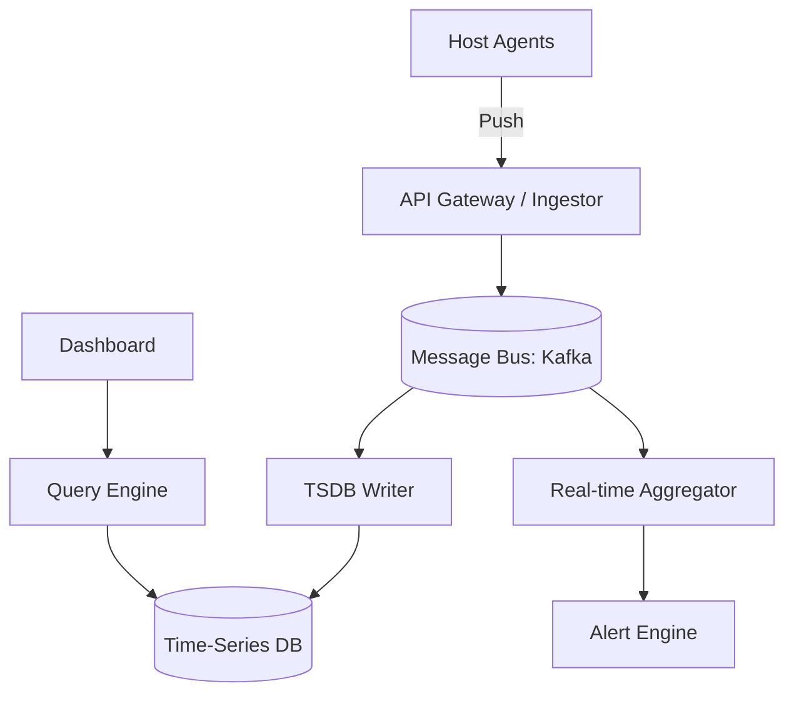

# 🏥 Metrics & Monitoring System (Datadog / Prometheus Scale)

> **Staff-Signal**: How do you ingestion 100M data points per second, store them for 1 year, and provide sub-second query latency for dashboards?

---

## 1. Problem Statement
Design a system that collects, stores, and alerts on metrics from millions of servers and applications.

---

## 2. Clarifying Questions
*   **Scale**: 10M hosts, each sending 100 metrics every 10 seconds.
*   **Data Type**: Numeric Time-Series (timestamp, value, tags).
*   **Resolution**: 1-second resolution for recent data, 1-hour for old data.
*   **Query**: Ad-hoc queries via a dashboard (Grafana-like).

---

## 3. Requirements
### Functional
*   Capture metrics (Push/Pull).
*   Storage and retrieval of time-series data.
*   Alerting: If `cpu > 90%` for 5 mins, send a notification.

### Non-Functional
*   **Insane Write-Throughput**: 100M data points/sec.
*   **Reliability**: The monitoring system must be more reliable than the systems it monitors.
*   **Low Query Latency**: Dashboards must be fast.

---

## 4. Capacity Estimation (Worked Math)
*   **Ingestion**: (10M hosts * 100 metrics) / 10s = **100M data points/sec**.
*   **Storage per point**: (Timestamp 8B + Value 8B + Metadata) ≈ 20 bytes.
*   **Total per sec**: 100M * 20B = **2 GB/sec**.
*   **Total per day**: 2GB/sec * 86400s ≈ **170 TB/day**.
*   **Total per year**: 170TB * 365 ≈ **60 PB**.

---

## 5. Components & Architecture

---

## 6. Component Deep Dive: The Time-Series DB (TSDB)
Standard SQL or NoSQL is too slow for 100M writes/sec.
- **Why?** B-Trees and even LSM Trees struggle with the "High Cardinality" of tags (e.g., `host_id`, `service_id`).
- **Staff Choice: Time-Series Optimized Engine** (e.g., InfluxDB, VictoriaMetrics, ClickHouse).
- **Compression**: Use **Gorilla Compression** (XOR-based) to compress 16-byte data points into ~1.3 bytes. This reduces storage by 10x.

---

## 7. High Cardinality (The "Dimension" Problem)
If you have 1B unique metric names (e.g., tracking every single IP address), your index will explode.
*   **Solution**: **Multi-tier Indexing**. 
    1.  Store raw data in an append-only log.
    2.  Build an inverted index for tags (similar to search engines).
    3.  Limit the number of unique tag values allowed per metric.

---

## 8. Data Management: Downsampling & Retention
We don't need 1-second resolution for data from 6 months ago.
1.  **Retention Policy**: 
    - 0-7 days: 1s resolution (Raw).
    - 7-30 days: 1m resolution (Downsampled).
    - 30-365 days: 1h resolution (Downsampled).
2.  **Downsampling Worker**: Background job that aggregates raw data (Mean, Max, Min) into lower resolutions.

---

## 9. Data Flow
1.  **Agent** pushes metrics to Gateway.
2.  **Gateway** puts data into Kafka.
3.  **Writer** batches data (e.g., 10,000 points) and does a sequential write to the TSDB.
4.  **Query Engine** retrieves data, performs "Aggregation on the fly" (e.g., SUM across all instances), and returns to User.

---

## 10. Bottlenecks
*   **Write Volume**: Kafka is required for buffering.
*   **Query Performance**: Aggregating millions of points for a 30-day view is slow.
    *   **Solution**: **Aggregated Read Views**. Pre-compute common queries.

---

## 11. Failure Scenarios
*   **TSDB Node Fails**: Use replication factor of 3.
*   **Network Partition**: Agents should buffer metrics locally (Disk) if the Gateway is unreachable.

---

## 12. Tradeoffs

| Choice | Pro | Con |
| :--- | :--- | :--- |
| **Push over Pull** | Better for ephemeral (Lambda/K8s) | Can overwhelm the system |
| **Pull (Prometheus)** | Better control; easy discovery | Hard for batch jobs |

---

## 13. The Interview Narrative
> "To handle 100M data points per second, I’ve designed a **write-optimized architecture** centered around a **Time-Series Database** with **XOR compression**. Instead of raw storage, I implement a **tiered retention policy** where data is downsampled from 1-second to 1-hour resolution as it ages, reducing our 60PB storage footprint by 90%. To manage the **High Cardinality** challenge of modern microservices, I utilize an inverted tag index and prioritize append-only writes, ensuring sub-second dashboard latency even for complex aggregate queries."

---

## 14. Follow-up Questions
1.  **"How do you handle 'Late-arriving' data?"** (Answer: Keep a 15-min window open for backfills).
2.  **"How do you handle massive spikes (e.g., Black Friday)?"** (Answer: Auto-scaling consumer groups in Kafka).

---

## 15. Common Mistakes
1.  **Using a relational DB** for raw metrics.
2.  **No compression**: Storage costs will bankrupt the company.
3.  **No downsampling**: Trying to plot 30 million points on a single chart.
