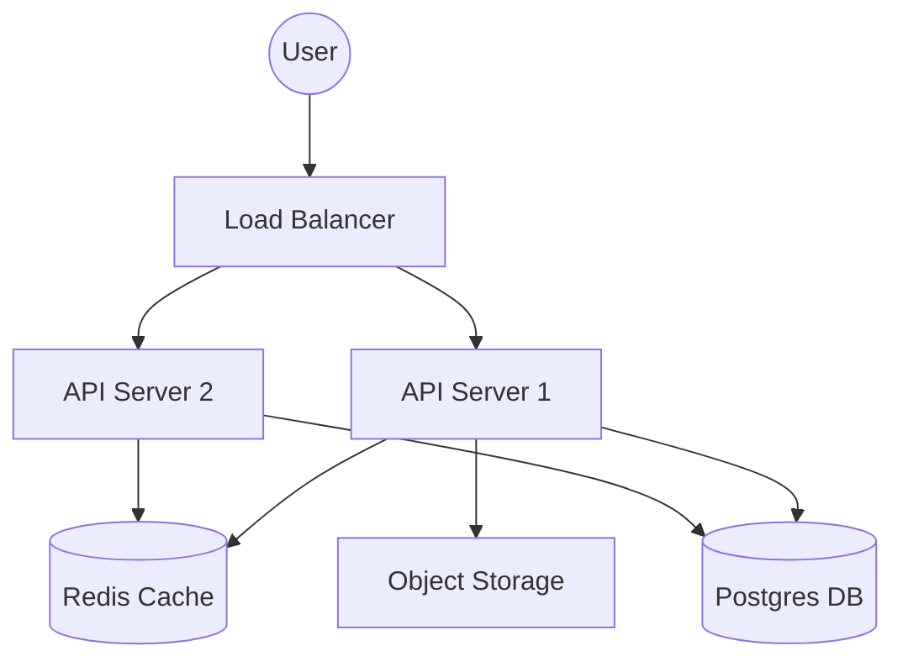
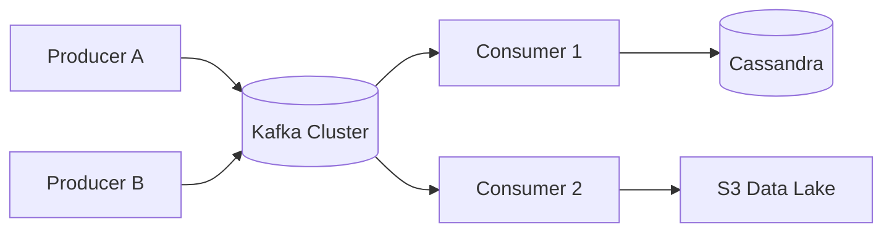
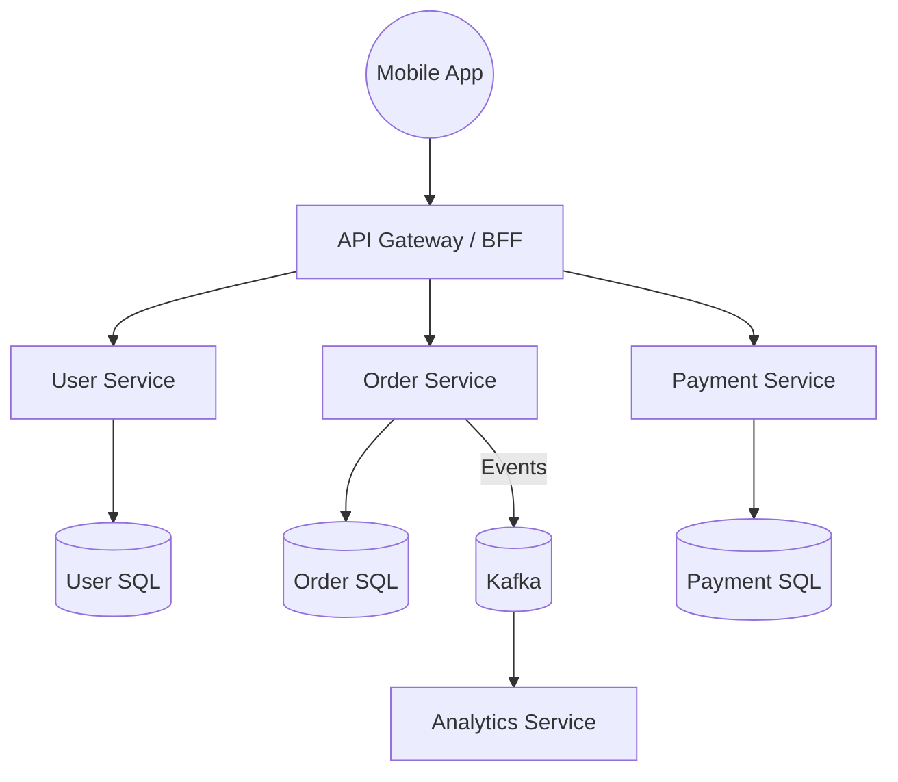
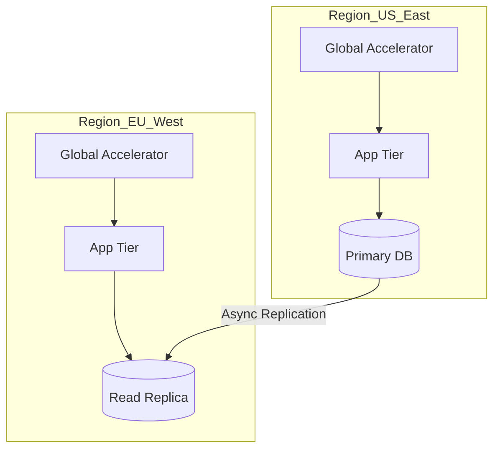
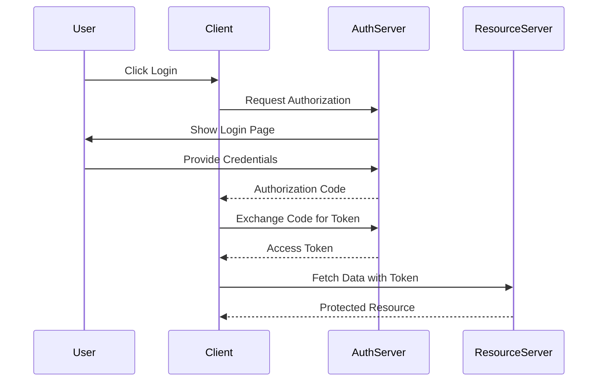

# 📊 Mermaid Diagram Templates (GitHub Native)

> **Pro Tip**: Use these Mermaid snippets in your GitHub issues, PRs, or Markdown files. They render natively on GitHub and are far better for "Live" collaboration than static images.

---

## 1. High-Level Three-Tier Architecture
Perfect for: Web apps, URL Shorteners, simple CRUD.

---

## 2. Event-Driven (Kafka) Pipeline
Perfect for: Logging, Analytics, Notification systems.

---

## 3. Microservices & API Gateway
Perfect for: Uber, News Feed, E-commerce.

---

## 4. Multi-Region Active-Active
Perfect for: Global services, Disaster Recovery.

---

## 5. Sequence Diagram: OAuth2 Flow
Perfect for: Explaining Auth or complex cross-service handshakes.

---

## 🎨 Design System for Diagrams

To keep your repo looking premium, follow these Mermaid styling rules:

| Entity | Shape | Syntax |
| :--- | :--- | :--- |
| **User** | Circle | `User((Name))` |
| **Database** | Cylinder | `DB[(Name)]` |
| **Manual Action** | Choice | `Decision{?}` |
| **External API** | Rect | `API[Name]` |

---

## 💡 Visual Learning Strategy
1.  **Don't overcomplicate**: Start with 4-5 boxes. Only add complexity when asked.
2.  **Color Coding**: Use Mermaid's `classDef` to highlight "New" components vs "Legacy".
3.  **Flow Direction**: Use `graph TB` (Top to Bottom) for hierarchy and `graph LR` (Left to Right) for data pipelines.
