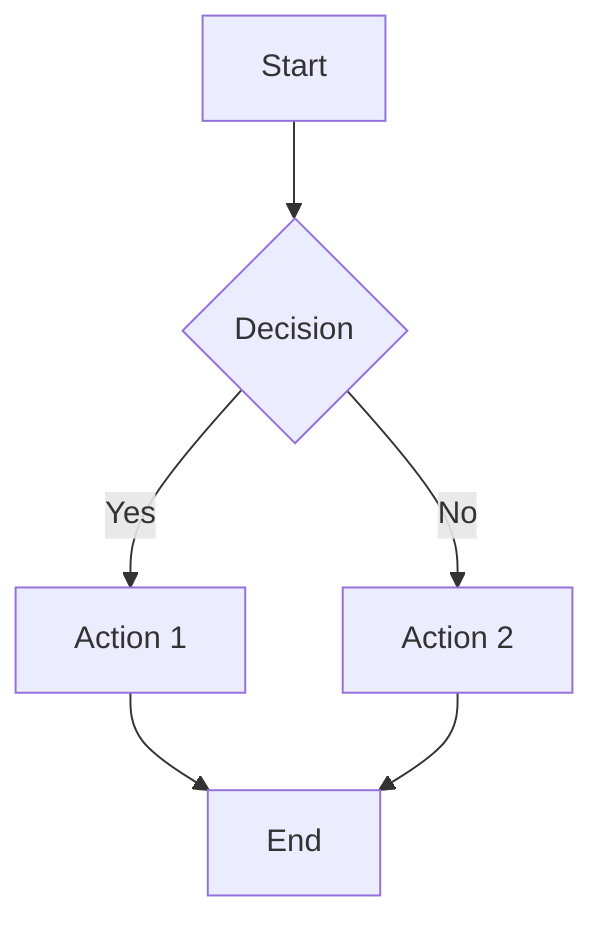
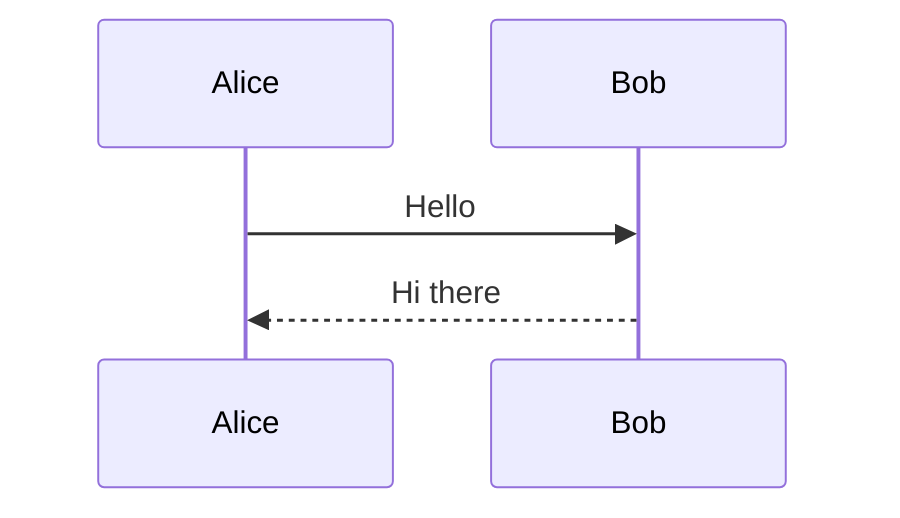
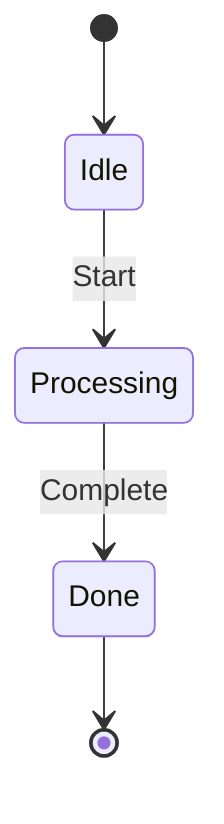
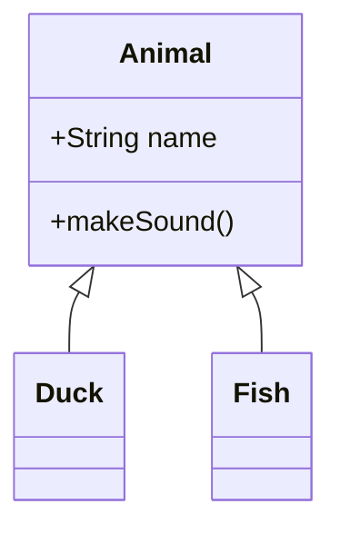
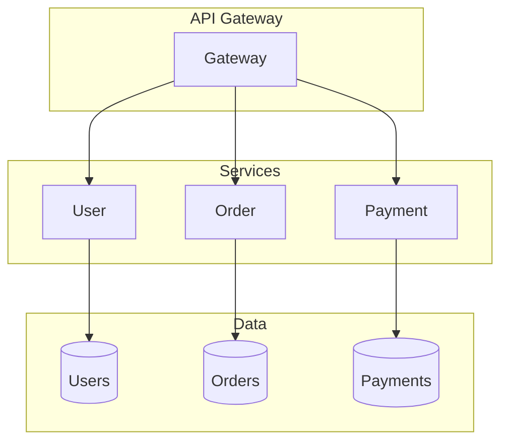
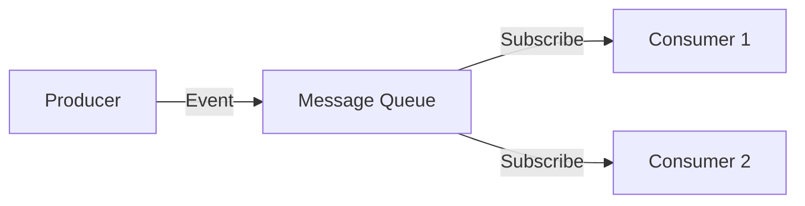
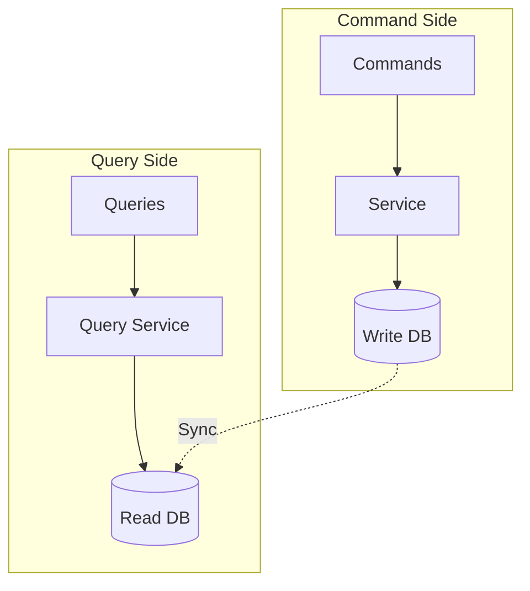
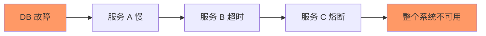

# Visual Learning Guide

> **使用图表和可视化方式理解系统设计。**

---

## 1. 架构图类型

### 1.1 架构图 (Architecture Diagram)

```
┌─────────────┐     ┌─────────────┐
│   Client    │────▶│Load Balancer│
└─────────────┘     └──────┬──────┘
                          │
           ┌──────────────┼──────────────┐
           │              │              │
           ▼              ▼              ▼
     ┌──────────┐   ┌──────────┐   ┌──────────┐
     │ Service A│   │ Service B│   │ Service C│
     └────┬─────┘   └────┬─────┘   └────┬─────┘
          │              │              │
          └──────────────┼──────────────┘
                         ▼
                  ┌──────────┐
                  │ Database │
                  └──────────┘
```

**用途**: 展示系统组件和关系

### 1.2 流程图 (Flowchart)

```
开始 → 接收请求
  ↓
检查缓存?
  ├─ 是 → 返回缓存
  └─ 否 → 查询数据库
  ↓
更新缓存
  ↓
返回响应
  ↓
结束
```

**用途**: 展示处理流程

### 1.3 时序图 (Sequence Diagram)

```
Client      Service       DB
  │            │            │
  │─REQ────────▶│            │
  │            │─SELECT────▶│
  │            │◀───────────│
  │◀───────────│            │
  │            │            │
```

**用途**: 展示交互时序

### 1.4 状态机 (State Machine)

```
    ┌───────┐
    │ start │
    └──┬────┘
       │
       ▼
  ┌─────────┐    error    ┌──────┐
  │processing│ ──────────▶│ error│
  └────┬────┘             └──────┘
       │
    success
       │
       ▼
  ┌────────┐
  │  done  │
  └────────┘
```

**用途**: 展示状态变化

---

## 2. Mermaid 快速参考

### 2.1 流程图



### 2.2 时序图



### 2.3 状态图



### 2.4 类图



---

## 3. 常见架构模式可视化

### 3.1 微服务架构



### 3.2 事件驱动



### 3.3 CQRS



---

## 4. 容量规划可视化

### 4.1 QPS 分布

```
     ▲
     │                    ████
     │            ██    ████
     │     ██  ████  ██████
     │  ████████████████████
     └──────────────────────▶
       0   100  500  1000  QPS
```

### 4.2 延迟分布

```
     ▲
     │    ┌ P50
     │────┤
     │    │       ┌ P95
     │────┤───────┤
     │    │       │       ┌ P99
     │────┤───────┼───────┤
     │    │       │       │
     └────┴───────┴───────┴────▶
        10ms   50ms   200ms  Latency
```

---

## 5. 故障分析可视化

### 5.1 故障传播



### 5.2 恢复曲线

```
Availability
    ▲
100%│                      ████
    │                 █████
 99%│            █████
    │       █████
 95%│███████
    │
    └──────────────────────────────▶
       恢复中     恢复完成
```

---

## 6. 画图技巧

### 6.1 颜色含义

| 颜色 | 含义 |
|------|------|
| 绿色 | 正常/健康 |
| 红色 | 故障/错误 |
| 黄色 | 警告/降级 |
| 蓝色 | 存储 |
| 灰色 | 外部系统 |

### 6.2 布局原则

- 从左到右，从上到下
- 核心组件放中间
- 相关组件放一起
- 分层清晰
