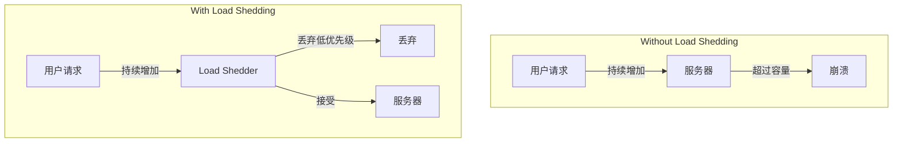
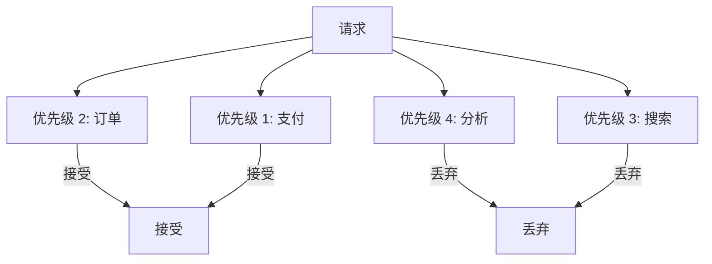
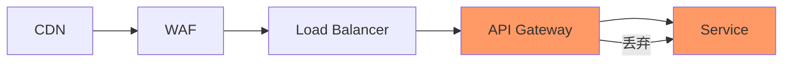

# Load Shedding

> **在系统过载时主动丢弃请求，保护系统不被压垮。**

---

## 1. 为什么需要 Load Shedding？



**目的**：
- 保护核心服务
- 保持部分可用
- 优雅降级

---

## 2. Load Shedding 策略

### 2.1 队列长度

```python
class QueueBasedShedder:
    def __init__(self, max_queue_size=1000):
        self.queue = asyncio.Queue(maxsize=max_queue_size)
    
    async def process(self, request):
        try:
            self.queue.put_nowait(request)
        except asyncio.QueueFull:
            # 队列满，丢弃请求
            metrics.increment("load_shed.queue_full")
            raise DroppedError("Queue full")
        
        # 处理请求
        return await self.do_process()
```

### 2.2 基于并发

```python
class ConcurrencyShedder:
    def __init__(self, max_concurrent=100):
        self.semaphore = asyncio.Semaphore(max_concurrent)
    
    async def process(self, request):
        # 尝试获取信号量
        if not self.semaphore.locked():
            async with self.semaphore:
                return await self.do_process()
        else:
            metrics.increment("load_shed.concurrent_full")
            raise DroppedError("Too many concurrent requests")
```

### 2.3 基于优先级



```python
class PriorityShedder:
    def __init__(self):
        self.limits = {
            "payment": 1000,   # 支付不限流
            "order": 500,
            "search": 100,
            "analytics": 0      # 丢弃所有
        }
        self.counters = {k: 0 for k in self.limits}
    
    def should_accept(self, request) -> bool:
        priority = request.priority
        limit = self.limits.get(priority, 0)
        
        if self.counters[priority] >= limit:
            return False
        
        self.counters[priority] += 1
        return True
```

---

## 3. 实现模式

### 3.1 入口层 Load Shedding

```python
# API Gateway 层
async def handle_request(request):
    # 检查是否需要限流
    if not await shedder.should_accept(request):
        return Response(429, "Service overloaded")
    
    # 传递上下文
    request.ctx['shedder'] = shedder
    
    return await next_handler(request)
```

### 3.2 分层 Load Shedding



| 层级 | 粒度 | 响应 |
|------|------|------|
| CDN | IP | 503 或页面 |
| WAF | IP/User | 429 |
| Gateway | User/Token | 429 |
| Service | 优先级 | 降级响应 |

---

## 4. 监控指标

```promql
# 请求被丢弃数量
rate(load_shed_requests_total[5m])

# 当前并发数
current_concurrent_requests

# 队列深度
queue_depth

# 响应延迟
histogram_quantile(0.99, request_duration_seconds)
```

---

## 5. Interview Narrative

> "Load shedding 保护系统在过载时不至于完全崩溃。我们在 API Gateway 实现基于优先级的限流：支付请求优先，搜索次之，分析请求可以直接丢弃。当检测到响应时间超过阈值，自动触发限流。根据优先级设置不同阈值：核心业务 1000 QPS，边缘业务 100 QPS。丢弃请求时返回 429 状态码并带重试时间。监控面板实时显示丢弃率，超过 5% 触发告警。"

---

## 6. 常见问题

### Q: Load Shedding vs Rate Limiting？
- Rate Limiting：限制单用户速率
- Load Shedding：系统过载时保护整体

### Q: 如何确定阈值？
- 基于历史负载测试
- 逐步调整
- 监控服务健康指标
