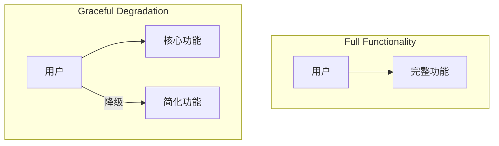
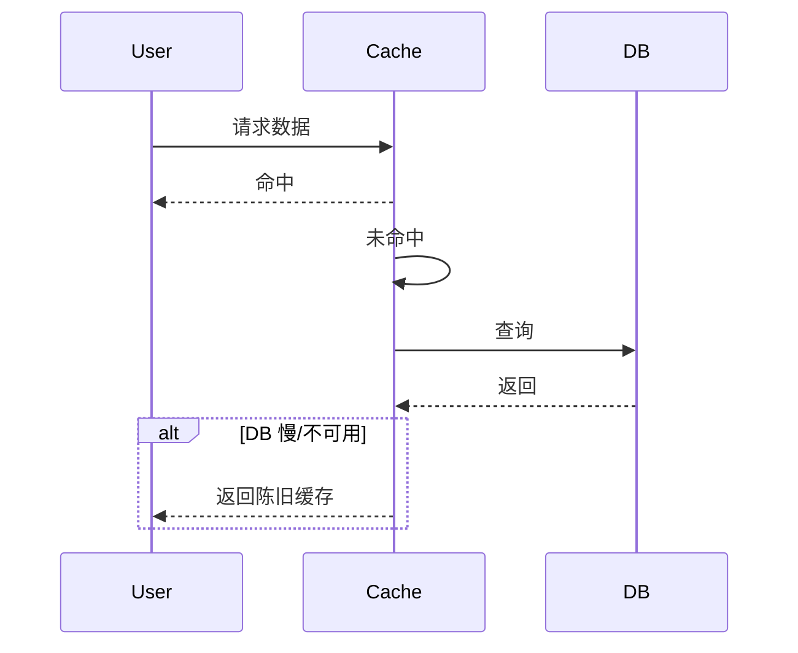
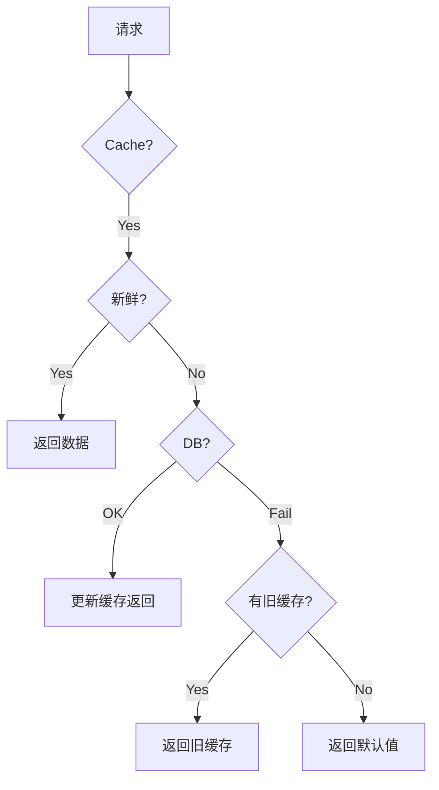

# Graceful Degradation

> **部分功能不可用时，保持系统整体可用。**

---

## 1. 什么是优雅降级？



**核心思想**：不是"全部可用"就是"全部不可用"，而是保持核心功能可用。

---

## 2. 降级策略

### 2.1 功能降级

| 功能 | 完整版 | 降级版 |
|------|--------|--------|
| 首页推荐 | 个性化算法 | 热门推荐 |
| 搜索 | 完整结果 | 缓存结果 |
| 评论 | 实时加载 | 显示固定 |
| 支付 | 在线支付 | 货到付款 |

### 2.2 数据降级

```python
# 完整数据 vs 降级数据
async def get_user_profile(user_id):
    try:
        # 尝试获取完整数据（超时 100ms）
        profile = await fetch_profile(user_id, timeout=0.1)
        return profile
    except TimeoutError:
        # 超时，返回缓存/默认数据
        return get_default_profile(user_id)
```

### 2.3 缓存降级



---

## 3. 实现方式

### 3.1 开关降级

```python
# Feature flags
if feature_flags.is_enabled("new_recommendation"):
    return await get_new_recommendations(user_id)
else:
    return get_popular_recommendations()  # 降级版本
```

### 3.2 熔断降级

```python
@circuit_breaker(failure_threshold=5, fallback=get_fallback)
async def get_recommendations(user_id):
    return await recommendation_service.get(user_id)

async def get_fallback(user_id):
    # 返回缓存或默认值
    return cache.get(f"recommendations:{user_id}") or get_default()
```

### 3.3 超时降级

```python
async def get_product_details(product_id):
    tasks = [
        get_product_info(product_id),       # 核心，50ms
        get_product_reviews(product_id),    # 非核心，200ms
        get_related_products(product_id),   # 非核心，200ms
    ]
    
    # 核心功能必须返回
    info = await tasks[0]
    
    # 非核心允许超时
    reviews = await asyncio.wait_for(tasks[1], timeout=0.1)
    related = await asyncio.wait_for(tasks[2], timeout=0.1)
    
    return {
        "info": info,
        "reviews": reviews or [],     # 超时返回空
        "related": related or []       # 超时返回空
    }
```

---

## 4. 降级决策树



---

## 5. 监控和告警

```yaml
# 降级监控
- alert: HighDegradationRate
  expr: |
    rate(degradation_fallback_total[5m]) 
    / rate(requests_total[5m]) > 0.1
  annotations:
    summary: "超过 10% 请求降级"
```

---

## 6. Interview Narrative

> "优雅降级确保即使部分服务不可用，用户仍能使用核心功能。我们采用分层降级策略：支付 > 订单 > 搜索 > 推荐。当推荐服务超时或不可用，自动切换到热门推荐（预计算）。缓存作为最终保障，即使数据库完全不可用，仍能返回 24 小时内的缓存数据。通过 feature flag 控制降级行为，可以随时切换回完整功能。监控降级率作为服务健康的重要指标。"

---

## 7. 降级策略选择

| 场景 | 降级策略 |
|------|----------|
| 非核心服务 | 返回默认值/空值 |
| 外部依赖 | 使用缓存 |
| 计算密集 | 简化算法 |
| 数据库压力 | 只读缓存 |
| 网络问题 | 重试 + 超时 |
