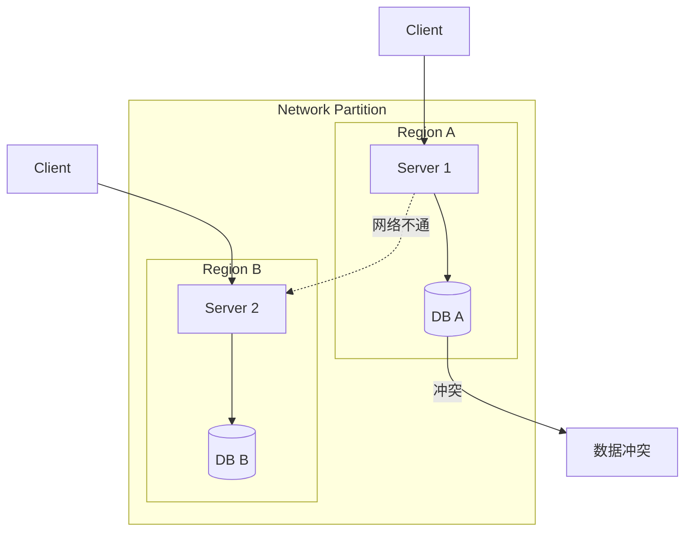
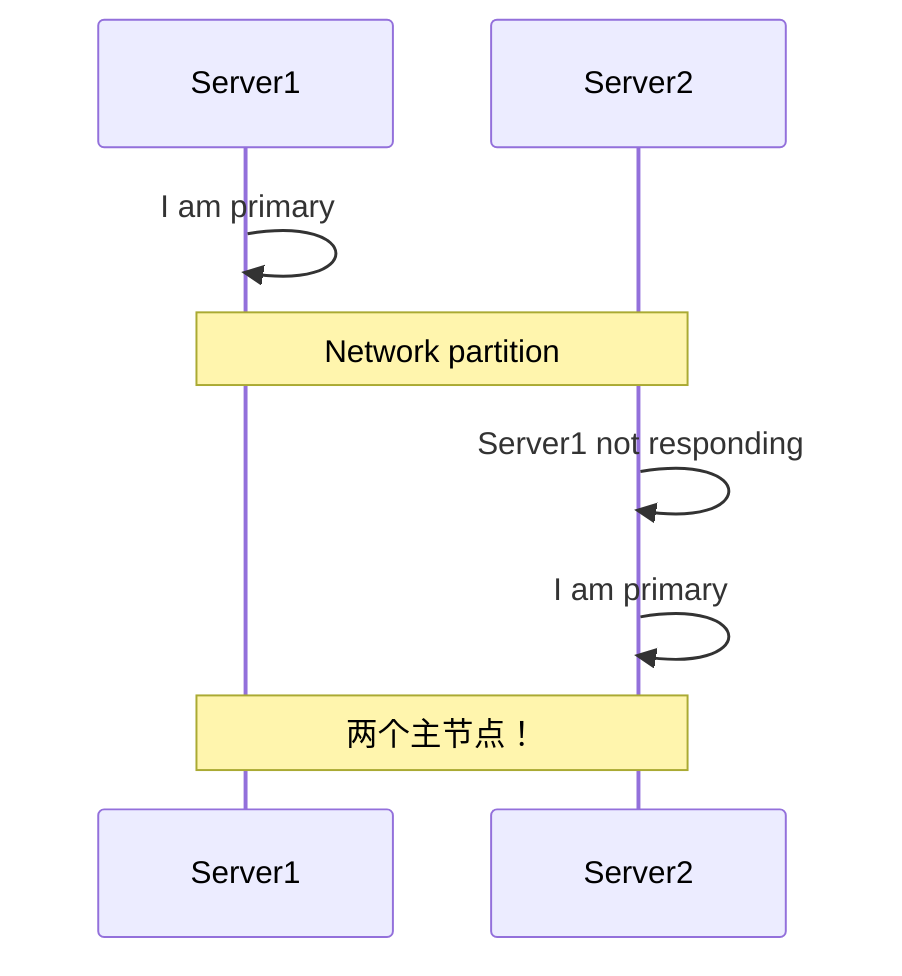
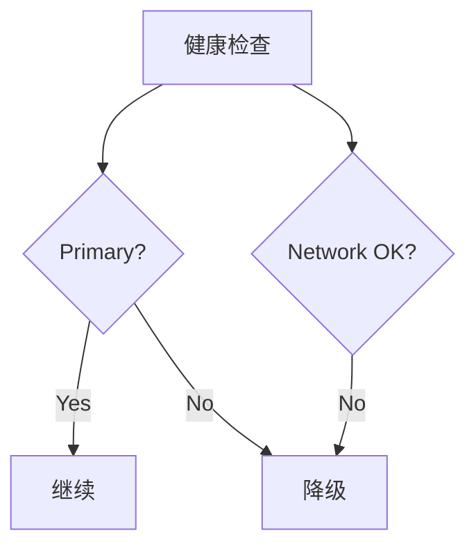

# Split-Brain in Distributed Systems

> **网络分区导致的多领导者冲突问题。**

---

## 1. 什么是 Split-Brain？



**问题**：两个分区各自认为自己是主节点，都可以写入，导致数据不一致。

---

## 2. Split-Brain 场景

### 2.1 主备切换



### 2.2 分布式锁

```
分区 A: 获取锁 Lock-1
分区 B: 获取锁 Lock-1 (以为 A 挂了)

两个分区都可以操作资源！
```

---

## 3. 解决方案

### 3.1 多数派 Quorum

```yaml
# Raft/多数派
- 3 节点集群
- 需要 2/3 票才能成为主节点
- 网络分区时，只有一方有多数派
- 少数派自动变为 follower
```

### 3.2 租赁机制

```python
# 分布式锁 + 租赁
lock = etcd.lock("resource-1")
if lock.acquire(lease=10s):
    try:
        # 处理
    finally:
        lock.release()

# 如果处理超过 10s，锁自动过期
# 其他节点可以获取
```

### 3.3 隔离机制

```yaml
# 资源隔离
- 只有一个区域可以写入
- 其他区域只读
- 称为 "Primary Region"
```

### 3.4 检查点



---

## 4. CRDT 解决方案

### 什么是 CRDT？

```
CRDT = Conflict-free Replicated Data Type

无论合并顺序如何，结果都一致！
```

### 示例：Counter

```python
# G-Counter (只能增加)
class GCounter:
    def __init__(self):
        self.counts = {}
    
    def increment(self, node_id):
        self.counts[node_id] = self.counts.get(node_id, 0) + 1
    
    def value(self):
        return sum(self.counts.values())
    
    def merge(self, other):
        for node_id, count in other.counts.items():
            self.counts[node_id] = max(
                self.counts.get(node_id, 0), 
                count
            )
```

---

## 5. 面试问题

### Q: 如何检测 Split-Brain？
**A**:
- 心跳超时检测
- 多数派投票
- 监控活跃主节点数

### Q: Split-Brain 后如何恢复？
**A**:
- 使用 LWW（最后写入胜出）
- 手动合并
- CRDT 自动合并

---

## 6. Interview Narrative

> "Split-brain 是分布式系统经典问题，我们用多数派解决：Raft 协议要求多数节点同意才能成为主节点，网络分区时只有多数派那一边能继续工作。数据冲突使用 Last-Writer-Wins 或 CRDT。对于跨区域写入，我们采用主备模式：只有主区域可以写入，其他区域只读。如果检测到 Split-Brain，少数派自动降级为只读并尝试重新加入。"

---

## 7. 最佳实践

| 方法 | 适用场景 | 复杂度 |
|------|----------|--------|
| 多数派 | 需要强一致性 | 中 |
| 租赁 | 锁服务 | 低 |
| CRDT | 计数器、集合 | 中 |
| 隔离 | 主备切换 | 低 |
