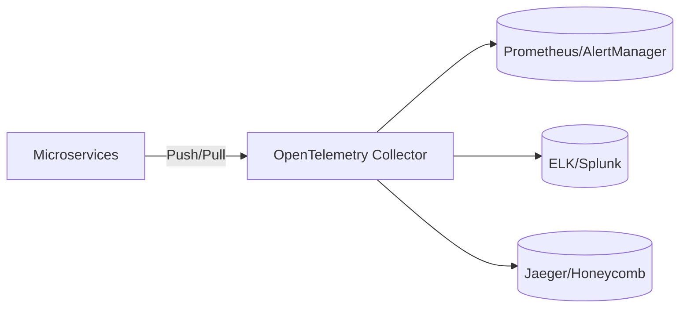

# 🩺 Observability & Monitoring Strategy (Staff Level)

> **Staff-Signal**: If the system goes down, can you pinpoint the root cause in < 5 minutes using data, or are you just "guessing" in the logs?

---

## 1. The Three Pillars of Observability
A common interview question: "What is the difference between monitoring and observability?"
1.  **Metrics**: (Aggregated) Numerical data over time. "How many 500 errors?"
2.  **Logs**: (Discrete) Events/Text. "Exactly what did this user do?"
3.  **Traces**: (Contextual) Path of a single request across many services. "Where is the 2-second bottleneck in this microservice chain?"

---

## 2. Setting SLOs, SLIs, and SLAs (The SRE Language)
MAANG interviewers use these terms to see if you have production experience.
*   **SLI (Indicator)**: The metric (e.g., Latency, Error Rate).
*   **SLO (Objective)**: The target for the SLI (e.g., 99.9% of requests < 200ms).
*   **SLA (Agreement)**: The legal contract with the customer (if SLO fails, we pay you).
*   **Error Budget**: The amount of downtime allowed (100% - SLO). If the budget is gone, we freeze feature releases.

---

## 3. Designing a Telemetry Pipeline

### 🗝️ Key Challenge: High Cardinality
A "Staff" problem is when you try to track `user_id` as a metric dimension. 
*   **Problem**: 1B users = 1B unique series in your DB. It will crash.
*   **Solution**: Only track "High Cardinality" data in **Logs/Traces**, not in **Metrics**. Metrics should be for aggregates (Region, Service, ErrorCode).

---

## 4. The Four Golden Signals (Google SRE)
Must mention these four in any "How would you monitor this?" answer:
1.  **Latency**: Time it takes to service a request.
2.  **Traffic**: Demand placed on the system.
3.  **Errors**: Rate of failed requests.
4.  **Saturation**: How "full" is your service? (CPU, Memory, I/O).

---

## 5. Distributed Tracing (The Staff Weapon)
When Service A calls B calls C, and it's slow, how do you know where?
*   **Trace ID**: A unique ID passed in the HTTP Header across all services.
*   **Span**: Each service records its start/end time for that ID.
*   **Result**: A "Gantt Chart" of the request lifecycle.

---

## ⚖️ Tradeoffs: Push vs. Pull Monitoring

| Parameter | Pull (Prometheus) | Push (StatsD/DataDog) |
| :--- | :--- | :--- |
| **Logic** | Server probes the app. | App sends data to server. |
| **Scaling** | Easy horizontally (add more scrapers). | Can overwhelm the collector. |
| **Complexity** | Service discovery required. | Simple client-side config. |

---

## 💬 How to use this in an Interview

> "I will implement the **Four Golden Signals** for all services, utilizing an **OpenTelemetry** pipeline for vendor-neutrality. I'll define a **99.9% Availability SLO** and use the **Error Budget** to drive our deployment frequency. For the microservice bottlenecks, I'll implement **Distributed Tracing** to track request spans across the network, ensuring we have the observability needed to meet our P99 latency targets."

### Follow-up question: "What if the monitoring system itself causes a thundering herd?"
**Correct Answer**: "I would implement **Sampling**. Instead of tracing 100% of requests, we only trace 0.1% or only 100% of 'Slow' requests (> 500ms). This gives us high signal with low performance overhead."
