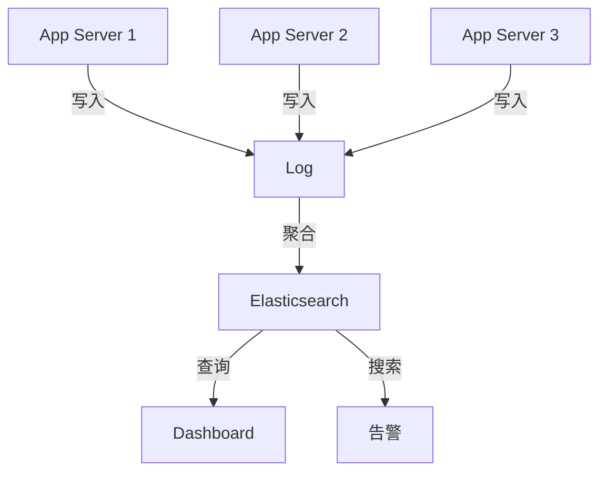
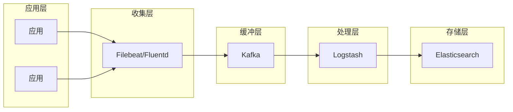

# Logging at Scale

> **构建可搜索、可分析的大规模日志系统。**

---

## 1. 为什么需要日志系统？



- **调试**: 出了问题，能查到什么
- **审计**: 谁在什么时候做了什么
- **分析**: 用户行为、业务趋势
- **告警**: 异常检测、主动通知

---

## 2. 日志级别

```python
import logging

# 级别定义
logging.DEBUG    # 10 - 详细调试信息
logging.INFO     # 20 - 正常运行信息
logging.WARNING  # 30 - 警告（非错误但需注意）
logging.ERROR    # 40 - 错误（功能受影响）
logging.CRITICAL # 50 - 严重（系统可能崩溃）
```

**使用原则**:
- DEBUG: 开发时，追踪详细流程
- INFO: 生产环境，重要业务事件
- WARNING: 需要注意但不影响功能
- ERROR: 需要修复的问题
- CRITICAL: 立即处理的问题

---

## 3. 日志格式 (JSON)

```json
{
  "timestamp": "2024-01-15T10:30:00.123Z",
  "level": "INFO",
  "service": "order-service",
  "environment": "production",
  "host": "ip-10-0-1-1",
  "trace_id": "abc123def456",
  "span_id": "span789",
  "message": "Order created",
  "context": {
    "order_id": "ord_123",
    "user_id": "user_456",
    "amount": 99.99
  },
  "logger": {
    "class": "OrderService",
    "method": "createOrder"
  }
}
```

**结构化日志的优势**:
- 易于搜索和过滤
- 便于程序解析
- 字段可以索引

---

## 4. 日志收集架构

### 4.1 架构图



### 4.2 Kubernetes 环境

```yaml
# DaemonSet 部署日志代理
apiVersion: apps/v1
kind: DaemonSet
metadata:
  name: filebeat
spec:
  template:
    spec:
      containers:
      - name: filebeat
        image: docker.elastic.co/beats/filebeat:8.11.0
        volumeMounts:
        - name: varlog
          mountPath: /var/log
        - name: config
          mountPath: /etc/filebeat
      volumes:
      - name: varlog
        hostPath:
          path: /var/log
```

---

## 5. 日志存储策略

| 存储层 | 保留时间 | 用途 | 成本 |
|--------|----------|------|------|
| **Hot (SSD)** | 0-7 天 | 实时查询 | 高 |
| **Warm** | 7-30 天 | 调查分析 | 中 |
| **Cold** | 30-90 天 | 合规存档 | 低 |
| **Archive** | 1-7 年 | 审计需求 | 最低 |

```yaml
# Elasticsearch ILM 策略
{
  "policy": {
    "phases": {
      "hot": {
        "min_age": "0ms",
        "actions": {
          "rollover": {
            "max_size": "50gb",
            "max_age": "7d"
          }
        }
      },
      "warm": {
        "min_age": "7d",
        "actions": {
          "shrink": {
            "number_of_shards": 1
          },
          "forcemerge": {
            "max_num_segments": 1
          }
        }
      },
      "cold": {
        "min_age": "30d",
        "actions": {
          "allocate": {
            "number_of_replicas": 0
          }
        }
      },
      "delete": {
        "min_age": "90d",
        "actions": {
          "delete": {}
        }
      }
    }
  }
}
```

---

## 6. 面试问题

### Q: 日志太多影响性能怎么办？
**A**:
- 异步写入
- 批量处理
- 采样（低优先级日志）
- 调整日志级别

### Q: 如何确保日志完整性？
**A**:
- 写入后刷新
- 多副本存储
- 定期备份

### Q: 日志如何保密？
**A**:
- 过滤敏感字段（PII、密码）
- 加密存储
- 访问控制

---

## 7. Interview Narrative

> "生产环境日志系统采用 ELK 架构：应用输出 JSON 格式日志，Filebeat 收集推送到 Kafka 缓冲，Logstash 处理后存入 Elasticsearch。设置生命周期策略：热存储 7 天用于实时查询，温存储 30 天用于调查，冷存储 90 天降低成本。所有日志包含 trace_id 关联分布式追踪，过滤敏感字段保证合规性。日志量大约 50GB/天，通过索引压缩和温存储平衡成本。"
