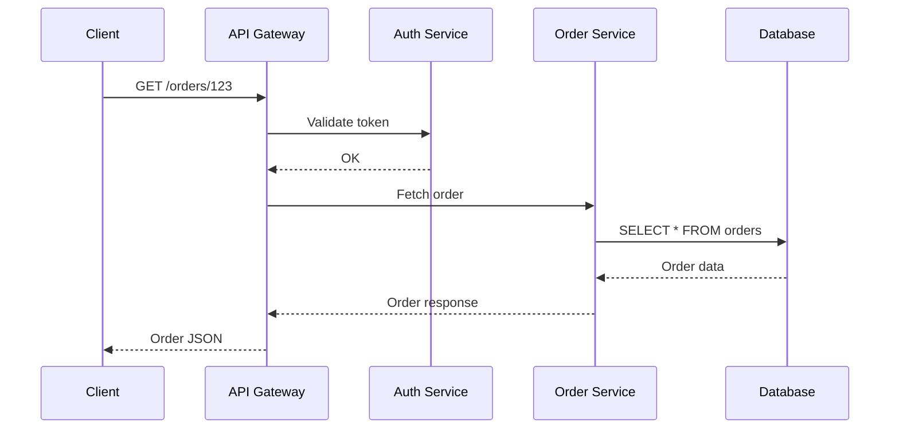
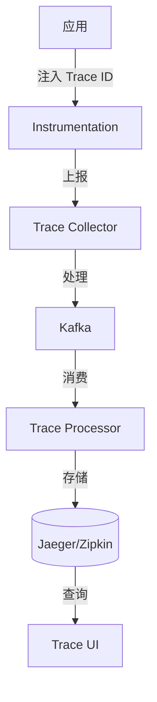

# Distributed Tracing

> **追踪请求在分布式系统中的完整路径。**

---

## 1. 什么是分布式追踪？



**问题**: 一个请求经过 10+ 服务，如何定位慢在哪？

**解决**: 分布式追踪

---

## 2. 核心概念

### 2.1 Trace & Span

```
Trace: 整个请求的生命周期
Span:  单个服务/组件的操作

┌─────────────────────────────────────────────────────┐
│ Trace: abc123                                       │
│  ├─ Span: api-gateway (10ms)                        │
│  │   ├─ Span: auth-service (2ms)                   │
│  │   └─ Span: order-service (8ms)                  │
│  │       └─ Span: database (5ms)                    │
│  └─ Span: response-transform (1ms)                 │
└─────────────────────────────────────────────────────┘
```

### 2.2 Trace Context

```http
# HTTP Header
traceparent: 00-0af7651916cd43dd8448eb211c80319-cb5e6a4f5a7dd123-01

# 分解:
# version: 00
# trace-id: 0af7651916cd43dd8448eb211c80319
# parent-id: cb5e6a4f5a7dd123
# trace-flags: 01 (sampled)
```

---

## 3. 追踪系统架构



---

## 4. 实现方式

### 4.1 代码注入 (OpenTelemetry)

```python
from opentelemetry import trace
from opentelemetry.exporter.jaeger import JaegerExporter
from opentelemetry.sdk.trace import TracerProvider
from opentelemetry.sdk.trace.export import BatchSpanProcessor

# 设置追踪提供者
provider = TracerProvider()
processor = BatchSpanProcessor(JaegerExporter(
    agent_host_name="jaeger",
    agent_port=6831,
))
provider.add_span_processor(processor)
trace.set_tracer_provider(provider)

# 创建追踪
tracer = trace.get_tracer(__name__)

def get_order(order_id):
    with tracer.start_as_current_span("get_order") as span:
        span.set_attribute("order_id", order_id)
        
        # 业务逻辑
        order = db.query(order_id)
        
        return order
```

### 4.2 服务网格 (Istio/Envoy)

```yaml
# 自动追踪所有入站和出站请求
apiVersion: networking.istio.io/v1beta1
kind: Telemetry
metadata:
  name: tracing-default
spec:
  tracing:
  - providers:
    - name: jaeger
    randomSamplingPercentage: 10.0
```

---

## 5. 采样策略

| 策略 | 采样率 | 用途 |
|------|--------|------|
| **Head** | 1-10% | 随机采样 |
| **Tail** | 100% | 错误请求优先 |
| **Error** | 100% | 只采样错误 |
| **Adaptive** | 动态 | 负载自适应 |

```python
# 错误请求 100% 采样
def should_sample(span):
    if span.status_code == ERROR:
        return True
    return random.random() < 0.1
```

---

## 6. 常用工具

| 工具 | 类型 | 特点 |
|------|------|------|
| **Jaeger** | 开源 | Uber 开源，全面 |
| **Zipkin** | 开源 | Twitter 开源，简单 |
| **DataDog** | SaaS | APM + 监控 |
| **AWS X-Ray** | 云服务 | AWS 集成 |
| **Google Cloud Trace** | 云服务 | GCP 集成 |

---

## 7. 面试问题

### Q: Trace ID 如何保证唯一性？
**A**:
- 64 或 128 位随机数
- UUID 格式
- 客户端生成或第一个服务生成

### Q: 追踪的性能影响？
**A**:
- 异步上报
- 批量处理
- 采样控制
- 通常 < 1% 性能损耗

### Q: 如何关联日志和追踪？
**A**:
- 在日志中注入 trace_id
- 日志查询时可以带上 trace_id
- 可以在 UI 上点击跳转到对应日志

---

## 8. Interview Narrative

> "分布式追踪使用 OpenTelemetry 标准，在每个服务的入口和出口自动注入 trace_id 和 span_id。请求经过 API Gateway 时生成 trace_id，后续服务通过 HTTP header 传递。每个操作记录为 span，包含时间、服务名、操作类型、关键属性。数据通过 Kafka 缓冲写入 Jaeger 存储。采样策略采用 Head 采样 10%，错误请求 100% 采样，确保关键请求不丢失。通过 trace_id 可以串联日志，快速定位问题。"
