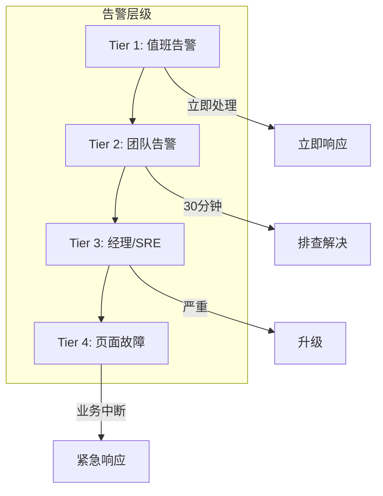

# Alerting and On-Call

> **建立有效的告警系统，最小化告警疲劳。**

---

## 1. 告警黄金法则

```
告警太多 = 没有告警

好的告警:
- 需要人工干预
- 可操作
- 清晰明确

❌ 糟糕的告警:
- 磁盘 90% (但还会继续运行)
- 5xx 错误 < 1% (业务无感知)
- 每日定时"检查"告警
```

---

## 2. 告警层级



### 告警分级

| 级别 | 名称 | 响应时间 | 示例 |
|------|------|----------|------|
| **P1** | 紧急 | 15 分钟 | 服务完全不可用 |
| **P2** | 高 | 30 分钟 | 部分功能不可用 |
| **P3** | 中 | 2 小时 | 性能下降 |
| **P4** | 低 | 24 小时 | 容量预警 |

---

## 3. 告警配置

### 3.1 Prometheus Alert Rules

```yaml
groups:
- name: api-alerts
  rules:
  # 错误率告警
  - alert: HighErrorRate
    expr: |
      sum(rate(http_requests_total{status=~"5.."}[5m])) 
      / sum(rate(http_requests_total[5m])) > 0.01
    for: 5m
    labels:
      severity: critical
    annotations:
      summary: "High error rate on {{ $labels.service }}"
      description: "Error rate is {{ $value | humanizePercentage }}"
      
  # 延迟告警
  - alert: HighLatency
    expr: |
      histogram_quantile(0.95, 
        sum(rate(http_request_duration_seconds_bucket[5m])) 
        by (le, service)) > 1
    for: 10m
    labels:
      severity: warning
    annotations:
      summary: "High P95 latency on {{ $labels.service }}"
      
  # 容量告警
  - alert: HighMemoryUsage
    expr: |
      (container_memory_usage_bytes / container_spec_memory_limit_bytes) > 0.85
    for: 15m
    labels:
      severity: warning
```

### 3.2 告警静默

```yaml
# 维护窗口期间静默
apiVersion: monitoring.coreos.com/v1alpha1
kind: Silence
metadata:
  name: maintenance-window
spec:
  comment: "Database maintenance window"
  startsAt: "2024-01-15T02:00:00Z"
  endsAt: "2024-01-15T04:00:00Z"
  matchers:
  - name: service
    value: payment-service
  - name: environment
    value: production
```

---

## 4. Runbook (告警处理手册)

```yaml
# HighErrorRate runbook
apiVersion: v1
kind: ConfigMap
metadata:
  name: runbook-high-error-rate
data:
  runbook.md: |
    ## High Error Rate Runbook
    
    ### 初步检查
    1. 查看错误日志: `kubectl logs -l app=api --tail=100`
    2. 查看依赖服务状态
    3. 检查最近部署
    
    ### 常见原因
    - 数据库连接池耗尽
    - 依赖服务超时
    - 新代码部署问题
    
    ### 解决方案
    1. 如果是部署问题: 回滚
    2. 如果是依赖问题: 启用熔断
    3. 如果是数据库: 重启服务释放连接
    
    ### 升级路径
    - 30 分钟未解决 → 升级到 SRE
    - 1 小时未解决 → 升级到技术经理
```

---

## 5. On-Call 最佳实践

### 5.1 值班轮换

```python
# 值班表生成（每两周轮换）
schedule = [
    ("alice@example.com", "2024-01-01", "2024-01-14"),
    ("bob@example.com", "2024-01-15", "2024-01-28"),
    ("charlie@example.com", "2024-01-29", "2024-02-11"),
]
```

### 5.2 值班装备

- **手机**: 24/7 可达
- **文档**: Runbook 可访问
- **工具**: VPN、日志系统权限
- **备份**: 副值班（escalation）

### 5.3 值班礼仪

```
✅ 应该:
- 及时响应（P1 < 15分钟）
- 记录所有操作
- 认真交接班

❌ 不应该:
- 忽略告警
- 未经排查直接升级
- 隐瞒问题
```

---

## 6. 面试问题

### Q: 如何减少告警疲劳？
**A**:
- 告警必须可操作
- 设置合理的阈值和持续时间
- 使用静默窗口
- 定期审查无效告警
- 自动化常见问题的响应

### Q: SLO vs SLA vs SLI？
**A**:
- SLI: 指标（实际测量的性能）
- SLO: 目标（我们承诺的目标）
- SLA: 协议（不达标的后果）

---

## 7. Interview Narrative

> "告警系统采用分级机制：P1 告警需要 15 分钟内响应，P2 30 分钟，P3 2 小时。告警必须可操作，每个告警关联 Runbook，值班人员可以直接按文档排查。我们定期审查告警质量，每月清理无效告警，减少告警疲劳。值班采用两周轮换制，有副值班作为升级后备。所有告警处理都会记录，作为事后复盘的输入。"
