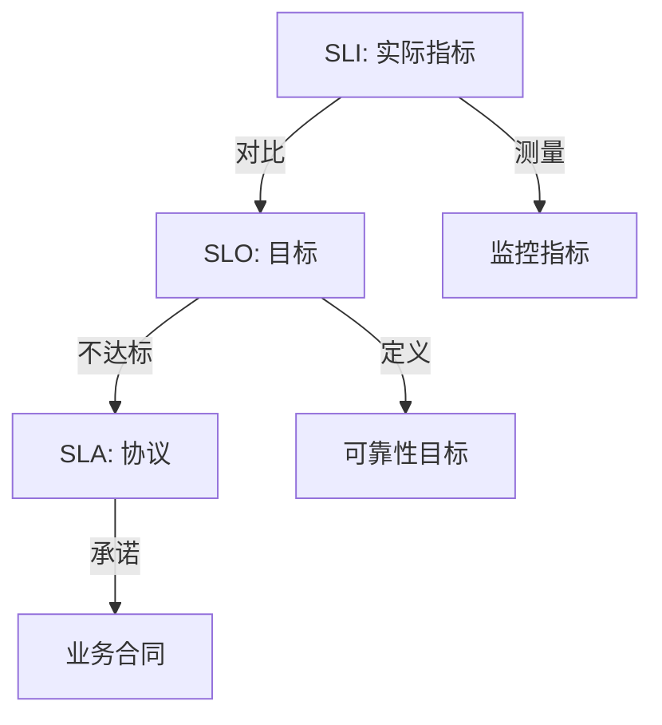
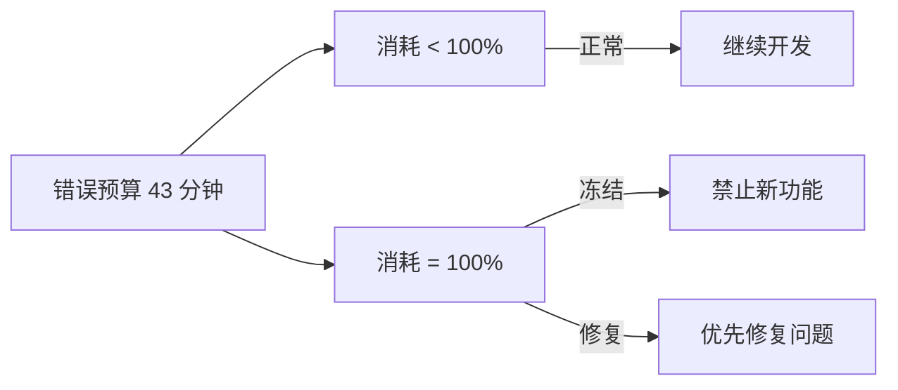

# SLO, SLI, and SLA

> **建立可靠性标准和业务承诺。**

---

## 1. 核心概念



- **SLI (Service Level Indicator)**: 实际测量的指标
- **SLO (Service Level Objective)**: 目标值
- **SLA (Service Level Agreement)**: 协议/合同

---

## 2. SLI 定义

### 2.1 常见 SLI 类型

| 类型 | 指标 | 公式 |
|------|------|------|
| **可用性** | 成功请求比例 | (成功请求 / 总请求) × 100% |
| **延迟** | P99 响应时间 | histogram_quantile(0.99, ...) |
| **质量** | 错误率 | (5xx / 总请求) × 100% |
| **吞吐量** | QPS | rate(requests_total) |
| **新鲜度** | 数据延迟 | now() - data_timestamp |

### 2.2 SLI 计算示例

```promql
# 可用性 SLI
sum(rate(http_requests_total{service="api", status=~"2.."}[5m]))
/ sum(rate(http_requests_total{service="api"}[5m]))

# 延迟 SLI (P99 < 500ms)
histogram_quantile(0.99,
  sum(rate(http_request_duration_seconds_bucket{service="api"}[5m])) by (le)
)

# 存储 SLI (数据新鲜度 < 5秒)
max by (table) (
  timestamp(gauge_data_age_seconds) - gauge_data_age_seconds
) < 5
```

---

## 3. SLO 设置

### 3.1 经典 SLO

```
服务: 用户 API
SLI: 可用性
目标: 99.9%
周期: 30 天
允许不可用: 43 分钟/月
```

| 目标 | 每月允许 downtime |
|------|-------------------|
| 99% | 7.3 小时 |
| 99.9% | 43 分钟 |
| 99.95% | 22 分钟 |
| 99.99% | 4.3 分钟 |
| 99.999% | 26 秒 |

### 3.2 多层 SLO

```yaml
# 用户 API SLO
service_level_objectives:
  - name: API Availability
    sli: http_requests_success / http_requests_total
    target: 0.999
    window: 30d
    alert_on_breach: true
    
  - name: API Latency P99
    sli: histogram_quantile(0.99, http_duration)
    target: 0.5s
    window: 7d
    alert_on_breach: true
    
  - name: Data Freshness
    sli: max(data_age_seconds)
    target: 5s
    window: 5m
```

---

## 4. 错误预算

### 4.1 概念

```
错误预算 = 允许的故障时间

30天 × 99.9% 可用性:
= 30 × 24 × 60 × 0.001
= 43 分钟错误预算

已使用 30 分钟 → 剩余 13 分钟
```

### 4.2 消耗策略



### 4.3 预算告警

```yaml
# 错误预算告警
- alert: ErrorBudgetExhausted
  expr: |
    (1 - (service:slo:errors:ratio30d))
    < 0.1  # 剩余 < 10%
  annotations:
    summary: "Error budget running low"
    description: "Only {{ $value | humanizePercentage }} remaining"
```

---

## 5. SLA 区别

| 方面 | SLO | SLA |
|------|-----|-----|
| **目标** | 内部目标 | 外部承诺 |
| **严格性** | 自己的标准 | 法律/合同 |
| **后果** | 自我约束 | 赔偿/罚款 |
| **典型值** | 99.9% - 99.99% | 99% - 99.9% |

---

## 6. Interview Narrative

> "SLO 我们设置为 99.9% 可用性（月度），对应每月 43 分钟的错误预算。采用多 SLI 监控：可用性、延迟 P99、数据新鲜度。错误预算按周追踪，当剩余 < 10% 时触发告警，暂停新功能开发优先修复可靠性问题。与客户的 SLA 承诺是 99.5%，比内部 SLO 宽松，为我们留出缓冲。"

---

## 7. 选择 SLO 值的指南

| 服务类型 | 推荐 SLO | 理由 |
|----------|----------|------|
| **核心业务** | 99.99% | 任何中断都影响收入 |
| **重要服务** | 99.9% | 可接受的小中断 |
| **内部工具** | 99% | 允许定期维护 |
| **实验性** | 95% | 快速迭代优先 |
