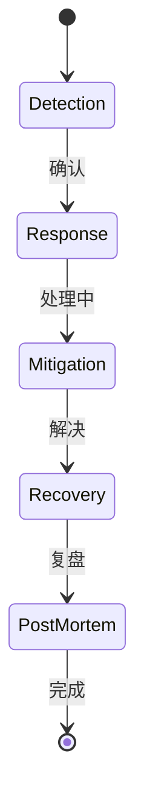

# Incident Response

> **快速有效地响应和恢复服务故障。**

---

## 1. 事件生命周期



| 阶段 | 目标 | 时间目标 |
|------|------|----------|
| **Detection** | 发现问题 | < 5 分钟 |
| **Response** | 确认和升级 | < 15 分钟 |
| **Mitigation** | 遏制影响 | < 30 分钟 |
| **Recovery** | 完全恢复 | < 4 小时 |
| **Post-mortem** | 学习改进 | < 7 天 |

---

## 2. 事件严重级别

| 级别 | 名称 | 影响 | 响应时间 | 示例 |
|------|------|------|----------|------|
| **SEV1** | 紧急 | 全站不可用 | 15 分钟 | 主数据库宕机 |
| **SEV2** | 高 | 核心功能不可用 | 30 分钟 | 支付失败 |
| **SEV3** | 中 | 非核心功能受损 | 2 小时 | 搜索缓慢 |
| **SEV4** | 低 | 小范围影响 | 24 小时 | 某个 UI bug |

---

## 3. 响应流程

### 3.1 检测阶段

```yaml
# 自动检测
- 监控系统检测到异常
- 触发 PagerDuty 告警
- 值班人员收到电话

# 人工检测
- 用户报告
- 客服转报
- 内部发现
```

### 3.2 响应阶段

```yaml
# 确认事件
1. 值班人员响应："收到，正在排查"
2. 创建事件 channel: #incident-123
3. 评估严重级别
4. 通知相关人员

# 升级
- SEV1 → 立即通知 SRE 经理
- SEV2 → 30 分钟未解决则升级
- 需要业务专家 → 拉入相关团队
```

### 3.3 缓解阶段

```yaml
# 立即止血
1. 启用备用方案
2. 禁用问题功能
3. 回滚到上一个稳定版本
4. 启用限流/熔断

# 沟通状态
1. 更新状态页
2. 定期发送进展
3. 告知预计恢复时间
```

---

## 4. 事件管理工具

### 4.1 PagerDuty 集成

```yaml
# PagerDuty Service
service:
  name: production-api
  escalation_policy:
    - targets:
      - user: oncall-sre
      timeout: 30 minutes
    - targets:
      - user: sre-manager
      timeout: 15 minutes
```

### 4.2 事件 Channel 模板

```
#inc-123: Payment Service Outage

**Status**: 🔴 SEV1 - Investigating
**Impact**: All payment processing failing
**Commander**: @alice (SRE)
**Affected**: payment-service

**Timeline**:
- 10:30 - Alert triggered (PagerDuty)
- 10:32 - On-call acknowledged
- 10:35 - Incident channel created
- 10:40 - Identified DB connection pool exhaustion

**Actions**:
- [x] Enabled circuit breaker on payment service
- [ ] Rolling restart of payment pods
- [ ] Scaling up DB connections

**Updates**:
- 10:45: Mitigation in progress
- ETA: 15 minutes
```

---

## 5. 事后复盘 (Post-Mortem)

### 5.1 复盘模板

```markdown
# Incident Post-Mortem: #inc-123

## Summary
Payment service experienced 45 minutes of downtime due to database connection pool exhaustion.

## Impact
- 12,000 failed transactions
- Estimated revenue loss: $15,000
- Customer impact: 2 hours of failed payments

## Timeline (UTC)
- 10:30 - Alert triggered
- 10:35 - Root cause identified  
- 10:45 - Mitigation deployed
- 11:15 - Full recovery

## Root Cause
New deployment increased concurrent requests without adjusting DB connection pool size.

## Contributing Factors
1. Load test did not include connection pool metrics
2. No auto-scaling for DB connections
3. Alert threshold set too high (90% vs 75%)

## Action Items
- [ ] Add connection pool metrics to dashboards (Owner: Bob, Due: 2024-01-22)
- [ ] Implement auto-scaling for DB connections (Owner: Alice, Due: 2024-02-05)
- [ ] Lower alert threshold to 75% (Owner: Ops, Due: 2024-01-18)
- [ ] Update load testing to include connection metrics (Owner: QA, Due: 2024-01-25)

## Lessons Learned
1. Database connection pools need monitoring
2. Load tests should cover all critical paths
3. Alert thresholds should be conservative
```

### 5.2 复盘原则

```
✅ 应该:
- 关注"什么"和"如何"，而非"谁"
- 提出具体的改进措施
- 记录时间线用于学习
- 分享经验避免重复

❌ 不应该:
- 指责个人
- 惩罚失败
- 隐瞒问题
- 跳过失败的事件
```

---

## 6. 面试问题

### Q: 如何决定是否回滚？
**A**:
- 如果是最近的变更（< 1 小时）
- 如果影响范围大
- 如果排查需要时间
- 回滚通常是安全的起点

### Q: 如何在事件中保持沟通？
**A**:
- 定期更新（每 15-30 分钟）
- 诚实面对不确定性
- 明确下一步行动
- 记录在公开 channel

---

## 7. Interview Narrative

> "我们采用 SEV 级别定义事件：SEV1 是全站不可用，需要 15 分钟内响应。每个事件都有事件指挥官（Incident Commander）负责协调，避免多人同时处理混乱。事件处理后 7 天内完成复盘文档，关注'什么'和'如何'而非'谁'，并分配具体的行动项跟进。我们相信每个事件都是学习机会，复盘文化鼓励报告问题而非隐瞒。"
