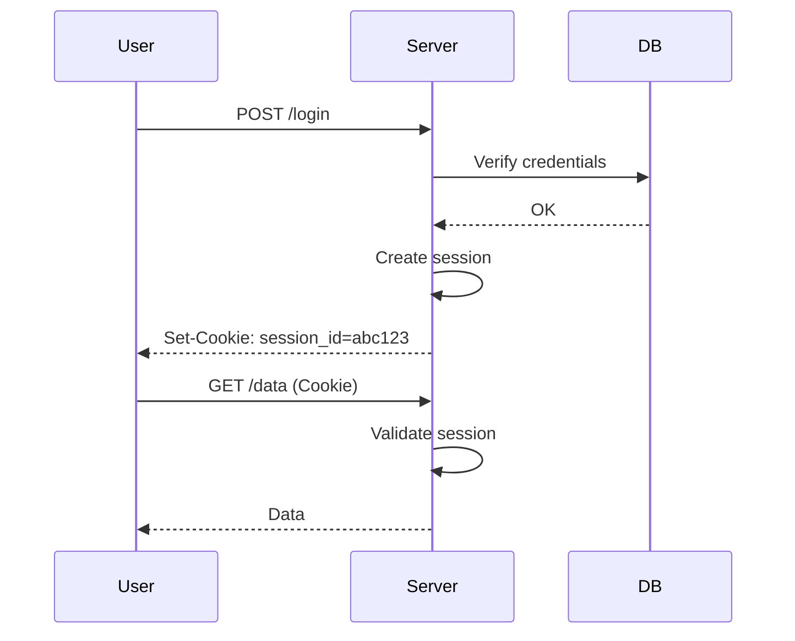
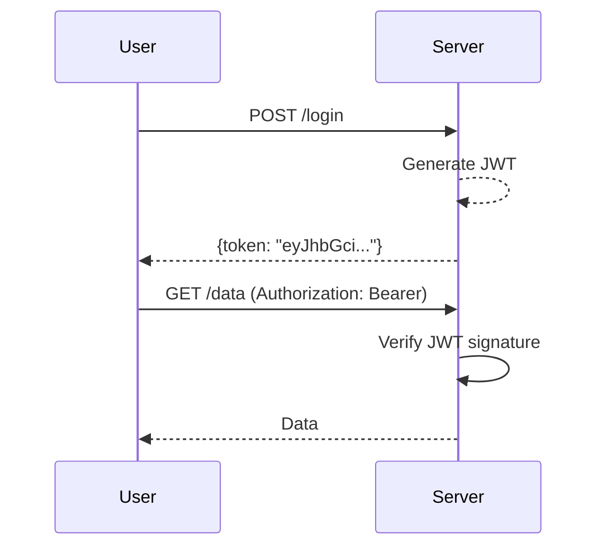
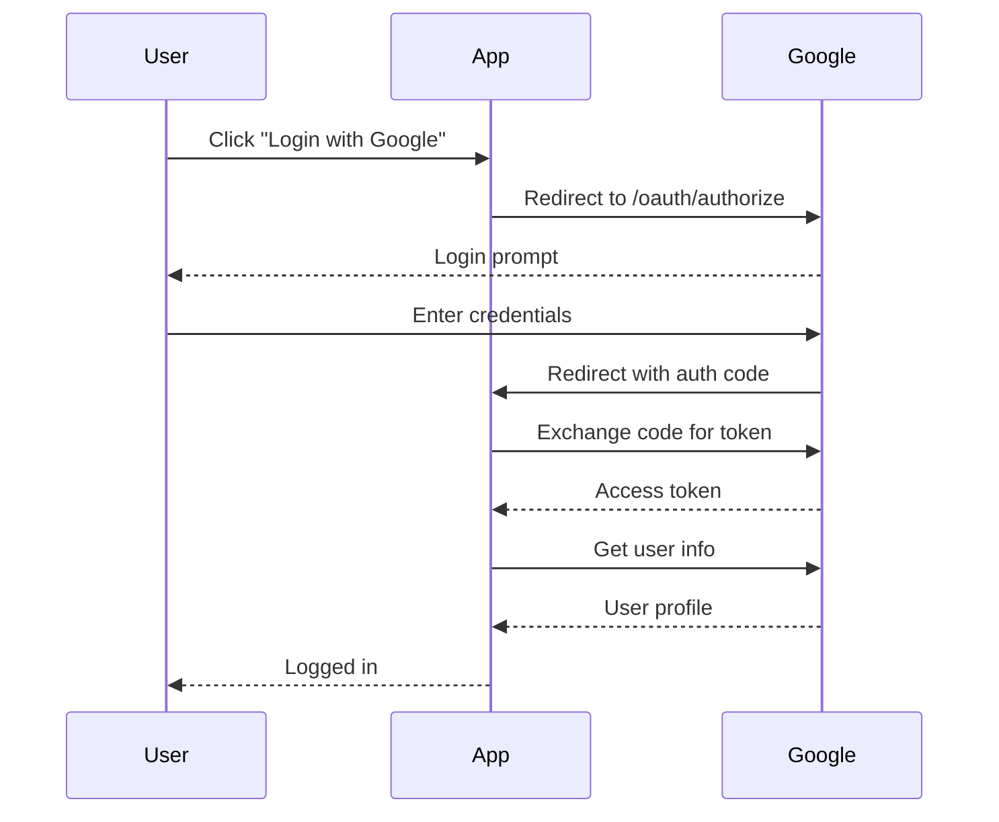

# Authentication and Authorization

> **验证身份和控制访问权限。**

---

## 1. 认证 vs 授权

```
认证 (Authentication): "你是谁？"
- 登录验证
- API Token 验证
- 多因素认证

授权 (Authorization): "你能做什么？"
- 角色权限
- 资源访问控制
- API 级别权限
```

---

## 2. Authentication 方法

### 2.1 Session-Based



**使用场景**: 传统 Web 应用

### 2.2 JWT (JSON Web Token)



**JWT 结构**:
```
eyJhbGciOiJIUzI1NiIsInR5cCI6IkpXVCJ9  # Header
.eyJzdWIiOiIxMjM0NTY3ODkwIiwibmFtZSI6IkpvaG4gRG9lIn0  # Payload
.SflKxwRJSMeKKF2QT4fwpMeJf36POk6yJV_adQssw5c  # Signature
```

**Payload 示例**:
```json
{
  "sub": "user123",
  "name": "John Doe",
  "role": "admin",
  "iat": 1516239022,
  "exp": 1516242622
}
```

### 2.3 OAuth 2.0



### 2.4 API Keys

```http
# 用于服务间调用
GET /api/v1/data
X-API-Key: sk_live_abc123def456

# 或
GET /api/v1/data?api_key=sk_live_abc123def456
```

---

## 3. Authorization 模式

### 3.1 RBAC (Role-Based Access Control)

```yaml
# 角色定义
roles:
  admin:
    - users:read
    - users:write
    - users:delete
    - orders:*
    
  manager:
    - users:read
    - orders:read
    - orders:write
    
  user:
    - orders:read
    - profile:read
    - profile:write
```

### 3.2 ABAC (Attribute-Based)

```json
{
  "effect": "allow",
  "actions": ["order:read"],
  "conditions": {
    "resource.owner": {"eq": "${user.id}"},
    "resource.status": {"in": ["active", "pending"]}
  }
}
```

### 3.3 ReBAC (Relationship-Based)

```json
{
  "effect": "allow",
  "action": "document:read",
  "condition": {
    "resource.team": {"eq": "user.team"}
  }
}
```

---

## 4. 最佳实践

### 4.1 安全 Headers

```http
# 响应 Headers
Strict-Transport-Security: max-age=31536000; includeSubDomains
Content-Security-Policy: default-src 'self'
X-Content-Type-Options: nosniff
X-Frame-Options: DENY
X-XSS-Protection: 1; mode=block
```

### 4.2 密码存储

```python
# 正确：使用 bcrypt
import bcrypt

def hash_password(password):
    return bcrypt.hashpw(password.encode(), bcrypt.gensalt())

def verify_password(password, hash):
    return bcrypt.checkpw(password.encode(), hash)

# ❌ 错误：不要用 MD5/SHA
h = hashlib.md5(password.encode())  # 不安全！
```

### 4.3 Token 安全

```
Access Token:
- 短期：15 分钟 - 1 小时
- 存储：内存（不要存 localStorage）

Refresh Token:
- 长期：7 - 30 天
- 存储：HttpOnly Cookie
- 存储位置：服务器端或安全存储
```

---

## 5. 面试问题

### Q: JWT vs Session？
**A**:
- JWT: 无状态，扩展性好，安全性依赖于签名
- Session: 有状态，服务端可控，扩展需要 Redis

### Q: 如何处理 Token 泄露？
**A**:
- 短期 Access Token 降低风险
- 实现 Token 撤销机制（黑名单）
- 监控异常登录
- 用户可以主动"登出所有设备"

---

## 6. Interview Narrative

> "认证采用 OAuth 2.0 + JWT：用户通过 Google 登录获取 Access Token（15 分钟）和 Refresh Token（7 天）。Token 使用 RS256 签名，私钥服务端保存。密码存储使用 bcrypt。权限控制采用 RBAC + ABAC 混合：角色定义基础权限，属性控制细粒度访问。所有 API 需要 Bearer Token，敏感操作需要额外验证。"
