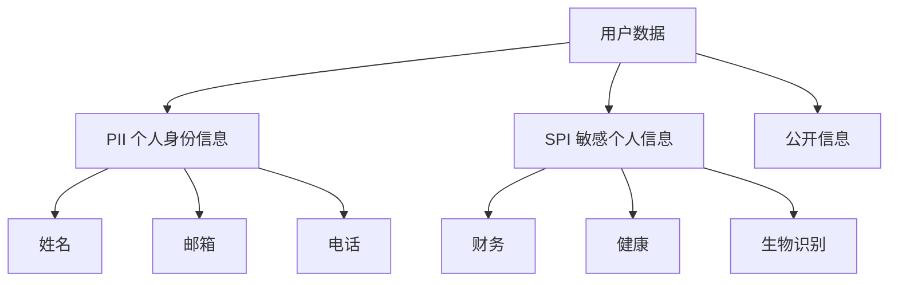
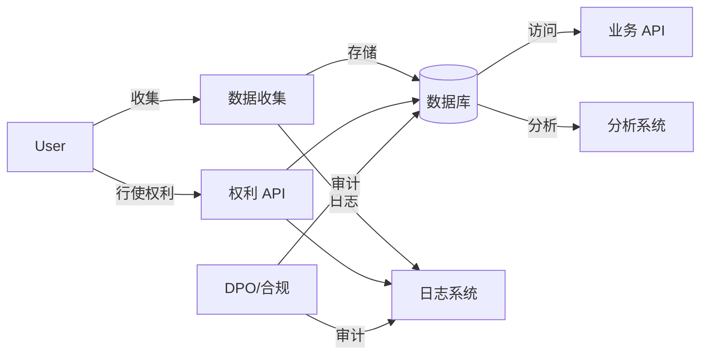

# Data Privacy: GDPR & Compliance

> **符合数据保护法规的设计原则。**

---

## 1. GDPR 核心原则

```
Lawful, Fair, Transparent
Purpose Limitation
Data Minimization
Accuracy
Storage Limitation
Integrity & Confidentiality
Accountability
```

---

## 2. 数据分类



| 类型 | 例子 | 保护级别 |
|------|------|----------|
| **PII** | 姓名、邮箱、IP | 中 |
| **SPI** | 财务、健康、生物 | 高 |
| **Public** | 公开博客 | 低 |

---

## 3. 数据主体权利

| 权利 | 描述 | 实现方式 |
|------|------|----------|
| **访问权** | 用户可以查看自己的数据 | API: GET /me/export |
| **更正权** | 修正不准确数据 | API: PUT /me |
| **删除权** | "被遗忘权" | 删除功能 + 级联删除 |
| **可携带权** | 导出数据 | 导出 JSON/CSV |
| **拒绝权** | 拒绝某些处理 | 偏好中心 |
| **限制处理** | 限制使用方式 | 标记 + 过滤 |

---

## 4. 合规架构

### 4.1 数据处理流程



### 4.2 数据存储设计

```sql
-- 用户表（加密存储敏感字段）
CREATE TABLE users (
    id UUID PRIMARY KEY,
    email_encrypted BYTEA,  -- 加密存储
    name_encrypted BYTEA,
    phone_encrypted BYTEA,
    preferences JSONB,      -- 偏好设置
    consent_record JSONB,   -- 同意记录
    deleted_at TIMESTAMP,   -- 软删除
    created_at TIMESTAMP,
    updated_at TIMESTAMP
);

-- 数据处理记录（审计）
CREATE TABLE processing_log (
    id UUID PRIMARY KEY,
    user_id UUID,
    processing_type VARCHAR(50),
    purpose VARCHAR(255),
    legal_basis VARCHAR(50),
    performed_at TIMESTAMP,
    performed_by UUID
);
```

---

## 5. Consent Management

### 5.1 同意记录

```json
{
  "user_id": "user_123",
  "consents": [
    {
      "purpose": "marketing",
      "granted": true,
      "version": "v2.1",
      "granted_at": "2024-01-15T10:30:00Z",
      "ip_address": "192.168.1.1",
      "method": "checkbox"
    },
    {
      "purpose": "analytics",
      "granted": false,
      "granted_at": null
    }
  ]
}
```

### 5.2 同意检查

```python
async def process_data(user_id: str, purpose: str):
    consent = await get_consent(user_id, purpose)
    
    if not consent or not consent.granted:
        raise PermissionError(f"No consent for {purpose}")
    
    if consent.version != CURRENT_VERSION:
        # 重新获取同意
        await prompt_reconsent(user_id, purpose)
    
    # 继续处理
    return await process()
```

---

## 6. 数据删除实现

### 6.1 软删除 + 级联

```python
async def delete_user(user_id: str):
    # 软删除用户
    await db.execute(
        "UPDATE users SET deleted_at = NOW() WHERE id = ?",
        user_id
    )
    
    # 删除关联数据（根据配置）
    await db.execute("DELETE FROM orders WHERE user_id = ?", user_id)
    await db.execute("DELETE FROM sessions WHERE user_id = ?", user_id)
    
    # 匿名化日志（保留统计价值）
    await anonymize_logs(user_id)
    
    # 记录删除审计
    await log_deletion(user_id, performed_by=get_current_user())
```

### 6.2 删除验证

```python
async def verify_deletion(user_id: str):
    """验证用户数据已完全删除"""
    
    # 检查所有表
    remaining = await db.fetch_all("""
        SELECT table_name 
        FROM information_schema.tables 
        WHERE table_schema = 'public'
    """)
    
    for table in remaining:
        count = await db.fetch_one(
            f"SELECT COUNT(*) as c FROM {table} WHERE user_id = ?",
            user_id
        )
        if count.c > 0:
            return False, f"Data remains in {table}"
    
    return True, "All data deleted"
```

---

## 7. CCPA (California)

```yaml
# 与 GDPR 类似但有差异
- Opt-out vs Opt-in: CCPA 是选择退出
- "Sale" of data: 必须披露数据销售
- Financial incentives: 需明确通知
- No private right of action: 部分例外
```

---

## 8. Interview Narrative

> "数据合规采用隐私优先设计。用户数据分类存储：PII 字段加密存储，敏感字段单独加密。实现完整的数据主体权利 API：导出、修正、删除。删除采用软删除 + 级联清理，确保 30 天内完全擦除。记录完整的处理审计日志，包括收集目的、法律依据、时间。Consent Management 追踪用户同意状态，所有数据处理前验证同意版本。"

---

## 9. 检查清单

- [ ] 数据分类并标记
- [ ] 加密敏感字段
- [ ] 实现删除 API
- [ ] 实现导出 API
- [ ] Consent 记录机制
- [ ] 审计日志
- [ ] DPO 指定
- [ ] 数据泄露通知流程
