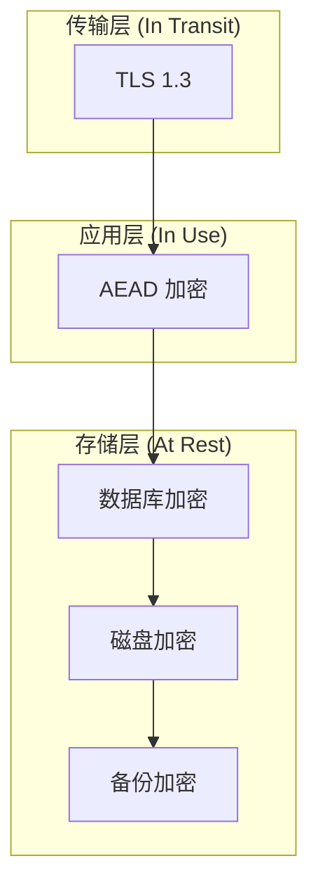
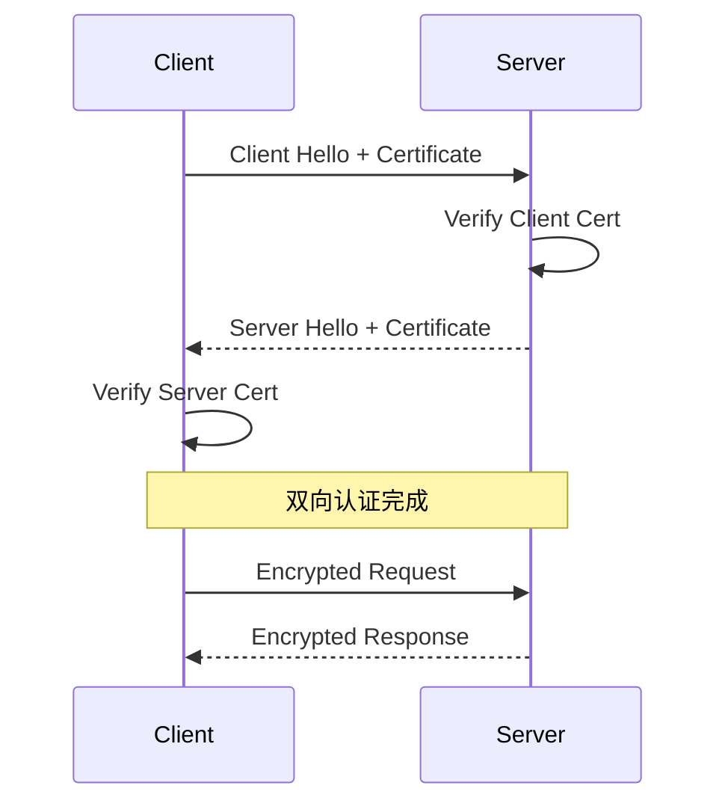

# Encryption at Rest and in Transit

> **保护数据安全的加密策略。**

---

## 1. 加密层次



---

## 2. 传输加密 (TLS)

### 2.1 TLS 配置

```nginx
# Nginx TLS 配置
server {
    listen 443 ssl http2;
    
    ssl_protocols TLSv1.2 TLSv1.3;
    ssl_ciphers 'ECDHE-ECDSA-AES128-GCM-SHA256:ECDHE-RSA-AES128-GCM-SHA256';
    ssl_prefer_server_ciphers off;
    
    ssl_certificate /etc/ssl/certs/server.crt;
    ssl_certificate_key /etc/ssl/private/server.key;
    
    # HSTS
    add_header Strict-Transport-Security "max-age=63072000" always;
}
```

### 2.2 证书管理

```yaml
# Kubernetes Ingress TLS
apiVersion: networking.k8s.io/v1
kind: Ingress
metadata:
  name: api-ingress
  annotations:
    cert-manager.io/cluster-issuer: letsencrypt-prod
spec:
  tls:
  - hosts:
    - api.example.com
    secretName: api-tls
  rules:
  - host: api.example.com
    http:
      paths:
      - path: /
        pathType: Prefix
        backend:
          service:
            name: api-service
            port:
              number: 80
```

### 2.3 mTLS (Mutual TLS)



---

## 3. 存储加密 (At Rest)

### 3.1 数据库透明加密 (TDE)

```sql
-- PostgreSQL: pgcrypto 扩展
-- 存储时加密
INSERT INTO users (email_encrypted) 
VALUES (
    pgp_sym_encrypt('user@example.com', 'encryption_key')
);

-- 读取时解密
SELECT 
    pgp_sym_decrypt(email_encrypted::bytea, 'encryption_key') as email
FROM users;
```

### 3.2 应用层加密

```python
from cryptography.fernet import Fernet

class EncryptionService:
    def __init__(self, key: bytes):
        self.cipher = Fernet(key)
    
    def encrypt(self, data: str) -> str:
        return self.cipher.encrypt(data.encode()).decode()
    
    def decrypt(self, encrypted: str) -> str:
        return self.cipher.decrypt(encrypted.encode()).decode()

# 使用
encryptor = EncryptionService(Fernet.generate_key())
encrypted = encryptor.encrypt("sensitive data")
decrypted = encryptor.decrypt(encrypted)
```

### 3.3 密钥管理 (KMS)

```yaml
# AWS KMS
resources:
  - type: AWS::KMS::Key
    properties:
      Description: "Database encryption key"
      EnableKeyRotation: true
      KeyPolicy:
        Version: "2012-10-17"
        Statement:
          - Effect: Allow
            Principal:
              AWS: "arn:aws:iam::123456789:root"
            Action:
              - kms:Encrypt
              - kms:Decrypt
            Resource: "*"
```

---

## 4. 密钥轮换

### 4.1 轮换策略

```
主密钥 (Master Key)
    ↓ 加密
数据密钥 (Data Key)
    ↓ 加密数据

每 90 天轮换:
1. 生成新数据密钥
2. 用主密钥加密新密钥
3. 用新密钥重新加密数据
4. 保留旧密钥用于解密历史数据
```

### 4.2 实现

```python
class KeyRotation:
    def __init__(self, kms_client, key_id):
        self.kms = kms_client
        self.key_id = key_id
    
    def rotate_data_key(self):
        # 生成新数据密钥
        new_key = Fernet.generate_key()
        
        # 用 KMS 加密
        encrypted = self.kms.encrypt(
            KeyId=self.key_id,
            Plaintext=new_key
        )
        
        # 存储加密的密钥
        self.store_encrypted_key(encrypted)
        
        return new_key
    
    def decrypt(self, data_key_id, encrypted_data):
        # 获取对应密钥
        data_key = self.get_data_key(data_key_id)
        
        # 解密
        cipher = Fernet(data_key)
        return cipher.decrypt(encrypted_data)
```

---

## 5. 加密算法选择

| 场景 | 算法 | 备注 |
|------|------|------|
| **对称加密** | AES-256-GCM | 带认证 |
| **非对称** | RSA-2048 或 ECDSA | 签名 |
| **哈希** | SHA-256 | 密码存储加盐 |
| **密码** | Argon2 / bcrypt | 推荐 |
| **TLS** | TLS 1.3 | 最新 |

---

## 6. 面试问题

### Q: 为什么同时需要 TLS 和数据库加密？
**A**:
- TLS: 保护传输中的数据（网络窃听）
- 数据库加密: 保护存储介质（磁盘被盗）

### Q: 密钥管理最佳实践？
**A**:
- 使用专门的 KMS 服务
- 不要把密钥硬编码
- 定期轮换密钥
- 最小权限原则

---

## 7. Interview Narrative

> "数据传输采用 TLS 1.3 强制加密，配置 HSTS 头。服务间通信使用 mTLS 双向认证。数据存储采用 AES-256-GCM 应用层加密，密钥由 AWS KMS 管理。主密钥开启自动轮换，数据密钥 90 天轮换一次。敏感字段（密码、支付信息、生物识别）额外加密存储。数据库透明加密（TDE）作为第二层保护。"
