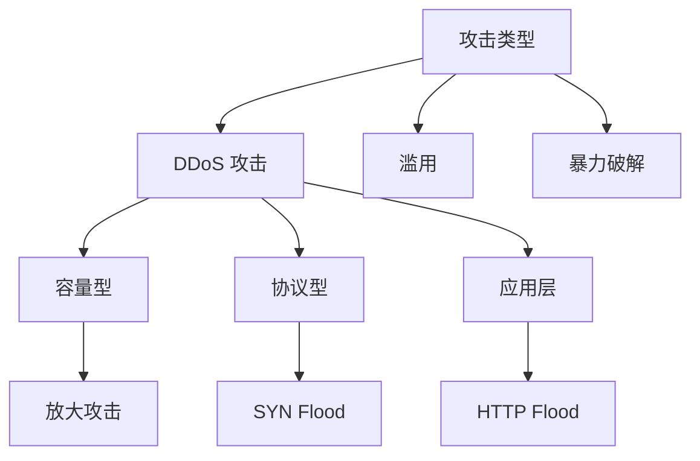
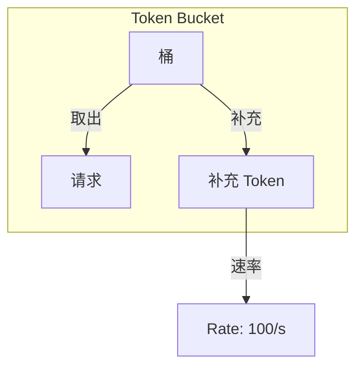
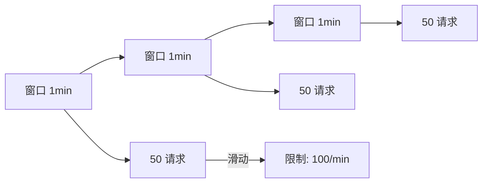
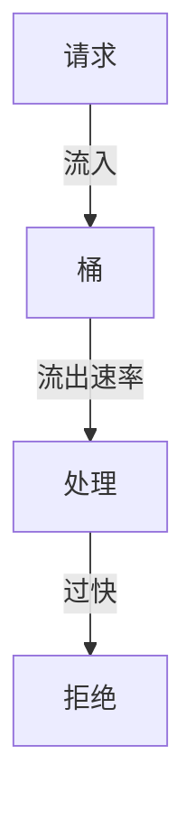
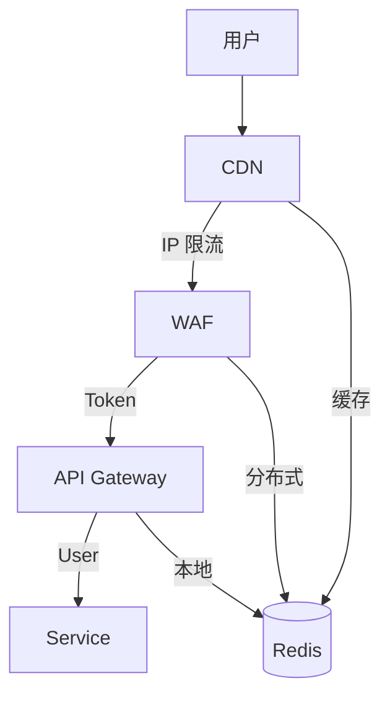
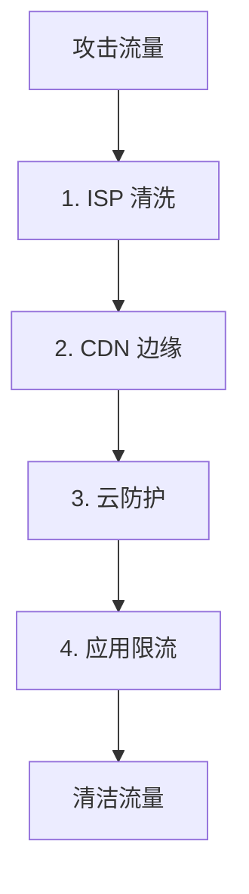

# Rate Limiting and DDoS Protection

> **保护服务免受滥用和攻击。**

---

## 1. 攻击类型



| 类型 | 特征 | 防护 |
|------|------|------|
| **容量型** | 大流量 | CDN/清洗 |
| **协议型** | 消耗连接 | SYN cookie |
| **应用层** | 伪装正常 | 速率限制 |

---

## 2. 速率限制算法

### 2.1 Token Bucket



**特点**:
- 允许突发
- 平滑限流
- 实现简单

```python
class TokenBucket:
    def __init__(self, rate, capacity):
        self.rate = rate
        self.capacity = capacity
        self.tokens = capacity
        self.last_update = time.time()
    
    def allow_request(self) -> bool:
        now = time.time()
        # 补充 tokens
        elapsed = now - self.last_update
        self.tokens = min(
            self.capacity,
            self.tokens + elapsed * self.rate
        )
        self.last_update = now
        
        if self.tokens >= 1:
            self.tokens -= 1
            return True
        return False
```

### 2.2 Sliding Window



**特点**:
- 更精确
- 无突发
- 内存略高

### 2.3 Leaky Bucket



---

## 3. 分布式限流

### 3.1 Redis 限流

```lua
-- Lua 脚本保证原子性
local key = KEYS[1]
local limit = tonumber(ARGV[1])
local window = tonumber(ARGV[2])

local current = redis.call('INCR', key)
if current == 1 then
    redis.call('EXPIRE', key, window)
end

if current > limit then
    return 0
else
    return 1
end
```

### 3.2 限流分层



| 层级 | 限流单位 | 阈值 |
|------|----------|------|
| **CDN** | IP | 1000 QPS |
| **WAF** | IP | 500 QPS |
| **Gateway** | User/Token | 100 QPS |
| **Service** | API Key | 50 QPS |

---

## 4. DDoS 防护

### 4.1 防护层次



### 4.2 云防护服务

| 服务商 | 产品 | 防护能力 |
|--------|------|----------|
| **Cloudflare** | DDoS Protection | 71 Tbps |
| **AWS** | Shield | Layer 3-7 |
| **Akamai** | Prolexic | 12 Tbps |
| **Google** | Cloud Armor | 10 Tbps |

### 4.3 防护配置

```yaml
# Cloudflare Page Rules
- url: "*.example.com/*"
  settings:
    security_level: "high"
    cache_level: "cache_everything"
    edge_cache_ttl: 3600
    
# Rate Limiting
- url: "api.example.com/*"
  rate_limit:
    requests: 10
    seconds: 60
    action: "block"
```

---

## 5. 响应策略

### 5.1 响应阶段

```
阶段 1: 检测 (0-5 分钟)
- 流量异常告警
- 自动触发清洗

阶段 2: 缓解 (5-30 分钟)
- 启用限流
- 屏蔽攻击 IP
- 切换 CDN

阶段 3: 恢复 (30+ 分钟)
- 监控流量正常
- 逐步放宽限制
- 复盘分析
```

### 5.2 应急响应

```python
async def handle_ddos_attack(attack_type: str, scale: int):
    if scale > 10000:  # 10K+ QPS
        # 启用严格限流
        await enable_strict_rate_limit()
        
        # 切换到备用域名
        await activate_backup_domain()
        
        # 通知云防护
        await notify_cloud_provider()
        
    if scale > 1000:  # 1K+ QPS
        # 启用中等级限流
        await enable_moderate_rate_limit()
        
        # 屏蔽可疑 IP
        await block_suspicious_ips()
```

---

## 6. 面试问题

### Q: 限流应该在哪里实现？
**A**: 多层防御：
- 边缘（CDN）: 第一层，阻断大流量
- 网关: 应用层限流
- 服务: 业务规则限流

### Q: 如何避免误伤正常用户？
**A**:
- 使用 User ID + IP 组合
- 逐步限流（先警告再拒绝）
- 白名单机制
- 人工干预渠道

---

## 7. Interview Narrative

> "DDoS 防护采用分层策略：CDN 边缘首先扛住容量型攻击，云防护服务处理协议型攻击，应用层使用 Redis 实现分布式令牌桶限流。限流分四级：CDN 1000 QPS/IP、WAF 500 QPS、Gateway 100 QPS、Service 50 QPS。检测到异常后自动触发清洗，误伤正常用户时可通过人工介入白名单。整个系统设计目标是保证在 10Gbps 攻击下核心服务仍可用。"
