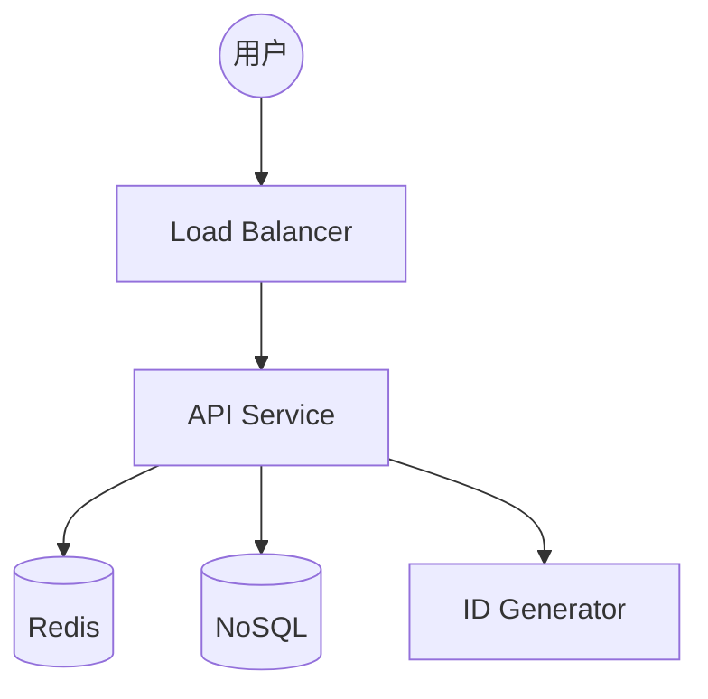

# Mock Interview: URL Shortener

> **45 分钟完整模拟面试脚本。**

---

## 面试官开场 (1 分钟)

> "你好，我是今天的面试官。很高兴见到你。今天我们要做一个系统设计面试，我会让你设计一个 URL 短链接服务。整个过程大约 45 分钟，包括最后几分钟的反馈时间。有什么问题吗？"
>
> "好的，那我们开始。请你在白板上画出你理解的系统架构，不要担心画错，我们看重的是你的思考过程。"

---

## 第一阶段：需求澄清 (5 分钟)

### 候选人说

> "好的，我理解的 URL 短链接服务，比如 bit.ly，可以把长 URL 转换成短链接，然后用户访问短链接时会重定向到原始 URL。"

### 面试官可能的回应

- 点头表示认可
- 或者问："好的，那关于规模，你认为需要支持多少用户？"

### 候选人的问题（应该问）

1. 每天创建多少短链接？
2. 访问量是多少？读多还是写多？
3. 是否需要支持自定义短链接？
4. 需要追踪点击统计吗？
5. 短链接有效期？

---

## 第二阶段：需求确认 (3 分钟)

### 候选人应该说

> "让我确认一下我理解的需求："
> 
> "- 创建一个短链接（POST）"
> "- 访问短链接重定向（GET）"
> "- 支持自定义别名（可选）"
> "- 假设规模：1000 万日活用户，每天创建 100 万链接，读取 1 亿次"
>
> "这个理解对吗？"

### 面试官

> "基本正确。假设读写比例是 100:1，其他的你来决定。"

---

## 第三阶段：容量估算 (5 分钟)

### 候选人应该做的

```python
# 口头计算
100万 writes/day = 1000000 / 86400 ≈ 12 QPS
1亿 reads/day = 100000000 / 86400 ≈ 1157 QPS

# 存储估算
100万 * 365天 * 5年 = 18亿 条记录
每条约 500 bytes = 9 TB
```

### 候选人应该说

> "我估算一下："
> "- 写 QPS: 约 12/秒"
> "- 读 QPS: 约 1157/秒（峰值可能 3000-5000）"
> "- 存储：假设每条记录 500 bytes，5 年约 9TB"

---

## 第四阶段：高层设计 (10 分钟)

### 候选人应该画的图



### 候选人应该说的

> "我的设计："
> "- 使用 API Gateway 处理所有请求"
> "- 写操作走 NoSQL 数据库（高写入）"
> "- 读操作优先走 Redis 缓存"
> "- 使用分布式 ID 生成器避免冲突"

---

## 第五阶段：深入探讨 (10 分钟)

### 面试官可能的追问

1. **"如何生成短链接 ID？"**
   - 候选人应该讨论：自增、UUID、雪花算法、哈希

2. **"如果数据库写入失败怎么办？"**
   - 候选人应该讨论：重试、幂等性

3. **"如何处理热点链接？"**
   - 候选人应该讨论：缓存预热、CDN

4. **"如何保证短链接的唯一性？"**
   - 候选人应该讨论：唯一约束、检查+重试

---

## 第六阶段：故障场景 (5 分钟)

### 面试官

> "如果 Redis 缓存全部失效会怎样？"

### 候选人应该说

> "如果 Redis 全部失效："
> "- 所有请求直接打到数据库"
> "- 数据库可能过载"
> "- 我们有熔断机制会限流"
> "- 降级到直接读数据库，虽然慢但可用"
> "- 同时后台重建缓存"

---

## 第七阶段：监控和指标 (3 分钟)

### 候选人应该提到

- 缓存命中率
- P99 延迟
- 错误率
- QPS

---

## 候选人收尾 (2 分钟)

> "我对今天的回答做个总结："
> "- 核心是 ID 生成和重定向"
> "- 使用 Redis 缓存保证低延迟"
> "- NoSQL 存储支持高写入"
> "- 有完整的故障处理机制"

---

## 反馈阶段 (5 分钟)

### 面试官可能说的

**正面**:
- "需求澄清做得很好"
- "容量估算准确"
- "缓存策略合理"

**改进**:
- "可以更深入讨论 ID 生成算法"
- "没有提到限流"
- "监控指标不够具体"

---

## 评分参考

| 维度 | 优秀 | 合格 | 不合格 |
|------|------|------|--------|
| 需求澄清 | 主动问规模、边界 | 基本问了 | 没问 |
| 容量估算 | 有计算、有峰值 | 有估算 | 没有 |
| 架构设计 | 完整、合理 | 基本正确 | 缺组件 |
| 深度 | 能回答 3+ 追问 | 能回答 1-2 | 卡住 |
| 故障处理 | 多层次降级 | 简单处理 | 没有 |
| 沟通 | 清晰、检查确认 | 还可以 | 不清晰 |
