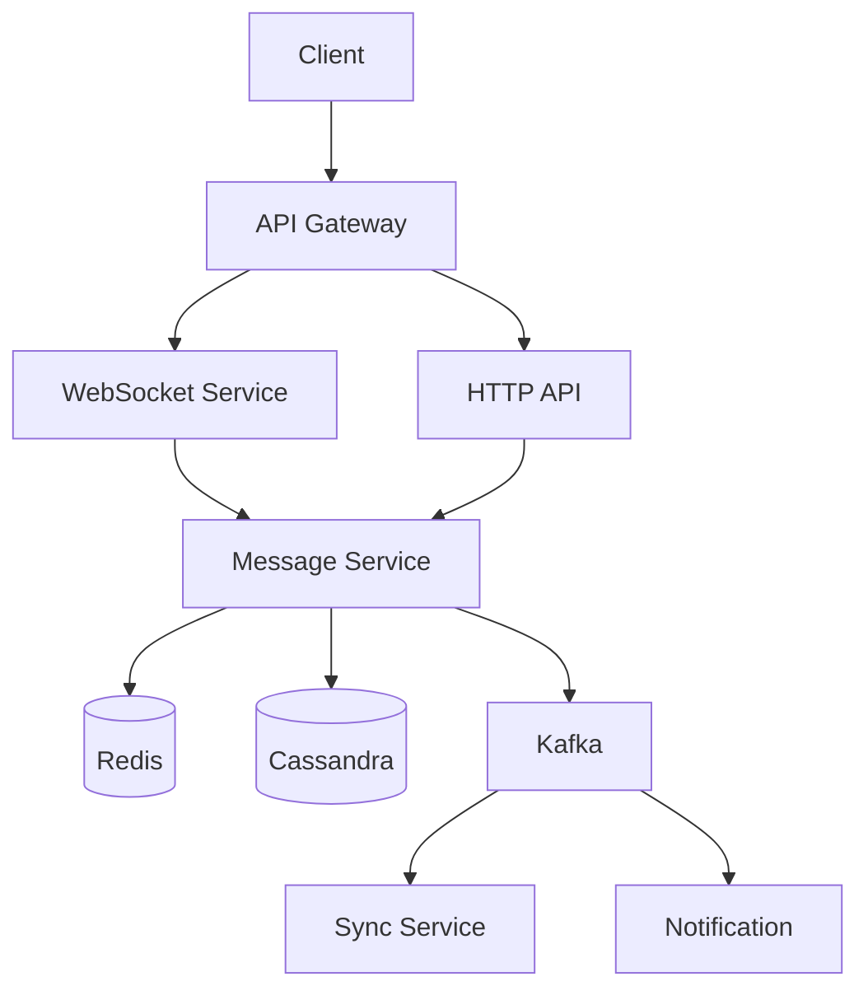

# Mock Interview: Chat System

> **45 分钟完整模拟面试脚本 - 聊天系统**

---

## 面试官开场 (1 分钟)

> "你好，今天我们设计一个聊天系统，比如 WhatsApp 或微信。整个过程 45 分钟左右，我们开始吧。"

---

## 需求澄清

**应该问的问题**:
- 同时在线用户数？
- 消息延迟要求？
- 群聊功能？文件传输？
- 离线消息存储？

**假设**:
- 1 亿日活用户
- 1000 万同时在线
- 100 条消息/用户/天
- 群聊最多 100 人

---

## 容量估算

```
日活: 100M
同时在线: 10M
消息量: 100M × 100 = 10B/天
QPS: 10B / 86400 ≈ 115,000 QPS (峰值 3x = 345K)

存储:
10B × 1KB × 365 天 × 3年 ≈ 10PB
```

---

## 高层架构



---

## 核心组件

### 1. WebSocket 管理
- 长连接维护
- 消息推送
- 心跳检测

### 2. 消息存储
- Cassandra (时间序列)
- 按用户+时间分区

### 3. 消息同步
- 离线消息推送
- 多设备同步

---

## 故障场景

1. **WebSocket 服务挂了** → HTTP 轮询降级
2. **消息丢失** → 消息确认 + 重试
3. **离线消息延迟** → 优先级队列

---

## 面试官追问

1. "如何处理消息顺序？"
2. "如果用户被拉黑，消息怎么处理？"
3. "端到端加密如何实现？"
4. "如何支持消息已读？"

---

## 评分要点

| 维度 | 权重 |
|------|------|
| 需求澄清 | 15% |
| 容量估算 | 15% |
| 架构设计 | 25% |
| 深度 | 20% |
| 故障处理 | 15% |
| 沟通 | 10% |
