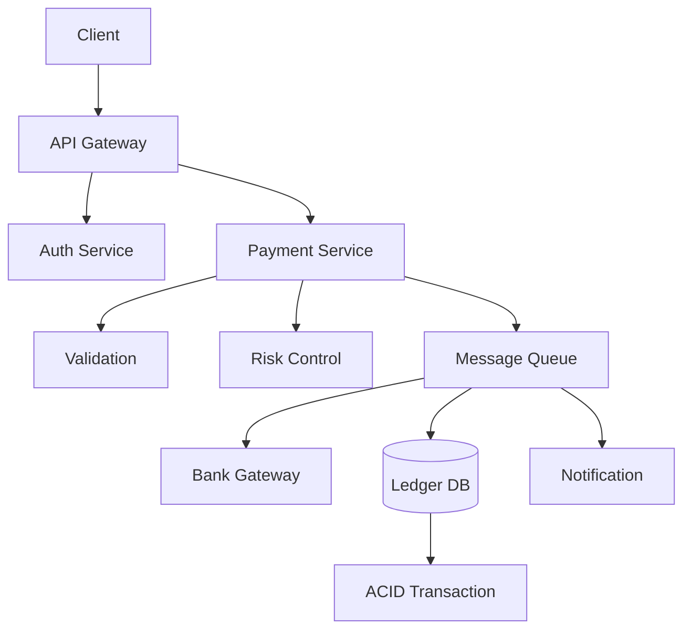

# Mock Interview: Payment System

> **45 分钟完整模拟面试脚本 - 支付系统**

---

## 面试官开场

> "你好，今天我们设计一个支付系统，比如 Stripe 或 PayPal。注意这是金融系统，需要保证资金安全。45 分钟，开始吧。"

---

## 需求澄清

**应该问的问题**:
- 交易量？
- 支持的支付方式？
- 是否支持退款？
- 国际化需求？
- 实时性要求？

**假设**:
- 1000 万笔/天
- 100K QPS 峰值
- 信用卡、借记卡、PayPal
- 支持退款
- T+1 结算

---

## 容量估算

```
交易量: 10M/天 = 115 QPS (峰值 3x = 345 QPS)
金额精度: 分 (整数存储)

存储:
10M × 365 × 5年 ≈ 18B 笔交易
每笔 500 bytes = 9TB
```

---

## 高层架构



---

## 核心设计点

### 1. 幂等性
```json
{
  "idempotency_key": "order_123_v1",
  "amount": 1000,
  "currency": "USD"
}
```

### 2. 分布式事务
- Two-Phase Commit
- Saga 模式
- 最终一致性

### 3. 对账
- 每日对账文件
- 差异处理流程

---

## 故障场景

1. **银行接口超时** → 幂等重试
2. **重复扣款** → 幂等键防止
3. **数据不一致** → 每日对账

---

## 面试官追问

1. "如何保证不重复扣款？"
2. "如果银行返回成功但用户没收到怎么办？"
3. "如何做风险控制？"
4. "如何支持退款？"
5. "如何保证数据一致性？"

---

## 关键区别 (vs 其他系统)

| 方面 | 聊天系统 | 支付系统 |
|------|----------|----------|
| 一致性 | 最终一致 | 强一致 |
| 延迟 | 可接受延迟 | 必须实时 |
| 错误 | 重试 | 必须精确 |
| 资金 | 可丢失 | 不可丢失 |

---

## 评分要点

- 幂等性设计 (必须)
- 资金安全
- 事务一致性
- 容错处理
